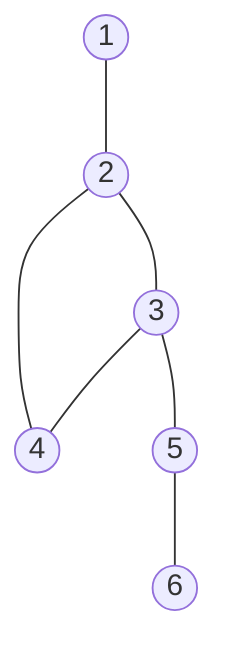

# 오늘의 주제: 단절점(Articulation Point)과 단절선(Bridge)

무방향 그래프에서 **제거하면 연결 요소가 늘어나는** 정점(단절점)과 간선(단절선)을 찾는 알고리즘.
DFS 트리 + **lowlink** 개념 하나로 둘 다 O(V+E)에 해결한다. SCC/2SAT과 같은 "DFS 시간 + low값" 계열의 기본기다.

---

## 1. 핵심 개념

DFS를 돌리면 방문 순서대로 각 정점에 **발견 시각 `order[u]`(=disc)** 가 매겨진다.
DFS 트리에서 무방향 그래프의 간선은 **트리 간선**과 **역방향 간선(back edge)** 두 종류뿐이다(교차 간선 없음).

- **`low[u]`** = `u`의 서브트리에서 (트리 간선을 따라 내려간 뒤) **back edge 한 번으로 도달할 수 있는 가장 빠른 발견 시각**.
- 정의:
  `low[u] = min(order[u], min(low[child]) for 트리자식, min(order[w]) for back edge u→w)`

`low`가 "이 서브트리가 자기 조상 위로 얼마나 되돌아 올라갈 수 있나"를 말해준다. 여기서 두 판정이 바로 나온다.

### 단절점 판정
정점 `u`, 자식 `v`(트리 간선)에 대해:

- **`u`가 루트가 아닐 때**: `low[v] >= order[u]` 인 자식이 하나라도 있으면 `u`는 단절점.
  → 자식 서브트리가 `u`를 거치지 않고는 `u`보다 위로 못 올라간다는 뜻.
- **`u`가 루트일 때**: DFS 트리 자식이 **2개 이상**이면 단절점.

> 등호 `>=` 주의! 단절점은 `low[v] == order[u]`도 포함한다(자식이 u까지만 올라오는 경우, u가 끊기면 분리됨).

### 단절선 판정
트리 간선 `u→v`에 대해:

- **`low[v] > order[u]`** 이면 간선 `(u, v)`는 단절선(bridge).
  → 자식 서브트리가 back edge로도 `u` 위로 못 올라가니, 이 간선이 유일한 통로.

> 여기선 **엄격한 부등호 `>`**. 등호면 back edge로 우회로가 있어 다리가 아니다.
> 단절선은 루트 예외 처리도 필요 없다(간선 관점이라 자연스럽게 처리됨).

---

## 2. 그림으로 보기



- `1-2`: 2를 떼면 1이 고립 → **단절선**. 정점 2, 3도 단절점.
- `2-3-4`는 사이클이라 서로 back edge로 우회 가능 → 이 안의 간선은 단절선 아님.
- `3-5`, `5-6`: 각각 떼면 아래가 분리 → **단절선**, 정점 5도 단절점.

즉 사이클(이중연결요소) 안의 간선은 절대 다리가 될 수 없다는 게 핵심 직관이다.

---

## 3. Python 템플릿

재귀 DFS는 파이썬에서 깊이 제한/속도 문제가 있으니 **반복(iterative) DFS**로 짜는 걸 권장한다.

### 단절점 (반복 DFS)

```python
import sys
input = sys.stdin.readline

def articulation_points(n, adj):
    order = [0] * (n + 1)   # 발견 시각(0=미방문)
    low = [0] * (n + 1)
    is_cut = [False] * (n + 1)
    timer = 1

    for s in range(1, n + 1):
        if order[s]:
            continue
        # stack: (u, parent, 처리할 이웃 인덱스, 루트자식수 카운트용)
        stack = [(s, 0, 0)]
        root_children = 0
        while stack:
            u, parent, i = stack.pop()
            if i == 0:               # u 처음 방문
                order[u] = low[u] = timer
                timer += 1
            advanced = False
            while i < len(adj[u]):
                v = adj[u][i]
                i += 1
                if v == parent:
                    continue
                if order[v]:                       # 이미 방문 → back edge
                    low[u] = min(low[u], order[v])
                else:                              # 트리 간선: v로 내려감
                    stack.append((u, parent, i))   # 복귀 지점 저장
                    stack.append((v, u, 0))
                    if u == s:
                        root_children += 1
                    advanced = True
                    break
            if advanced:
                continue
            # u의 이웃 소진 → 부모로 low 전파 + 판정
            if parent:
                low[parent] = min(low[parent], low[u])
                if parent != s and low[u] >= order[parent]:
                    is_cut[parent] = True
        if root_children >= 2:
            is_cut[s] = True

    return [v for v in range(1, n + 1) if is_cut[v]]
```

### 단절선 (반복 DFS)

```python
def bridges(n, adj):
    order = [0] * (n + 1)
    low = [0] * (n + 1)
    res = []
    timer = 1

    for s in range(1, n + 1):
        if order[s]:
            continue
        stack = [(s, -1, 0)]
        while stack:
            u, parent, i = stack.pop()
            if i == 0:
                order[u] = low[u] = timer
                timer += 1
            advanced = False
            while i < len(adj[u]):
                v = adj[u][i]
                i += 1
                if v == parent:
                    parent = -1          # 다중간선 대비: 부모 무시 1회만
                    continue
                if order[v]:
                    low[u] = min(low[u], order[v])
                else:
                    stack.append((u, parent, i))
                    stack.append((v, u, 0))
                    advanced = True
                    break
            if advanced:
                continue
            up = stack[-1][0] if stack else -1   # 실제 부모(=복귀할 노드)
            if up != -1:
                low[up] = min(low[up], low[u])
                if low[u] > order[up]:
                    res.append(tuple(sorted((up, u))))
    return sorted(res)
```

> 다중 간선(같은 두 정점 사이 간선 2개)이 있으면 그 간선은 다리가 아니다.
> `parent==v` 를 **딱 한 번만** 건너뛰도록 처리하면 이 케이스도 정확히 잡힌다.

---

## 4. 대표 예제

### 예제 1 — 백준 11266 단절점
정점 V, 간선 E가 주어질 때 단절점의 개수와 번호를 출력.

- 위 `articulation_points`를 그대로 호출.
- 핵심: 루트는 **자식 2개 이상**, 비루트는 **`low[child] >= order[u]`**.

### 예제 2 — 백준 11400 단절선
단절선의 개수와, 각 간선을 두 정점 오름차순 정렬해 사전순 출력.

- 위 `bridges` 사용, 조건은 **`low[v] > order[u]`**.
- 출력 정렬만 주의하면 끝.

---

## 5. 시간복잡도 · 자주 하는 실수

- **시간복잡도**: 단절점/단절선 모두 DFS 한 번 → **O(V + E)**.
- ⚠️ **단절점은 `>=`, 단절선은 `>`** — 이 부등호 하나 헷갈리면 다 틀린다.
- ⚠️ **루트 예외**: 단절점은 루트를 자식 수로 따로 판정. 단절선은 필요 없음.
- ⚠️ **재귀 깊이**: 파이썬 재귀로 짜면 `sys.setrecursionlimit`을 크게(예: 3×10^5+) 잡고 `sys.stdin` 사용. 그래도 stack overflow 위험 → 반복 DFS 권장.
- ⚠️ **`low[u] = min(low[u], order[v])`** (back edge는 자식의 `low`가 아니라 **`order[v]`** 를 쓴다). 여기서 `low[v]`를 쓰면 미묘하게 틀린다.
- ⚠️ **다중 간선 / 부모 간선**: 부모로 되돌아가는 간선은 back edge로 세면 안 됨. 단 다중 간선이면 한 번만 무시.

---

## 6. 한 줄 요약

DFS 발견시각 `order`와 되돌아갈 수 있는 최솟값 `low` 두 배열로,
**자식이 나를 거치지 않고 위로 못 가면(단절점 `>=`, 단절선 `>`)** 잘라내면 그래프가 쪼개진다.
