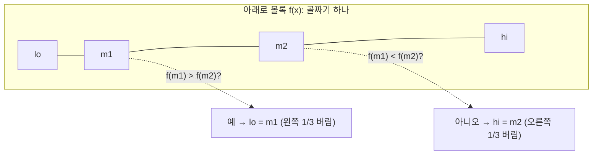

# 오늘의 주제: 삼분탐색 (Ternary Search)

> **한 줄 요약:** 이분탐색이 "단조(monotone)" 함수에서 경계를 찾는다면, **삼분탐색은 "단봉(unimodal, 볼록/오목)" 함수에서 극값(최소/최대)을 찾는다.**

---

## 1. 언제 쓰는가

- 함수 `f(x)`가 **아래로 볼록(convex)** 이라 최솟값이 하나 → 삼분탐색으로 최소점 탐색
- 또는 **위로 오목(concave)** 이라 최댓값이 하나 → 최대점 탐색
- 즉 **감소하다가 증가**(또는 증가하다가 감소)하는 "골짜기/봉우리" 모양이면 OK
- 대표 신호: "이동하는 두 점 사이 거리의 최소", "각도·위치·시간을 매개변수로 최적화", "|합|을 최소로 만드는 기준점"

⚠️ **단조 함수면 이분탐색을 써라.** 삼분탐색은 극값이 함수 내부에 있을 때 쓴다.

---

## 2. 원리 — 왜 동작하는가

구간 `[lo, hi]`를 세 등분하는 두 점 `m1 = lo + (hi-lo)/3`, `m2 = hi - (hi-lo)/3` 을 잡는다. 아래로 볼록 함수라 가정하면:

- `f(m1) < f(m2)` → 최소점은 `m2` 오른쪽에 없다 → `hi = m2` 로 축소
- `f(m1) > f(m2)` → 최소점은 `m1` 왼쪽에 없다 → `lo = m1` 로 축소

**정당성:** 단봉 함수에서 최소점을 `x*` 라 하면, `m1 < m2` 일 때 두 값의 대소만으로 `x*` 가 절대 존재할 수 없는 한쪽 3분의 1 구간을 안전하게 버릴 수 있다. 매 반복마다 구간이 **2/3배**로 줄어든다.



---

## 3. 시간복잡도

- 구간 길이가 매번 2/3배 → 반복 횟수 `O(log_{3/2}(구간/정밀도))`
- 실수 삼분탐색: **100~200회** 반복이면 부동소수점 정밀도 한계까지 도달 (안전빵으로 그냥 200번 돌려도 됨)
- 정수 삼분탐색: `O(log N)`, 구간이 3 이하로 좁아지면 완전탐색으로 마무리
- 한 번 반복에 `f(x)` 평가 비용이 붙으므로 총 `O(반복 × f평가)`

---

## 4. 대표 예제 ①  BOJ 11662 — 민식이의 여행 (실수 삼분탐색)

두 사람이 각자 `(Ax,Ay)→(Bx,By)`, `(Cx,Cy)→(Dx,Dy)` 로 **동시에 등속 이동**한다. 시각 `t∈[0,1]` 에서 둘 사이 거리를 최소로 만드는 값을 구하라.

**핵심 아이디어:** 각 점의 위치는 `t`의 1차식 → 두 점 사이 거리 `dist(t)` 는 `t`에 대해 **아래로 볼록**. 그러니 `[0,1]` 구간에서 삼분탐색.

```python
import sys
from math import hypot

def main():
    Ax,Ay,Bx,By,Cx,Cy,Dx,Dy = map(int, sys.stdin.read().split())

    def dist(t):
        # 시각 t에서 두 사람 위치
        mx = Ax + (Bx-Ax)*t;  my = Ay + (By-Ay)*t
        gx = Cx + (Dx-Cx)*t;  gy = Cy + (Dy-Cy)*t
        return hypot(mx-gx, my-gy)

    lo, hi = 0.0, 1.0
    for _ in range(200):                 # 실수: 그냥 넉넉히 반복
        m1 = lo + (hi-lo)/3
        m2 = hi - (hi-lo)/3
        if dist(m1) < dist(m2):
            hi = m2
        else:
            lo = m1
    print(f"{dist((lo+hi)/2):.10f}")

main()
```

- **시간복잡도:** `O(200)` — 사실상 상수
- **자주 하는 실수:** 정답 시각 `t`가 아니라 **그때의 거리**를 출력해야 함. 마지막엔 `(lo+hi)/2` 를 대표값으로.

---

## 5. 대표 예제 ②  BOJ 8986 — 전봇대 (정수/실수 삼분탐색)

첫 전봇대는 0에 고정. 나머지를 등간격 `d`로 재배치할 때, 각 전봇대 이동거리의 **합**을 최소로 하는 `d`를 찾아라. 목표: `sum(|x_i - i*d|)` 최소화.

**핵심 아이디어:** `x_i`가 정렬돼 있고 `i*d`가 선형 → `|x_i - i*d|` 는 `d`에 대해 볼록, 그 합도 볼록. `d ≥ 0` 범위에서 삼분탐색.

```python
import sys

def main():
    data = sys.stdin.read().split()
    n = int(data[0])
    xs = list(map(int, data[1:1+n]))

    def cost(d):
        return sum(abs(xs[i] - i*d) for i in range(n))

    lo, hi = 0.0, xs[-1]          # d의 상한은 마지막 좌표면 충분
    for _ in range(200):
        m1 = lo + (hi-lo)/3
        m2 = hi - (hi-lo)/3
        if cost(m1) < cost(m2):
            hi = m2
        else:
            lo = m1
    d = (lo+hi)/2
    print(round(cost(d)))          # 정수 답 → 반올림

main()
```

- **시간복잡도:** `O(200 · N)` (반복마다 합 계산 `O(N)`)
- **자주 하는 실수:** `d` 상한을 너무 작게 잡으면 최적점을 놓침. 좌표 최댓값 정도로 넉넉히.

---

## 6. 정수 삼분탐색 템플릿 (극값의 x가 정수일 때)

```python
def ternary_int(lo, hi, f):
    # f가 아래로 볼록일 때 최소값을 주는 정수 x 탐색
    while hi - lo >= 3:
        m1 = lo + (hi - lo)//3
        m2 = hi - (hi - lo)//3
        if f(m1) < f(m2):
            hi = m2
        else:
            lo = m1
    # 남은 좁은 구간은 완전탐색
    best_x = min(range(lo, hi+1), key=f)
    return best_x
```

---

## 7. 자주 하는 실수 체크리스트

- ❌ 함수가 진짜 **단봉인지** 확인 안 함 → 봉우리가 2개면 삼분탐색이 틀림
- ❌ 최소를 찾는데 부등호를 반대로 씀 (볼록: `f(m1) < f(m2)` 이면 `hi=m2`)
- ❌ 실수인데 반복 횟수를 너무 적게(예: 100 미만) → 정밀도 부족. **200번**이면 안전
- ❌ 정수 삼분탐색에서 평평한 구간(`f(m1)==f(m2)`)을 잘못 버림 → 마지막 좁은 구간은 완전탐색으로 마무리
- ❌ "최댓값" 문제인데 볼록 로직 그대로 씀 → 부등호를 뒤집거나 `-f` 를 최소화

---

## 8. 이분탐색 vs 삼분탐색 한눈에

| 구분 | 이분탐색 | 삼분탐색 |
|------|----------|----------|
| 대상 함수 | 단조(monotone) | 단봉(unimodal, 볼록/오목) |
| 찾는 것 | 경계/조건 만족점 | 극값(최소/최대) |
| 구간 축소 | 1/2 | 2/3 |
| 평가 지점 | 1개 (mid) | 2개 (m1, m2) |
