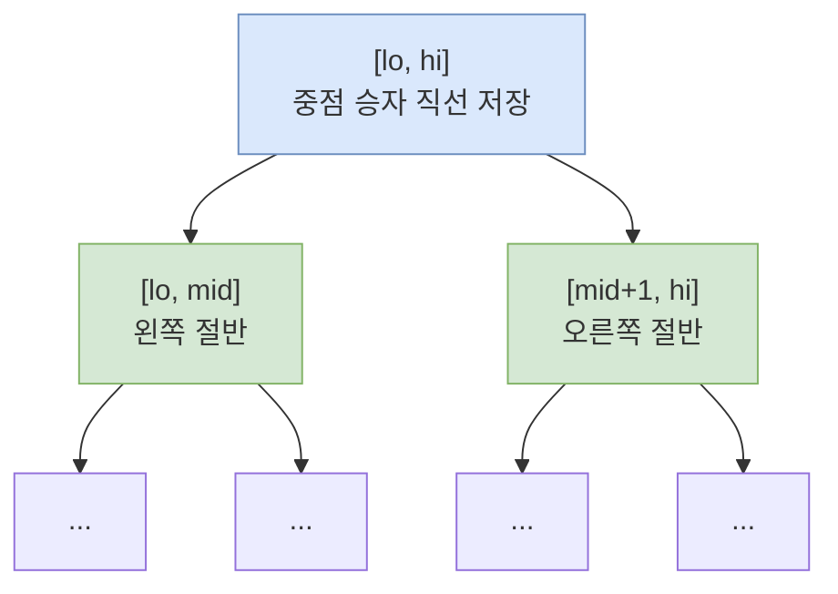
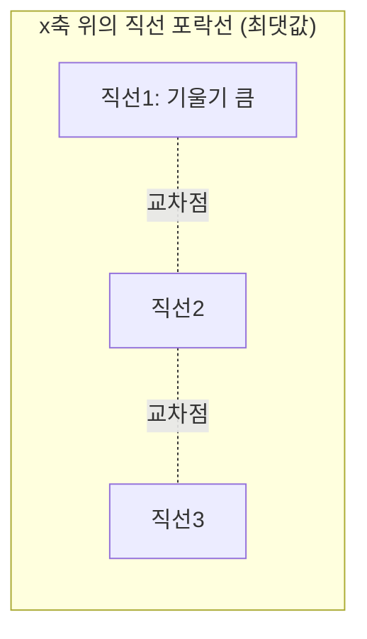

# 오늘의 주제: Li Chao Tree (리 차오 트리)

> **한 줄 요약**: x축 구간을 세그먼트 트리로 쪼개고, 각 노드에 "이 구간을 지배하는 직선 하나"를 저장한다. 직선을 **임의 순서로** 삽입하면서 특정 x에서의 최댓값(또는 최솟값)을 `O(log X)`에 질의한다.

---

## 왜 필요한가 — CHT와의 관계

DP 최적화의 단골 형태는 이렇다.

```
dp[i] = min over j ( a[j] * x[i] + b[j] )
```

즉 **여러 개의 직선** `y = a·x + b`가 있고, 특정 x에서 그 직선들의 **하한(또는 상한) 포락선**을 질의하는 문제다.

- **Convex Hull Trick (CHT)**: 이미 노트에 있음. 하지만 기울기가 **단조**로 들어오거나, 질의 x가 정렬돼야 편하다. 임의 순서 삽입은 Li Chao Tree(또는 monotonic stack + 이분탐색)로 처리.
- **Li Chao Tree**: 직선을 **아무 순서로나** 넣어도 되고, 질의 x도 아무 순서나 된다. 구현이 짧고 실수가 적다. 그 대신 x 좌표 범위(또는 질의 좌표 집합)를 미리 알아야 한다.

> **핵심 직관**: 세그먼트 트리의 각 노드는 x 구간 `[lo, hi]`를 담당하고, "이 구간에서 대체로 이기는 직선 한 개"를 들고 있다. 새 직선이 들어오면 **구간의 중점(mid)에서 누가 이기는지** 비교해서 이긴 직선을 노드에 남기고, 진 직선은 여전히 이길 가능성이 있는 절반(자식)으로 내려보낸다.

---

## 동작 원리 (최댓값 버전)

노드 구간 `[lo, hi]`, 중점 `mid = (lo+hi)//2`. 노드에 저장된 직선 `cur`, 새 직선 `new`.

1. **중점에서 비교**: `new(mid) > cur(mid)` 이면 `new`가 더 세므로 `swap(cur, new)`. (이제 `cur`가 중점 승자)
2. 남은 `new`(진 쪽)를 어디로 내려보낼지 결정 — 직선은 한 번만 교차하므로 왼쪽/오른쪽 중 한쪽에서만 `cur`를 이길 수 있다.
   - `new`가 **왼쪽 끝(lo)** 에서 `cur`보다 세면 → 왼쪽 자식으로.
   - `new`가 **오른쪽 끝(hi)** 에서 `cur`보다 세면 → 오른쪽 자식으로.
3. 재귀적으로 삽입. 리프(길이 1)에 도달하면 종료.

**질의**: x가 속한 경로를 따라 루트→리프로 내려가며 만난 모든 노드의 직선을 x에 대입, 그 최댓값을 답으로 모은다. 경로 길이 = `O(log X)`.

> **왜 맞는가**: 두 직선은 최대 한 점에서만 교차한다. 중점 승자를 노드에 두고 패자를 "패자가 이길 수 있는 유일한 절반"으로만 보내므로, 임의의 x에서 진짜 승자는 반드시 루트→리프 경로상의 어떤 노드에 저장돼 있다.





- **시간복잡도**: 삽입/질의 각각 `O(log X)`. X = x좌표 범위 크기(또는 좌표압축 후 개수).
- **공간**: 동적 세그트리로 짜면 삽입한 직선 수에 비례, 배열이면 `O(X)`.

---

## 대표 예제 1 — BOJ 12795 반평면 땅따먹기

**문제 요약**: 두 종류 쿼리.
- `1 a b`: 직선 `y = a·x + b` 추가.
- `2 x`: 지금까지 추가된 직선들 중 그 x에서의 **최댓값** 출력.

전형적인 Li Chao Tree(최댓값) 문제. x 범위는 대략 `[-2e12, 2e12]` 정도로 크므로 **동적(포인터/딕셔너리) 세그트리**로 구현한다.

### 핵심 아이디어
- 좌표 범위가 크니 노드를 미리 만들지 말고 **필요할 때 생성**(dynamic).
- 직선 값이 `a·x+b` 로 `x`가 최대 2e12, `a`가 크면 곱이 커지므로 Python은 큰 정수라 안전(오버플로 걱정 X — Python의 장점).

### 시간복잡도
- 직선 수 `Q`, 좌표 범위 `X` → 전체 `O(Q log X)`.

### 자주 하는 실수
- 최댓값/최솟값 부호를 반대로 넣기 → 최솟값이 필요하면 `a, b`를 부호 반전해서 최댓값 트리에 넣고 답도 부호 반전.
- 중점 비교 후 **패자를 내려보내는 절반을 잘못 고르기**(왼끝/오른끝 비교 헷갈림).
- 재귀 깊이: 범위가 크면 `log2(4e12) ≈ 42` → 얕아서 파이썬 기본 재귀로도 OK. 그래도 반복문 구현이 스택 안전.

### Python 풀이 (동적 Li Chao, 최댓값)

```python
import sys
input = sys.stdin.readline

NEG = float('-inf')
# 좌표 범위: 문제 제약에 맞춰 넉넉히
LO, HI = -(10**12), 10**12

class LiChao:
    # 각 노드: [line(a,b), left_idx, right_idx], line=None이면 비어있음
    def __init__(self):
        self.a = []   # 직선 기울기
        self.b = []   # 직선 절편
        self.lc = []  # 왼쪽 자식 인덱스(-1이면 없음)
        self.rc = []  # 오른쪽 자식 인덱스
        self._new_node()  # 루트 = 0

    def _new_node(self):
        self.a.append(0); self.b.append(NEG)  # 비어있는 직선 = 항상 -inf
        self.lc.append(-1); self.rc.append(-1)
        return len(self.a) - 1

    def insert(self, na, nb):
        self._insert(0, LO, HI, na, nb)

    def _insert(self, node, lo, hi, na, nb):
        while True:
            mid = (lo + hi) // 2
            ca, cb = self.a[node], self.b[node]
            # 중점에서 새 직선이 더 크면 승자 교체
            if na * mid + nb > ca * mid + cb:
                self.a[node], self.b[node] = na, nb
                na, nb = ca, cb  # 패자를 계속 내려보냄
            # 패자(na,nb)를 이길 수 있는 절반으로
            if lo == hi:
                return
            if na * lo + nb > self.a[node] * lo + self.b[node]:
                if self.lc[node] == -1:
                    self.lc[node] = self._new_node()
                node, hi = self.lc[node], mid
            elif na * hi + nb > self.a[node] * hi + self.b[node]:
                if self.rc[node] == -1:
                    self.rc[node] = self._new_node()
                node, lo = self.rc[node], mid + 1
            else:
                return

    def query(self, x):
        node, lo, hi = 0, LO, HI
        best = NEG
        while node != -1:
            best = max(best, self.a[node] * x + self.b[node])
            mid = (lo + hi) // 2
            if x <= mid:
                node, hi = self.lc[node], mid
            else:
                node, lo = self.rc[node], mid + 1
        return best

def main():
    tree = LiChao()
    q = int(input())
    out = []
    for _ in range(q):
        parts = list(map(int, input().split()))
        if parts[0] == 1:
            tree.insert(parts[1], parts[2])
        else:
            out.append(str(tree.query(parts[1])))
    print('\n'.join(out))

main()
```

---

## 대표 예제 2 — DP 최적화 (BOJ 13263 나무 자르기 류)

`dp[i] = dp[j] + b[j]·a[i]` 꼴의 점화식(기울기 `b[j]`, 대입값 `a[i]`)은 그대로 Li Chao Tree로 최적화된다.

### 핵심 아이디어
- `j`까지 계산이 끝나면 직선 `y = b[j]·x + dp[j]` 를 트리에 **삽입**.
- `dp[i]` 계산 시 `x = a[i]` 에서 최적값(문제에 따라 min/max)을 **질의**.
- CHT처럼 기울기 단조 조건이 필요 없어 구현이 단순하다.

```python
# 뼈대만 (최솟값 문제면 부호 반전해서 최댓값 트리 사용)
tree = LiChao()
tree.insert(b[0], dp[0])          # 초기 직선
for i in range(1, n):
    dp[i] = tree.query(a[i])       # x=a[i]에서 최적값
    tree.insert(b[i], dp[i])       # 새 직선 등록
```

- **시간복잡도**: `O(N log X)` — CHT의 `O(N)`보다 log 하나 비싸지만 조건이 자유로워 실전에서 안전.

---

## Python 템플릿 정리

```python
# 최솟값이 필요할 때: 넣을 때 (a, b) → (-a, -b), 질의 답도 부호 반전
tree = LiChao()
tree.insert(-a_line, -b_line)      # y = a_line*x + b_line 의 최솟값 포락선
ans = -tree.query(x)                # x에서의 최솟값
```

**체크리스트**
- [ ] 좌표 범위 `LO, HI`를 문제 제약보다 넉넉히 (질의/삽입 x가 항상 `[LO, HI]` 안).
- [ ] 최소/최대 방향 확인 → 최소면 부호 반전 트릭.
- [ ] Python은 큰 정수라 오버플로 무관 (C++이면 `__int128`/오버플로 주의).
- [ ] 반복문 삽입/질의로 재귀 스택 회피.

---

## 요약

- Li Chao Tree = x축 위 세그먼트 트리, 노드마다 "중점 승자 직선" 저장.
- 삽입: 중점 비교 후 패자를 이길 가능성 있는 절반으로 재귀. `O(log X)`.
- 질의: 루트→리프 경로의 직선들을 x에 대입해 최댓값. `O(log X)`.
- CHT 대비 **임의 순서 삽입 + 임의 순서 질의**가 강점, log 하나가 비용.
