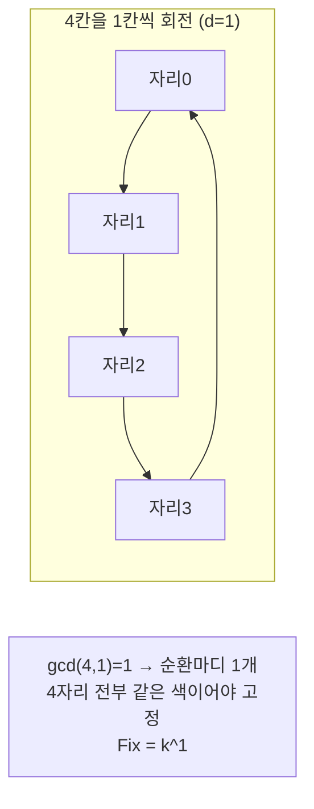
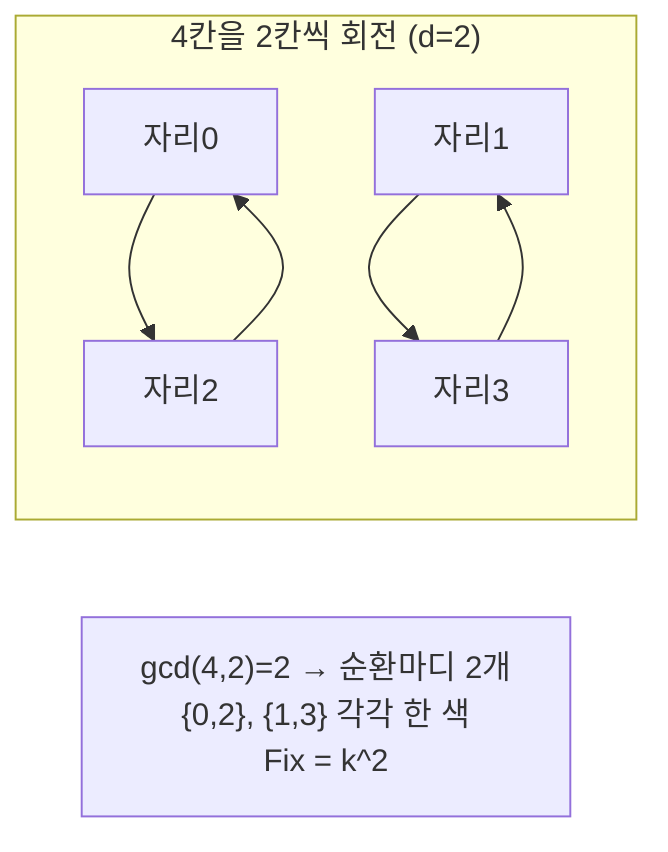

# 번사이드 보조정리 & 폴리아 열거 (Burnside's Lemma / Pólya Enumeration)

> **오늘의 주제: 대칭(회전·반사) 아래에서 서로 다른 배치의 개수를 세는 조합론 도구 — 번사이드 보조정리와 폴리아 열거 정리.**

목걸이 색칠, 정다각형 칠하기, 큐브 면 채색처럼 "돌리거나 뒤집으면 같은 것으로 본다"는 문제를 세는 표준 무기다.

---

## 1. 문제의 본질: 대칭으로 같은 것 묶기

`n`개의 자리에 `k`가지 색을 칠하는 경우의 수는 단순히 `k^n`이다. 그런데 **회전하면 같아지는 배치를 하나로 센다면?** 단순 `k^n`은 중복을 센다.

예: 구슬 4개 목걸이를 2색으로 칠할 때 `2^4=16`가지지만, 회전을 같다고 보면 실제 서로 다른 목걸이는 6가지뿐이다.

이 "대칭 아래의 서로 다른 배치 수"를 세는 것이 핵심이며, 여기서 **군(group)** 이 등장한다. 대칭들의 집합(회전 0·1·2·3칸, 그리고 반사들)이 군을 이룬다.

---

## 2. 번사이드 보조정리 (핵심 공식)

군 `G`가 집합 위에 작용할 때, **서로 다른 배치(궤도, orbit)의 개수**는:

$$
\text{서로 다른 배치 수} = \frac{1}{|G|} \sum_{g \in G} |\text{Fix}(g)|
$$

- `|G|` : 대칭 연산의 총 개수 (회전 n개 + 반사 n개 등)
- `Fix(g)` : 연산 `g`를 적용해도 **변하지 않는(고정된) 배치**의 개수

즉 **"각 대칭이 고정하는 배치 수를 모두 더하고, 대칭 개수로 나눈다."**

### 왜 동작하는가 (정당성)
각 배치가 속한 궤도의 크기로 나누어 세면 궤도 하나당 정확히 1이 된다. 궤도-안정자 정리(Orbit-Stabilizer)로 `∑|Fix(g)| = ∑_{orbit} |G|` 가 되어, `|G|`로 나누면 궤도 개수가 나온다. 핵심 직관: **"평균적으로 각 대칭이 고정하는 배치 수 = 궤도 수."**

---

## 3. 폴리아 열거 정리 (Fix 계산을 순환마디로)

`k`색으로 `n`자리를 칠하는 문제에서, 연산 `g`가 자리들을 여러 개의 **순환마디(cycle)** 로 쪼갠다고 하자. 같은 순환마디 안의 자리는 모두 같은 색이어야 `g`로 고정된다. 따라서:

$$
|\text{Fix}(g)| = k^{c(g)}, \quad c(g) = g\text{의 순환마디 개수}
$$

이 관계가 폴리아 열거의 계산 엔진이다. 번사이드에 대입하면:

$$
\text{답} = \frac{1}{|G|}\sum_{g\in G} k^{c(g)}
$$

**원형 회전군의 순환마디 개수**: `n`칸을 `d`칸 회전하면 순환마디 개수는 정확히 `gcd(n, d)` 이다. 그래서 회전만 고려하면:

$$
\text{회전 아래 답} = \frac{1}{n}\sum_{d=0}^{n-1} k^{\gcd(n,d)}
$$





---

## 4. 대표 예제 1 — 회전만 고려한 목걸이

**문제**: `n`개의 구슬을 원형으로 배치, `k`가지 색. **회전**해서 같으면 같은 목걸이. 서로 다른 목걸이 수는?

### 핵심 아이디어
- 회전군 `|G| = n` (0칸 ~ n-1칸 회전).
- `d`칸 회전의 순환마디 = `gcd(n, d)` → Fix = `k^gcd(n,d)`.
- 답 = `(1/n) · Σ_{d=0}^{n-1} k^{gcd(n,d)}`.

```python
from math import gcd

def necklace_rotation(n, k):
    total = sum(k ** gcd(n, d) for d in range(n))
    return total // n   # 번사이드 결과는 항상 정수로 나누어떨어짐

print(necklace_rotation(4, 2))  # 6
print(necklace_rotation(3, 3))  # 11
```

- **시간복잡도**: `O(n log n)` (각 항 gcd + 거듭제곱). 큰 `n`이면 약수별로 오일러 φ로 묶어 `O(√n · d(n))`까지 단축 가능.
- **정수 나눗셈 주의**: 합은 반드시 `n`의 배수라 `//` 로 안전. 단 모듈러 문제라면 `//` 대신 `n`의 모듈러 역원을 곱해야 한다.

### 약수 묶기 최적화 (n이 클 때)
같은 `gcd = g`를 주는 `d`의 개수는 `φ(n/g)` 이다:

$$
\text{답} = \frac{1}{n}\sum_{g \mid n} \varphi\!\left(\frac{n}{g}\right) k^{g}
$$

```python
from sympy import totient  # 또는 직접 φ 구현

def necklace_fast(n, k):
    ans = 0
    g = 1
    while g * g <= n:
        if n % g == 0:
            ans += totient(n // g) * k ** g
            if g != n // g:
                ans += totient(g) * k ** (n // g)
        g += 1
    return ans // n
```

---

## 5. 대표 예제 2 — 회전 + 반사 (이면군, Dihedral)

**문제**: 팔찌(bracelet) — 회전뿐 아니라 **뒤집기(반사)** 도 같은 것으로 본다. `|G| = 2n`.

### 반사의 순환마디 개수
- `n`이 **홀수**: 반사축 `n`개, 각 축은 꼭짓점 1개 통과 → 순환마디 `(n+1)/2` 개.
- `n`이 **짝수**: 축이 두 종류.
  - 마주보는 꼭짓점 통과 (n/2개): 순환마디 `n/2 + 1` 개.
  - 마주보는 변 통과 (n/2개): 순환마디 `n/2` 개.

```python
from math import gcd

def bracelet(n, k):
    # 회전 파트
    rot = sum(k ** gcd(n, d) for d in range(n))
    # 반사 파트
    if n % 2 == 1:
        ref = n * k ** ((n + 1) // 2)
    else:
        ref = (n // 2) * k ** (n // 2 + 1) + (n // 2) * k ** (n // 2)
    return (rot + ref) // (2 * n)

print(bracelet(4, 2))  # 6
print(bracelet(6, 2))  # 13
```

- **시간복잡도**: `O(n log n)`.
- **자주 하는 실수**: 반사 순환마디를 `n`의 홀짝으로 나누지 않고 하나의 식으로 처리 → 오답. 반드시 케이스 분리.

---

## 6. 자주 하는 실수 모음

- **`k^n`을 그냥 답으로 제출** — 대칭 중복을 안 뺀 것. 문제에 "회전/대칭하면 같다"가 있는지 반드시 확인.
- **`|G|`를 회전만 넣고 반사를 빠뜨림** (팔찌인데 목걸이 공식 사용).
- **모듈러 환경에서 `// |G|` 사용** — 나눗셈은 역원으로. `|G|`가 소수 `p`와 서로소여야 역원 존재. 보통 `p = 998244353` 같은 소수 사용.
- **순환마디 개수 오산** — 회전 `d`칸의 순환마디는 `gcd(n,d)`임을 잊지 말 것 (`n/d` 아님!).
- **고정점(반사축 위 원소)** 처리 누락 — 짝수 반사에서 축이 원소를 통과하는지 변을 통과하는지 구분.

---

## 7. Python 템플릿 (일반 군)

임의의 대칭 연산 목록이 순열로 주어졌을 때의 범용 번사이드:

```python
from math import gcd

def count_cycles(perm):
    """순열 perm의 순환마디 개수."""
    n = len(perm)
    seen = [False] * n
    cycles = 0
    for i in range(n):
        if not seen[i]:
            cycles += 1
            j = i
            while not seen[j]:
                seen[j] = True
                j = perm[j]
    return cycles

def burnside(perms, k, mod=None):
    """perms: 군 G의 모든 원소(순열 리스트), k색."""
    total = 0
    for p in perms:
        c = count_cycles(p)
        total += pow(k, c, mod) if mod else k ** c
    G = len(perms)
    if mod:
        return total * pow(G, mod - 2, mod) % mod   # 페르마 역원 (mod 소수)
    return total // G

# 예: 4칸 원형 회전군
rotations = [[(i + s) % 4 for i in range(4)] for s in range(4)]
print(burnside(rotations, 2))  # 6
```

- **핵심**: 어떤 대칭 문제든 (1) 군의 모든 원소를 순열로 나열 → (2) 각 순열의 순환마디 세기 → (3) `k^cycles` 합 / `|G|`.
- **시간복잡도**: `O(|G| · n)`. 군이 작으면 매우 실용적.

---

## 한 줄 요약

**"각 대칭이 고정하는 배치 수(= k^순환마디)를 모두 더해 대칭 개수로 나눈다."** 원형 회전은 `gcd(n,d)`, 팔찌는 반사 케이스 분리만 기억하면 대부분의 채색 카운팅 문제가 풀린다.
