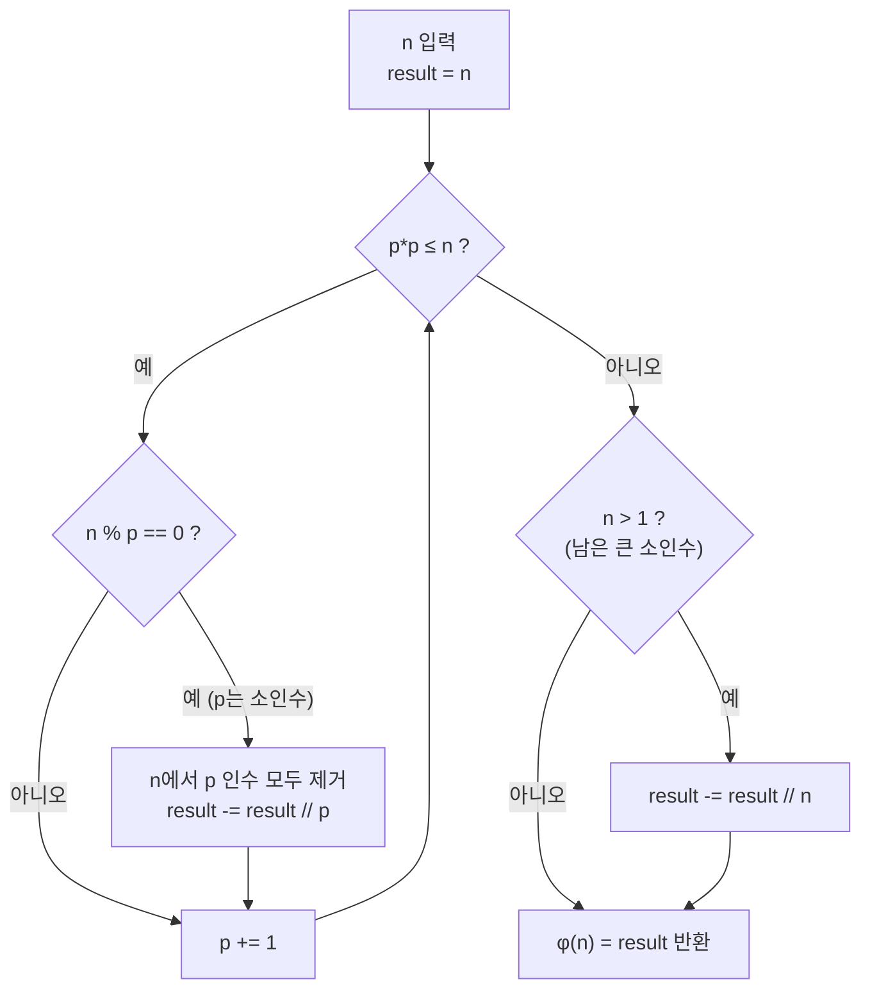
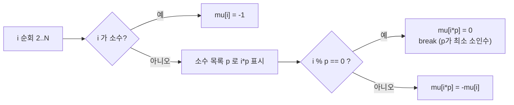

# 오늘의 주제: 오일러 피 함수(φ)와 뫼비우스 함수(μ) — 정수론 곱셈적 함수

> 약수/배수 관계를 다루는 정수론 문제의 두 핵심 도구. **φ(n)** 은 "n 이하에서 n과 서로소인 수의 개수", **μ(n)** 은 "제곱 인수가 있으면 0, 없으면 소인수 개수의 홀짝으로 부호"를 준다. 둘 다 **곱셈적 함수(multiplicative)** 라서 소인수분해 또는 선형 체로 빠르게 전처리한다.
> 대표 문제: 백준 11689(GCD(n,k)=1 개수 = φ(n)), 백준 1557(제곱 free 수 개수 = μ 포함배제).

---

## 1. 왜 이 두 함수인가 — 곱셈적 함수의 힘

두 함수 모두 **서로소인 a, b에 대해 f(ab) = f(a)·f(b)** 를 만족한다(곱셈적).
따라서 소인수분해 `n = p₁^e₁ · p₂^e₂ · … · p_k^e_k` 만 알면 각 소수 거듭제곱에서의 값을 곱해 즉시 구할 수 있다.

- **오일러 피 φ(n)**: `1 ≤ k ≤ n` 중 `gcd(n, k) = 1` 인 k의 개수.
- **뫼비우스 μ(n)**: 어떤 소수의 제곱으로 나눠지면 0, 아니면 `(-1)^(서로 다른 소인수 개수)`.

이 두 함수는 **뫼비우스 반전 공식(Möbius inversion)** 으로 연결되어, "약수/배수 합"으로 정의된 함수를 뒤집어 계산하게 해준다. 포함배제(inclusion-exclusion)를 정수론적으로 자동화한 도구라고 보면 된다.

---

## 2. 오일러 피 함수 φ(n)

### 핵심 공식

곱셈적 성질과 `φ(p^e) = p^e − p^(e−1) = p^(e−1)(p−1)` 로부터:

$$\varphi(n) = n \prod_{p \mid n} \left(1 - \frac{1}{p}\right)$$

여기서 곱은 **n의 서로 다른 소인수 p** 에 대해서만 돈다.

- 예) φ(12): 12 = 2²·3 → 12·(1−1/2)·(1−1/3) = 12·(1/2)·(2/3) = **4**. (서로소: 1,5,7,11)
- **왜 서로소 개수인가**: 각 소인수 p에 대해 "p의 배수"를 걸러내는 포함배제가 정확히 위 곱셈꼴로 정리된다.

### 대표 예제 — 백준 11689 (GCD(n, k) = 1)

`1 ≤ k ≤ n` 중 `gcd(n, k) = 1` 인 k의 개수 = 정의상 **φ(n)** 그대로.
`n ≤ 10^12` 이므로 **O(√n)** 소인수분해로 한 방에 구한다.

```python
import sys

def euler_phi(n):
    result = n
    p = 2
    while p * p <= n:
        if n % p == 0:
            while n % p == 0:   # 같은 소인수 중복 제거
                n //= p
            result -= result // p   # result *= (1 - 1/p) 를 정수로
        p += 1
    if n > 1:                   # 남은 큰 소인수 1개
        result -= result // n
    return result

n = int(sys.stdin.readline())
print(euler_phi(n))
```

- **핵심 아이디어**: `result -= result // p` 는 `result * (p-1)//p` 와 같다 — 정수 나눗셈으로 오차 없이 `(1 − 1/p)` 를 곱한다.
- **시간복잡도**: 소인수분해가 지배 → **O(√n)**.
- **자주 하는 실수**:
  - 같은 소인수를 여러 번 곱하는 것 → 반드시 `while n % p == 0` 로 **한 번만** 반영.
  - `result * (p-1) / p` 로 실수 나눗셈 쓰면 큰 수에서 부동소수 오차. **정수 `//` 유지**.
  - 마지막 `n > 1` (남은 큰 소인수) 처리 누락 → 예: n=14=2·7 에서 7을 빠뜨림.

### 1~N 전체 φ를 한 번에 — 체(sieve) O(N log log N)

여러 n에 대해 φ가 필요하면 에라토스테네스 변형으로 배열 전체를 채운다.

```python
def phi_sieve(N):
    phi = list(range(N + 1))        # phi[i] = i 로 초기화
    for p in range(2, N + 1):
        if phi[p] == p:             # p 가 소수 (아직 안 건드려짐)
            for m in range(p, N + 1, p):
                phi[m] -= phi[m] // p
    return phi
```

---

## 3. 뫼비우스 함수 μ(n)

### 정의

$$
\mu(n) =
\begin{cases}
1 & n = 1 \\
(-1)^k & n \text{이 서로 다른 } k \text{개 소수의 곱 (제곱 인수 없음)} \\
0 & p^2 \mid n \text{ 인 소수 } p \text{가 존재}
\end{cases}
$$

- μ(1)=1, μ(2)=−1, μ(6)=μ(2·3)=1, μ(12)=0 (2²로 나눠짐), μ(30)=μ(2·3·5)=−1.

### 선형 체로 μ 전처리 — O(N)

가장 작은 소인수를 이용한 **선형 체(linear sieve)** 로 소수 목록과 μ를 동시에 만든다.

```python
def mobius_sieve(N):
    mu = [0] * (N + 1)
    mu[1] = 1
    primes = []
    is_comp = [False] * (N + 1)
    for i in range(2, N + 1):
        if not is_comp[i]:
            primes.append(i)
            mu[i] = -1
        for p in primes:
            if i * p > N:
                break
            is_comp[i * p] = True
            if i % p == 0:
                mu[i * p] = 0      # p^2 인수 발생 → 0
                break
            else:
                mu[i * p] = -mu[i] # 새 소인수 하나 추가 → 부호 반전
    return mu
```

### 대표 예제 — 백준 1557 (제곱 free 수, squarefree)

`1 ≤ x ≤ n` 중 "어떤 제곱수로도 나눠지지 않는 수(squarefree)"의 개수 Q(n)은 **뫼비우스 포함배제**로:

$$Q(n) = \sum_{d=1}^{\lfloor\sqrt{n}\rfloor} \mu(d)\left\lfloor \frac{n}{d^2} \right\rfloor$$

`d²` 로 나눠지는 수를 μ 부호로 포함/배제한다. K번째 squarefree 수를 찾을 때 `Q(x)` 가 단조증가라 **이분탐색**과 결합한다.

```python
# K번째 제곱 free 수 찾기 (Q(x)에 대한 파라메트릭 이분탐색)
import sys

def solve():
    K = int(sys.stdin.readline())
    LIMIT = 45000            # sqrt(2*10^9) 여유
    mu = mobius_sieve(LIMIT)

    def Q(x):                # x 이하 squarefree 개수
        total = 0
        d = 1
        while d * d <= x:
            total += mu[d] * (x // (d * d))
            d += 1
        return total

    lo, hi = 1, 2 * 10**9
    while lo < hi:
        mid = (lo + hi) // 2
        if Q(mid) >= K:      # K번째 이상이 되는 최소 x
            hi = mid
        else:
            lo = mid + 1
    print(lo)

solve()
```

- **시간복잡도**: μ 체 O(LIMIT) + 이분탐색 O(log·√x). K ≤ 10^9 규모에서도 빠름.
- **자주 하는 실수**:
  - `d²` 상한을 `d ≤ √n` 이 아니라 `d² ≤ n` 으로 잡아야 인덱스 오류가 안 난다.
  - μ 배열 크기(LIMIT)를 `√(답의 상한)` 보다 크게 잡을 것.

---

## 4. 두 함수를 잇는 뫼비우스 반전 공식

`g(n) = Σ_{d|n} f(d)` 로 정의되면, 뒤집어서:

$$f(n) = \sum_{d \mid n} \mu(d)\, g\!\left(\frac{n}{d}\right)$$

대표 항등식:

$$\sum_{d \mid n} \varphi(d) = n, \qquad \sum_{d \mid n} \mu(d) = [\,n = 1\,]$$

"gcd가 특정 값인 쌍의 개수", "GCD 합/LCM 합" 류 문제는 이 반전으로 **약수 단위 합 → 곱셈적 함수 합**으로 바꿔 O(N log N) 또는 O(N)으로 푼다.

---

## 5. 함께 보는 계산 흐름 (φ, 소인수분해 기반)



μ의 선형 체는 "가장 작은 소인수로 한 번씩만 방문"하기 때문에 O(N)이 보장된다:



---

## 6. 정리 · 언제 쓰나

| 상황 | 도구 | 복잡도 |
|---|---|---|
| 단일 n의 서로소 개수 | φ(n) O(√n) 소인수분해 | O(√n) |
| 1~N 전체 φ 필요 | φ 체 | O(N log log N) |
| 제곱 free / gcd 조건 포함배제 | μ 선형 체 + 합 | O(N) 전처리 |
| 약수 합으로 정의된 함수 뒤집기 | 뫼비우스 반전 | 문제별 |

- **핵심 한 줄**: 곱셈적 함수는 "소인수 단위로 쪼개서 곱한다"가 전부. φ는 서로소 세기, μ는 포함배제 부호 담당.
- **주의점**: 부동소수 대신 정수 `//`, 남은 큰 소인수 처리, 체 크기 여유 확보 — 이 셋만 지키면 실수가 거의 없다.
