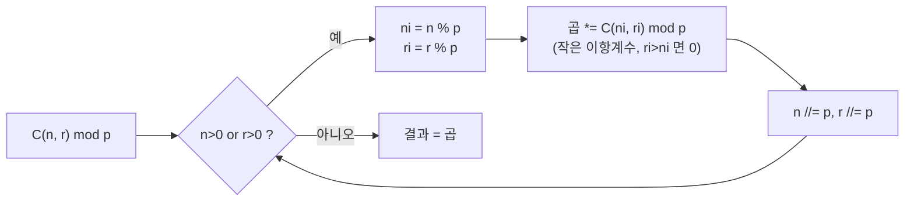

# 오늘의 주제: 뤼카 정리 (Lucas' Theorem) · 모듈러 이항계수

> **한 줄 요약:** 소수 `p`에 대한 이항계수 `C(n, r) mod p`를, `n`·`r`을 **p진법으로 쪼갠 자릿수별 작은 이항계수의 곱**으로 구한다. `n`이 10^18처럼 거대해도 O(p + log_p n)에 계산 가능.

---

## 1. 왜 필요한가 — 두 가지 상황

이항계수 `C(n, r) = n! / (r!(n-r)!)` 를 소수 `p`로 나눈 나머지를 구하는 문제는 매우 흔하다. 상황에 따라 접근이 갈린다.

| 상황 | n의 크기 | 방법 | 복잡도 |
|------|----------|------|--------|
| **A. n이 작음** (~10^6) | `n < p` 또는 `n < 몇백만` | 팩토리얼 전처리 + 페르마 역원 | 전처리 O(n), 질의 O(1) |
| **B. n이 거대함** (10^18) | `n ≫ p`, 단 `p`가 작은 소수 | **뤼카 정리** | O(p + log_p n) |

핵심 도구는 둘 다 **모듈러 곱셈 역원**이다. `p`가 소수면 페르마 소정리로 `a^(p-1) ≡ 1 (mod p)` → `a^(-1) ≡ a^(p-2)`.

---

## 2. 상황 A — 팩토리얼 전처리 + 페르마 역원

가장 자주 쓰는 정석. `n < p` 이면 분모의 `r!`, `(n-r)!` 가 `p`와 서로소이므로 역원이 존재한다.

**핵심 아이디어**
- `fact[i] = i! mod p` 를 미리 계산.
- `C(n,r) = fact[n] · inv(fact[r]) · inv(fact[n-r])`.
- 역원은 `inv[i] = fact[i]^(p-2)`. 하나씩 거듭제곱하면 O(n log p)지만, **역팩토리얼을 뒤에서부터 한 번 곱하면** O(n)에 전부 구할 수 있다: `inv_fact[i] = inv_fact[i+1] · (i+1)`.

```python
import sys

def build_binom(N, p):
    fact = [1] * (N + 1)
    for i in range(1, N + 1):
        fact[i] = fact[i - 1] * i % p
    inv_fact = [1] * (N + 1)
    inv_fact[N] = pow(fact[N], p - 2, p)   # 페르마 소정리로 역원
    for i in range(N - 1, -1, -1):
        inv_fact[i] = inv_fact[i + 1] * (i + 1) % p
    def C(n, r):
        if r < 0 or r > n:
            return 0
        return fact[n] * inv_fact[r] % p * inv_fact[n - r] % p
    return C
```

> **왜 O(1) 질의인가:** 무거운 `pow`는 딱 한 번(`inv_fact[N]`)만 쓰고, 나머지 역팩토리얼은 곱셈 한 번으로 전파한다. 질의당 곱셈 2번.

---

## 3. 상황 B — 뤼카 정리

`n`이 10^18인데 `p`는 작은 소수(예: 1000003, 심지어 그 이상이라도 자리수만 작으면)일 때.

**정리 (Lucas).** 소수 `p`에 대해 `n`, `r`을 p진법으로 전개하면
`n = n_k p^k + ... + n_1 p + n_0`, `r = r_k p^k + ... + r_1 p + r_0` 일 때

```
C(n, r) ≡ Π C(n_i, r_i)  (mod p)
```

즉 **각 자릿수끼리의 작은 이항계수를 곱한 것**과 합동이다. 어떤 자리에서 `r_i > n_i`면 그 항 `C(n_i, r_i) = 0` 이라 전체가 0이 된다.

### 왜 성립하는가 (직관)
`(1+x)^p ≡ 1 + x^p (mod p)` — 중간 이항계수 `C(p,k)` (0<k<p) 는 분자에 `p`가 남아 전부 0이 되기 때문. 이를 반복하면
`(1+x)^n = Π (1+x^{p^i})^{n_i} (mod p)` 가 되고, 양변에서 `x^r` 의 계수를 비교하면 자릿수 분해가 튀어나온다. `r`의 p진법 표현은 유일하므로 계수 매칭이 곧 자릿수별 곱이 된다.

### p진법 분해 흐름 (mermaid)



### 코드 — O(p) 전처리 후 질의 O(log_p n)

```python
def lucas_builder(p):
    # 자릿수는 항상 p 미만 → fact를 p까지만 준비
    fact = [1] * p
    for i in range(1, p):
        fact[i] = fact[i - 1] * i % p
    inv_fact = [1] * p
    inv_fact[p - 1] = pow(fact[p - 1], p - 2, p)
    for i in range(p - 2, -1, -1):
        inv_fact[i] = inv_fact[i + 1] * (i + 1) % p

    def small_C(n, r):                 # 0 <= n, r < p 보장
        if r < 0 or r > n:
            return 0
        return fact[n] * inv_fact[r] % p * inv_fact[n - r] % p

    def lucas(n, r):
        res = 1
        while n > 0 or r > 0:
            ni, ri = n % p, r % p
            res = res * small_C(ni, ri) % p
            if res == 0:               # 한 자리라도 0이면 조기 종료
                return 0
            n //= p
            r //= p
        return res
    return lucas
```

- **시간복잡도:** 전처리 O(p), 질의당 자릿수 `⌈log_p n⌉` 개 × 각 O(1) = **O(log_p n)**.
- **주의:** `p`가 크면(예: 10^9+7) 자릿수는 1~3개뿐이라 사실상 상황 A와 같아진다. 뤼카는 **`p`가 작고 `n`이 클 때** 빛난다.

---

## 4. 대표 예제

### 예제 1 — BOJ 11402 「이항 계수 4」 (뤼카 정리 기본)

`C(N, K) mod 1,000,003` 을 구하되 `N ≤ 10^18`. p=1000003 은 소수 → 정확히 뤼카가 필요한 형태.

```python
import sys

def solve():
    N, K = map(int, sys.stdin.readline().split())
    p = 1_000_003
    lucas = lucas_builder(p)   # 위 3절의 빌더
    print(lucas(N, K))

solve()
```

- 아이디어: `N`이 float 범위를 훌쩍 넘으므로 팩토리얼 전처리(상황 A)는 불가능. p진법 자릿수는 3~4개뿐이라 순식간.
- 자주 하는 실수: `K > N` 케이스에서 `small_C`가 0을 반환하도록 방어. 어떤 자리에서 `ri > ni`면 자동 0.

### 예제 2 — BOJ 11401 「이항 계수 3」 (상황 A, 페르마 역원)

`C(N, K) mod 1,000,000,007`, `N ≤ 4,000,000`. `p`가 커서 자릿수 분해는 의미 없고, 팩토리얼 전처리가 정답.

```python
import sys

def solve():
    N, K = map(int, sys.stdin.readline().split())
    p = 1_000_000_007
    C = build_binom(N, p)   # 위 2절의 빌더
    print(C(N, K))

solve()
```

- 아이디어: `N!`, `K!`, `(N-K)!` 를 전처리하고 페르마 역원으로 나눗셈을 곱셈으로 바꾼다.
- 핵심: `pow(x, p-2, p)` 를 남발하지 말고 역팩토리얼 뒤에서부터 전파 → 전처리 O(N).

---

## 5. 자주 하는 실수 체크리스트

- **`p`가 소수가 아닐 때** 페르마 역원과 뤼카가 그대로는 성립하지 않는다. 소수 거듭제곱 모듈러면 **Granville / Andrew Lucas 확장**이나 CRT 조합이 필요.
- 역원 `pow(a, p-2, p)` 는 **a와 p가 서로소**일 때만 유효. `a`가 `p`의 배수면 애초에 `C`가 0.
- 뤼카에서 `fact` 배열은 **p까지만** 만들면 된다 (자릿수 < p). 실수로 n까지 만들면 메모리 폭발.
- `C(n, r)`에서 `r < 0` 또는 `r > n` 방어를 빼먹으면 인덱스 에러 / 오답.
- 파이썬은 큰 정수를 기본 지원하지만, **모듈러를 매 곱셈마다** 취하지 않으면 수가 폭증해 느려진다.

---

## 6. Python 템플릿 (복붙용)

```python
import sys

# --- 상황 A: n이 작을 때 (n < p, 전처리 O(n) / 질의 O(1)) ---
def build_binom(N, p):
    fact = [1] * (N + 1)
    for i in range(1, N + 1):
        fact[i] = fact[i - 1] * i % p
    inv_fact = [1] * (N + 1)
    inv_fact[N] = pow(fact[N], p - 2, p)
    for i in range(N - 1, -1, -1):
        inv_fact[i] = inv_fact[i + 1] * (i + 1) % p
    def C(n, r):
        if r < 0 or r > n: return 0
        return fact[n] * inv_fact[r] % p * inv_fact[n - r] % p
    return C

# --- 상황 B: n이 거대하고 p가 작은 소수일 때 (뤼카 정리) ---
def lucas_builder(p):
    fact = [1] * p
    for i in range(1, p):
        fact[i] = fact[i - 1] * i % p
    inv_fact = [1] * p
    inv_fact[p - 1] = pow(fact[p - 1], p - 2, p)
    for i in range(p - 2, -1, -1):
        inv_fact[i] = inv_fact[i + 1] * (i + 1) % p
    def small_C(n, r):
        if r < 0 or r > n: return 0
        return fact[n] * inv_fact[r] % p * inv_fact[n - r] % p
    def lucas(n, r):
        res = 1
        while n > 0 or r > 0:
            res = res * small_C(n % p, r % p) % p
            if res == 0: return 0
            n //= p; r //= p
        return res
    return lucas
```

---

## 정리

- `C(n,r) mod p` 는 **n의 크기와 p의 크기**로 방법이 갈린다.
- **n 작음 / p 큼** → 팩토리얼 전처리 + 페르마 역원 (O(n) 전처리, O(1) 질의).
- **n 거대 / p 작은 소수** → **뤼카 정리**: p진법 자릿수별 작은 이항계수의 곱, O(log_p n) 질의.
- 두 방법 모두 뿌리는 **모듈러 역원**이고, 뤼카는 `(1+x)^p ≡ 1+x^p (mod p)` 라는 한 줄의 항등식에서 나온다.
