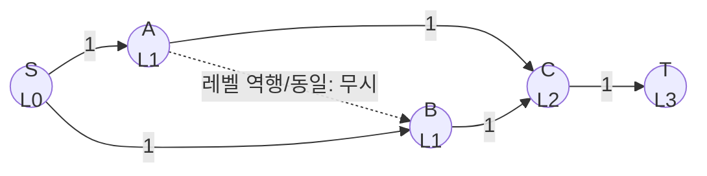

# 오늘의 주제: 디닉 알고리즘 (Dinic's Maximum Flow)

> **한 줄 요약**: 잔여 그래프를 BFS로 **레벨 그래프(level graph)** 로 나눈 뒤, 그 위에서 DFS로 **블로킹 플로우(blocking flow)** 를 한 번에 여러 경로로 흘린다. Edmonds-Karp의 `O(VE²)` 를 `O(V²E)` 로, 이분매칭·단위용량에서는 `O(E√V)` 로 끌어올린 최대 유량 알고리즘.

---

## 1. 왜 Edmonds-Karp로는 부족한가

네트워크 유량의 기본기(잔여 그래프, 역간선, 증가 경로)는 [네트워크 유량 노트](2026-06-27-네트워크유량.md)에 있다. Edmonds-Karp는 증가 경로를 **BFS로 한 번에 하나씩** 찾아 `O(VE²)`. 정점·간선이 커지면(예: V=1000, E=10^4) 느리다.

**디닉의 핵심 통찰**: BFS 한 번으로 "S에서의 최단 거리(레벨)" 를 모든 정점에 매긴 뒤, **레벨이 정확히 1씩 증가하는 간선만** 따라가면서 DFS로 **여러 증가 경로를 한꺼번에** 밀어넣는다. 이 "한 페이즈에서 밀 수 있는 최대치" 가 블로킹 플로우다.

---

## 2. 두 단계 구조

### (1) BFS — 레벨 그래프 만들기
잔여 용량 `> 0` 인 간선만 사용해 S에서 BFS. `level[v] =` S로부터의 최단 간선 수.
- T에 도달 불가(`level[T] == -1`)면 **더 이상 증가 경로 없음 → 종료**.

### (2) DFS — 블로킹 플로우 밀기
`level[u]+1 == level[v]` 인 간선만 따라가며 S→T 경로로 흐름을 민다. 여러 번 반복해 이 레벨 그래프에서 **더는 못 미는 상태(blocking)** 까지 짜낸다.



레벨은 S→(A,B)→C→T = 0,1,1,2,3. DFS는 `level+1` 간선만 타므로 왔던 곳으로 되돌아가거나 옆으로 새지 않는다.

### 왜 빨라지는가 (정당성)
- **레벨(=최단 거리)은 페이즈마다 최소 1 증가**한다. 최단 거리는 최대 `V`까지 → **페이즈 수 ≤ V**.
- 한 페이즈의 블로킹 플로우는 `O(VE)`. → 전체 `O(V²E)`.
- **단위 용량(이분매칭 등)** 에서는 페이즈 수가 `O(√V)` 로 줄어 **`O(E√V)`** (홉크로프트-카프급).

---

## 3. `it` 포인터 최적화 (필수)

DFS에서 이미 "막힌(더 못 미는)" 간선을 매번 다시 방문하면 느리다. 정점마다 **현재 탐색 시작 간선 인덱스 `it[u]`** 를 두고, 막힌 간선은 건너뛴 채로 유지한다. 이 최적화가 있어야 블로킹 플로우가 `O(VE)` 로 보장된다. (없으면 TLE의 주범)

---

## 4. 대표 예제 1 — BOJ 6086 최대 유량

**문제**: 무향 파이프망에서 A→Z 최대 유량. 정점은 대소문자 알파벳('A'~'Z','a'~'z', 총 52). **같은 두 점 사이 파이프가 여러 개** 나올 수 있고 **양방향**이다.

### 핵심 아이디어
- 무향 간선 `u—v(c)` 는 **양쪽 방향 모두 용량 `c`** 로 넣는다 (역간선이 곧 반대방향 통로).
- 중복 간선은 **용량을 더한다**(같은 인덱스에 누적하거나 그냥 여러 개 추가해도 됨).
- 소스 `A`, 싱크 `Z`.

```python
import sys
from collections import deque
input = sys.stdin.readline

class Dinic:
    def __init__(self, n):
        self.n = n
        self.graph = [[] for _ in range(n)]  # [to, cap, rev_index]
    def add_edge(self, u, v, c, rc=0):   # rc: 역방향 용량(무향이면 c)
        self.graph[u].append([v, c, len(self.graph[v])])
        self.graph[v].append([u, rc, len(self.graph[u]) - 1])
    def bfs(self, s, t):
        self.level = [-1] * self.n
        self.level[s] = 0
        q = deque([s])
        while q:
            u = q.popleft()
            for v, cap, _ in self.graph[u]:
                if cap > 0 and self.level[v] < 0:
                    self.level[v] = self.level[u] + 1
                    q.append(v)
        return self.level[t] >= 0
    def dfs(self, u, t, f):
        if u == t:
            return f
        while self.it[u] < len(self.graph[u]):
            e = self.graph[u][self.it[u]]
            v, cap, rev = e
            if cap > 0 and self.level[v] == self.level[u] + 1:
                d = self.dfs(v, t, min(f, cap))
                if d > 0:
                    e[1] -= d
                    self.graph[v][rev][1] += d
                    return d
            self.it[u] += 1     # 막힌 간선은 다시 보지 않음
        return 0
    def max_flow(self, s, t):
        flow = 0
        while self.bfs(s, t):
            self.it = [0] * self.n
            while True:
                f = self.dfs(s, t, float('inf'))
                if f == 0:
                    break
                flow += f
        return flow

def idx(ch):
    return ord(ch) - 65 if ch.isupper() else ord(ch) - 71  # A..Z=0..25, a..z=26..51

n = int(input())
din = Dinic(52)
for _ in range(n):
    a, b, c = input().split()
    din.add_edge(idx(a), idx(b), int(c), int(c))  # 무향: 양방향 용량 c
print(din.max_flow(idx('A'), idx('Z')))
```

- **시간복잡도**: `O(V²E)` (여기선 V=52로 사실상 상수급).
- **자주 하는 실수**: ① 무향인데 한 방향만 넣기(→답 작아짐) ② 중복 파이프를 덮어써서 용량 손실 ③ `it` 포인터 없이 순수 재귀 → 큰 입력 TLE.

---

## 5. 대표 예제 2 — BOJ 2188 축사 배정 (이분매칭 = 단위용량 유량)

**문제**: 소 `N`마리, 축사 `M`칸. 소 i가 원하는 축사 목록이 주어질 때 최대 몇 마리를 서로 다른 칸에 넣을 수 있나. 전형적 **이분 매칭**.

### 유량으로 모델링
- `S → 각 소(용량 1)` : 소는 한 번만 배정.
- `소 i → 원하는 축사 j(용량 1)`.
- `각 축사 → T(용량 1)` : 칸은 한 마리만.
- **최대 유량 = 최대 매칭**. 모든 용량이 1(단위 용량)이라 디닉이 **`O(E√V)`** 로 동작 → 헝가리안 DFS 매칭보다 안정적으로 빠르다.

```python
# 정점 번호: S=0, 소 1..N, 축사 N+1..N+M, T=N+M+1
S, T = 0, N + M + 1
din = Dinic(N + M + 2)
for i in range(1, N + 1):
    din.add_edge(S, i, 1)
    for j in wanted[i]:              # i번 소가 원하는 축사들
        din.add_edge(i, N + j, 1)
for j in range(1, M + 1):
    din.add_edge(N + j, T, 1)
print(din.max_flow(S, T))            # = 최대 매칭 수
```

- **핵심 포인트**: 이분매칭을 굳이 전용 코드로 안 짜도, **디닉 하나로 매칭·최소정점덮개·최대독립집합(쾨니그 정리)** 문제를 다 커버할 수 있다.
- **주의**: 이분매칭에선 소→축사 간선을 **단방향(rc=0)** 으로. 무향으로 넣으면 매칭 의미가 깨진다.

---

## 6. 언제 쓰나 / 정리

- **최대 유량 / 최소 컷** (최대유량-최소컷 정리): 프로젝트 선택, 이미지 분할, 최소정점덮개 등 모델링 문제 전반.
- **이분매칭·단위용량**: 디닉이 `O(E√V)` 라 사실상 표준 무기.
- Edmonds-Karp보다 항상 같거나 빠르므로, **유량 기본기가 있으면 디닉을 기본 템플릿으로** 쓰는 걸 추천.

| 알고리즘 | 증가 경로 방식 | 시간복잡도 |
|---|---|---|
| Ford-Fulkerson | DFS(용량 정수) | `O(E·maxflow)` |
| Edmonds-Karp | BFS 1경로/회 | `O(VE²)` |
| **Dinic** | BFS 레벨 + DFS 블로킹 | **`O(V²E)`**, 단위용량 `O(E√V)` |

### 자주 하는 실수 총정리
1. `it` 포인터(현재 간선) 최적화 누락 → 블로킹 플로우가 느려져 TLE.
2. BFS 레벨 그래프에서 `level[v]==level[u]+1` 조건을 빼먹고 아무 간선이나 타기 → 무한 루프/오답.
3. 역간선 용량 초기값 실수: 유향은 `rc=0`, 무향은 `rc=c`.
4. `float('inf')` 로 시작한 흐름을 정수 그래프에 흘릴 때, 실제 push 값은 병목(min)이라 문제없지만 **용량을 float로 넣으면 오차** — 정수로 유지.
