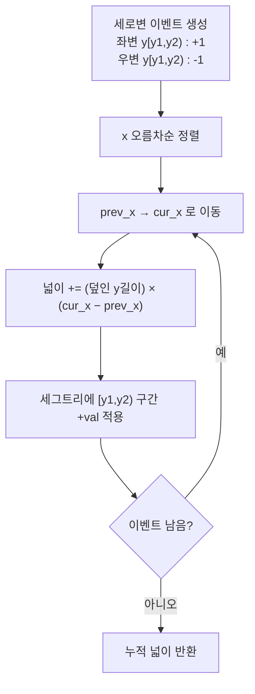
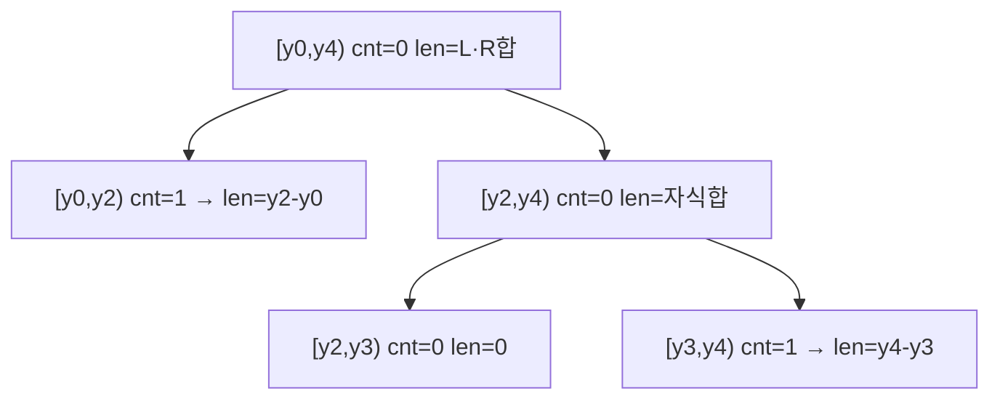

# 스위핑(Sweeping) + 좌표압축 — 직사각형 합집합 넓이

> **오늘의 주제:** 세로 스위핑 라인으로 여러 직사각형이 겹쳐 이루는 **합집합 넓이**를 O(N log N)에 구하기. 좌표압축 + "구간을 덮은 겹 수"를 관리하는 세그먼트 트리(면적 세그트리)를 함께 쓴다.

---

## 1. 핵심 아이디어

직사각형 하나를 좌변(x1)과 우변(x2) **두 개의 세로 이벤트**로 쪼갠다.

- 좌변에서 y구간 `[y1, y2)`가 **활성화(+1)**, 우변에서 **비활성화(−1)**.
- 이벤트들을 **x 좌표 오름차순**으로 훑으면(sweep), 두 이벤트 사이의 얇은 세로 띠에서 덮인 넓이는

$$\text{덮인 } y \text{ 길이} \times (x_{\text{cur}} - x_{\text{prev}})$$

- 이걸 전부 더하면 합집합 넓이. **왜 겹침을 저절로 처리하나?** 각 세로 띠에서 "현재 덮여 있는 y의 총 길이"만 재기 때문에 몇 겹으로 덮였든 길이는 한 번만 센다.



**언제 쓰나:** 직사각형 합집합/교집합 넓이·둘레, 겹친 구간 길이, 2D 스위핑 계열 문제. 축에 평행한 도형이면 대부분 이 골격.

---

## 2. 면적 세그먼트 트리 (겹 수 + 덮인 길이)

y좌표를 **좌표압축**해서 인접한 두 좌표 사이를 "기본 구간(elementary interval)"으로 본다. 좌표가 `k`개면 기본 구간은 `k−1`개.

각 노드는 두 값을 든다.

- `cnt[node]`: 이 노드 구간을 **완전히 덮는** 활성 세로변의 순 개수(부분합 형태로만 저장).
- `length[node]`: 이 노드 구간에서 **실제 덮인 y 길이**.

`update` 후 각 노드는 아래 규칙으로 `length`를 재계산(pull)한다.

- `cnt > 0` → 구간 전체가 덮임 → `length = ys[hi] − ys[lo]`
- 리프이면서 `cnt == 0` → `length = 0`
- 그 외 → `length = 왼자식.length + 오른자식.length`

> **중요 포인트 — lazy propagation이 필요 없다.** 값이 완전 포함 구간에만 `cnt`에 더해지고, 실제 답은 매번 `pull`로 재계산한다. `cnt`는 자식으로 내려보내지 않고 그 노드에 "쌓아두기만" 하므로 전파가 불필요하다. 게다가 모든 `+1`은 반드시 대응하는 `−1`과 짝이라 `cnt`가 음수로 깨질 일도 없다.



---

## 3. 대표 예제 & Python 풀이

### 공통 함수 — 합집합 넓이

```python
import sys

def rectangle_union_area(rects):
    # rects: (x1, y1, x2, y2), x1<x2, y1<y2
    ys = sorted({y for _, y1, _, y2 in rects for y in (y1, y2)})
    yidx = {y: i for i, y in enumerate(ys)}
    m = len(ys) - 1                 # 기본 y구간 개수
    cnt = [0] * (4 * m)
    length = [0] * (4 * m)          # 정수 좌표면 int, 유리수면 float

    def update(node, lo, hi, ql, qr, val):
        if qr <= lo or hi <= ql:    # 겹치지 않음
            return
        if ql <= lo and hi <= qr:   # 완전 포함
            cnt[node] += val
        else:
            mid = (lo + hi) // 2
            update(node * 2,     lo, mid, ql, qr, val)
            update(node * 2 + 1, mid, hi, ql, qr, val)
        # pull: length 재계산
        if cnt[node] > 0:
            length[node] = ys[hi] - ys[lo]
        elif hi - lo == 1:
            length[node] = 0
        else:
            length[node] = length[node * 2] + length[node * 2 + 1]

    events = []                     # (x, y_lo_idx, y_hi_idx, val)
    for x1, y1, x2, y2 in rects:
        events.append((x1, yidx[y1], yidx[y2], 1))
        events.append((x2, yidx[y1], yidx[y2], -1))
    events.sort()

    area = 0
    prev_x = events[0][0]
    for x, l, r, val in events:
        area += length[1] * (x - prev_x)   # 이벤트 적용 '전' 띠 넓이
        update(1, 0, m, l, r, val)
        prev_x = x
    return area
```

### 예제 1 — 백준 3392 「화성 지도」

`N`개의 직사각형(좌표 ≤ 30000)이 덮는 총 넓이. 위 함수를 그대로 호출.

```python
input = sys.stdin.readline
n = int(input())
rects = []
for _ in range(n):
    x1, y1, x2, y2 = map(int, input().split())
    rects.append((x1, y1, x2, y2))
print(rectangle_union_area(rects))
```

### 예제 2 — 백준 7626 「직사각형」

`N ≤ 2·10^5`, 좌표 ≤ 10^9. **좌표압축이 필수**인 버전 — 같은 함수가 그대로 동작한다(넓이가 크므로 파이썬 int면 오버플로 걱정 없음).

- **핵심 아이디어:** 세로 스위핑 + y좌표 압축 + 면적 세그트리.
- **시간복잡도:** 이벤트 `2N`개 정렬 O(N log N) + 각 이벤트 세그트리 갱신 O(log N) → **O(N log N)**.
- **공간:** O(N).

---

## 4. 자주 하는 실수

- **좌표압축 후 구간 개수**를 `k`가 아니라 `k−1`로 잡아야 함(리프 = 좌표 사이의 "구간").
- 넓이 누적을 **update 이전에** 해야 함(이번 이벤트가 적용되기 직전까지의 띠 넓이).
- `length`를 `pull`에서 **매번 재계산**해야지, 차감식으로 관리하면 부동/누적 오차가 생김.
- lazy를 억지로 붙이려다 `cnt` 전파로 로직을 깨뜨리는 경우 — 이 문제군은 lazy가 **불필요**.
- x 동률 이벤트 순서는 무관(그 사이 Δx=0이라 넓이 기여 0). 단, **둘레** 문제로 확장하면 순서·중복 처리가 달라짐.

---

## 5. Python 템플릿 (요약)

```python
def sweep_area(rects):
    ys = sorted({y for _, a, _, b in rects for y in (a, b)})
    idx = {y: i for i, y in enumerate(ys)}
    m = len(ys) - 1
    cnt = [0]*(4*m); ln = [0]*(4*m)
    def upd(nd, lo, hi, ql, qr, v):
        if qr <= lo or hi <= ql: return
        if ql <= lo and hi <= qr: cnt[nd] += v
        else:
            md = (lo+hi)//2
            upd(nd*2, lo, md, ql, qr, v); upd(nd*2+1, md, hi, ql, qr, v)
        ln[nd] = ys[hi]-ys[lo] if cnt[nd] > 0 else (0 if hi-lo == 1 else ln[nd*2]+ln[nd*2+1])
    ev = []
    for x1, y1, x2, y2 in rects:
        ev += [(x1, idx[y1], idx[y2], 1), (x2, idx[y1], idx[y2], -1)]
    ev.sort()
    area = 0; px = ev[0][0]
    for x, l, r, v in ev:
        area += ln[1]*(x-px); upd(1, 0, m, l, r, v); px = x
    return area
```
