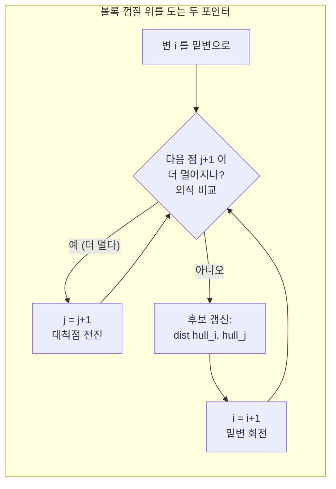

# 오늘의 주제: 회전하는 캘리퍼스 (Rotating Calipers)

> **한 줄 요약**: 볼록 껍질 위를 두 개의 "평행한 자(caliper)"가 회전하며 돌면, 가장 먼 두 점(지름) · 최소 폭 · 최소 넓이 경계 사각형 같은 값을 **O(N)** 에 구할 수 있다.
> (전제: 볼록 껍질을 먼저 구해야 함 → `2026-07-01-CCW와볼록껍질.md` 복습)

**언어: Python**

---

## 1. 언제 쓰나

점 집합에서 다음을 물어보는 문제:

- **가장 먼 두 점 (지름, diameter)** — 대표 문제. BOJ 9240(로버트 후드), 10254(고속도로).
- 두 볼록 다각형 사이 최소/최대 거리
- 최소 폭(width), 최소 넓이/둘레 경계 사각형

핵심 통찰: **가장 먼 두 점은 반드시 볼록 껍질의 꼭짓점 쌍이다.** 내부 점이나 변 위 점은 절대 최댓값을 만들 수 없다. 그래서 껍질을 구한 뒤 껍질 위에서만 탐색하면 된다.

- 껍질 꼭짓점이 `h`개면 모든 쌍은 O(h²). 그런데 회전하는 캘리퍼스로 O(h)까지 줄인다.

---

## 2. 아이디어 — 왜 O(N)에 되는가

지름을 만드는 두 점 `p`, `q`를 생각하자. `p`에서 가장 먼 점 `q`는, `p` 근처 변의 방향을 기준으로 봤을 때 **가장 멀리 떨어진(폭이 최대인) 대척점(antipodal point)** 이다.

두 개의 평행선(캘리퍼스)이 껍질을 위·아래에서 감싸고 있다고 상상하자. 이 평행선을 한 바퀴 돌리면, 서로 맞닿는(대척) 점 쌍들만 후보가 된다. 이런 **대척점 쌍(antipodal pairs)** 의 개수는 O(h)개뿐이다.

구현에서는 평행선을 실제로 돌리는 대신, **한 변의 방향과 상대 점 사이의 벡터 외적(넓이)** 이 최대가 되는 점을 따라간다. 아래 표현이 핵심:

```
현재 변 (hull[i] → hull[i+1]) 을 밑변으로 볼 때,
"이 변에서 가장 먼 점"은 삼각형 넓이(=외적)가 최대인 점 j.
i를 한 칸 돌리면 j는 되돌아가지 않고 앞으로만 간다 (단조성!).
```

두 포인터(변 인덱스 `i`, 대척 점 인덱스 `j`)가 각각 껍질을 한 바퀴만 돌므로 **총 O(h)**. (껍질 구성은 정렬 때문에 O(N log N)이라, 전체는 O(N log N).)

### 회전 과정 (대척점 쌍이 도는 모습)



> 그림: 밑변 `i`를 한 칸씩 돌릴 때 대척점 `j`는 앞으로만 이동한다(단조성). 그래서 두 인덱스 합쳐 O(h)번만 움직인다.

---

## 3. 대표 예제 1 — 가장 먼 두 점 (BOJ 10254 고속도로)

N개의 점 중 유클리드 거리가 가장 먼 두 점의 좌표를 출력.

### 핵심 아이디어
1. 볼록 껍질을 구한다 (모노톤 체인, O(N log N)).
2. 껍질 위에서 회전하는 캘리퍼스로 대척점 쌍만 검사 → 최대 거리 쌍.
3. 거리 비교는 **제곱 거리(정수)** 로 → 부동소수/오차 회피.

### 시간복잡도
- 껍질: O(N log N) (정렬 지배)
- 캘리퍼스: O(N)
- 전체: **O(N log N)**

### Python 풀이

```python
import sys
input = sys.stdin.readline

def convex_hull(pts):
    pts = sorted(set(pts))
    if len(pts) <= 1:
        return pts
    def cross(o, a, b):
        return (a[0]-o[0])*(b[1]-o[1]) - (a[1]-o[1])*(b[0]-o[0])
    lower = []
    for p in pts:
        while len(lower) >= 2 and cross(lower[-2], lower[-1], p) <= 0:
            lower.pop()
        lower.append(p)
    upper = []
    for p in reversed(pts):
        while len(upper) >= 2 and cross(upper[-2], upper[-1], p) <= 0:
            upper.pop()
        upper.append(p)
    return lower[:-1] + upper[:-1]   # 마지막 중복점 제거, 반시계 순

def rotating_calipers(hull):
    h = len(hull)
    if h == 2:
        return hull[0], hull[1]
    def cross(o, a, b):
        return (a[0]-o[0])*(b[1]-o[1]) - (a[1]-o[1])*(b[0]-o[0])
    def dist2(a, b):
        return (a[0]-b[0])**2 + (a[1]-b[1])**2

    best = -1
    pa = pb = None
    j = 1
    for i in range(h):
        ni = (i + 1) % h
        # 변 (hull[i] -> hull[ni]) 에서 가장 먼 대척점 j를 전진시킨다
        while cross(hull[i], hull[ni], hull[(j+1) % h]) > \
              cross(hull[i], hull[ni], hull[j]):
            j = (j + 1) % h
        # i, ni 각각과 j 사이 거리 후보 갱신
        for k in (i, ni):
            d = dist2(hull[k], hull[j])
            if d > best:
                best, pa, pb = d, hull[k], hull[j]
    return pa, pb

T = int(input())
out = []
for _ in range(T):
    n = int(input())
    pts = [tuple(map(int, input().split())) for _ in range(n)]
    hull = convex_hull(pts)
    a, b = rotating_calipers(hull)
    out.append(f"{a[0]} {a[1]} {b[0]} {b[1]}")
print('\n'.join(out))
```

---

## 4. 대표 예제 2 — 최소 폭 (Minimum Width)

껍질을 감싸는 두 평행선 사이 **최소 간격**. 대척점 쌍마다 `(변까지의 점-선 거리)` 를 재고 최소를 취한다. 로봇이 지나갈 수 있는 가장 좁은 통로, 최소 두께 등에 등장.

```python
def min_width(hull):
    h = len(hull)
    def cross(o, a, b):
        return (a[0]-o[0])*(b[1]-o[1]) - (a[1]-o[1])*(b[0]-o[0])
    import math
    best = float('inf')
    j = 1
    for i in range(h):
        ni = (i + 1) % h
        while cross(hull[i], hull[ni], hull[(j+1) % h]) > \
              cross(hull[i], hull[ni], hull[j]):
            j = (j + 1) % h
        area2 = abs(cross(hull[i], hull[ni], hull[j]))  # 평행사변형 넓이
        base = math.dist(hull[i], hull[ni])             # 밑변 길이
        best = min(best, area2 / base)                  # 높이 = 넓이/밑변
    return best
```

> 폭 문제에서는 거리 대신 **점-직선 거리 = 외적 넓이 / 밑변 길이** 를 최소화한다. 넓이는 정수로 유지하고 나눗셈은 마지막에.

---

## 5. 자주 하는 실수

- **껍질 방향**: 위 코드는 껍질을 **반시계(CCW)** 로 만든다는 전제. 시계 방향이면 외적 부등호 방향이 뒤집혀 대척점 추적이 깨진다.
- **일직선(collinear) 처리**: `cross <= 0` 으로 껍질을 만들면 변 위의 중간 점이 제거된다. 지름 문제는 이래도 되지만, 둘레·경계 사각형처럼 변 위 점이 필요하면 `< 0` 으로 남겨야 한다.
- **부동소수 오차**: 지름은 반드시 **제곱 거리(정수)** 로 비교. `sqrt` 는 출력 직전에만.
- **점 개수 ≤ 2 예외**: 점이 1~2개면 껍질 함수가 캘리퍼스로 못 넘어간다. 위 코드처럼 `h == 2` 를 따로 처리.
- **중복 점**: `sorted(set(pts))` 로 제거하지 않으면 껍질 스택이 꼬일 수 있다.
- **`j` 초기값과 mod**: `j`는 절대 되돌리지 말고 `%h` 로만 전진. `while` 조건에 `>=` 를 쓰면 무한 루프 위험 → `>` 사용.

---

## 6. Python 템플릿 (재사용용)

```python
def cross(o, a, b):
    return (a[0]-o[0])*(b[1]-o[1]) - (a[1]-o[1])*(b[0]-o[0])

def convex_hull(pts):
    pts = sorted(set(pts))
    if len(pts) <= 1:
        return pts
    lo, up = [], []
    for p in pts:
        while len(lo) >= 2 and cross(lo[-2], lo[-1], p) <= 0: lo.pop()
        lo.append(p)
    for p in reversed(pts):
        while len(up) >= 2 and cross(up[-2], up[-1], p) <= 0: up.pop()
        up.append(p)
    return lo[:-1] + up[:-1]          # CCW 순서

def diameter(hull):                   # 가장 먼 두 점(제곱거리, 좌표)
    h = len(hull)
    if h < 2: return 0, None
    if h == 2:
        d = (hull[0][0]-hull[1][0])**2 + (hull[0][1]-hull[1][1])**2
        return d, (hull[0], hull[1])
    d2 = lambda a, b: (a[0]-b[0])**2 + (a[1]-b[1])**2
    best, pair, j = -1, None, 1
    for i in range(h):
        ni = (i+1) % h
        while cross(hull[i], hull[ni], hull[(j+1)%h]) > cross(hull[i], hull[ni], hull[j]):
            j = (j+1) % h
        for k in (i, ni):
            d = d2(hull[k], hull[j])
            if d > best: best, pair = d, (hull[k], hull[j])
    return best, pair
```

---

## 정리

- 회전하는 캘리퍼스 = **볼록 껍질 + 단조 두 포인터**. 대척점 쌍만 O(h)개 검사.
- 지름/폭/경계 사각형을 O(N log N)에 해결(껍질 정렬이 병목).
- 비교는 정수(제곱거리·외적넓이)로, 나눗셈·sqrt는 마지막에.
- 껍질 방향(CCW)과 일직선 처리에 항상 주의.
