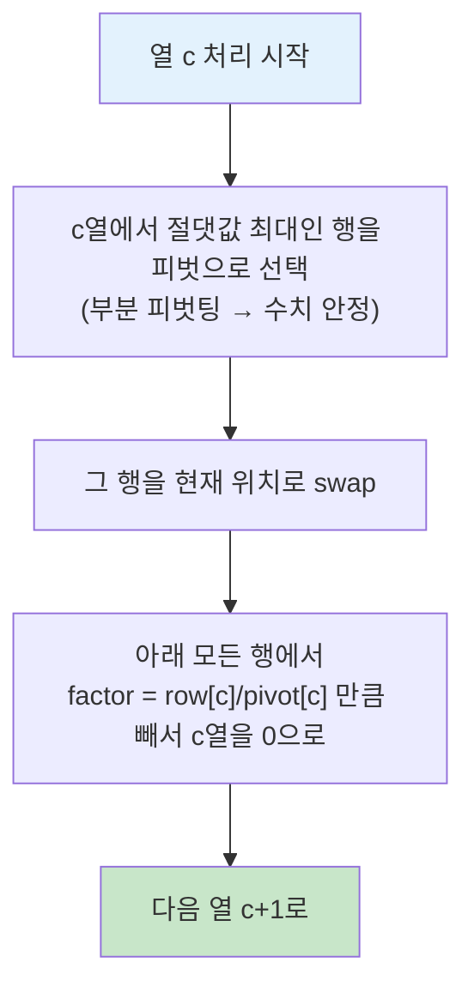

# 오늘의 주제: 가우스 소거법 (Gaussian Elimination / 연립일차방정식)

> 미지수 `n`개, 식 `n`개짜리 **연립일차방정식 `Ax = b`** 를 **O(n³)** 에 푼다.
> 핵심은 "행 연산으로 계수 행렬을 **위삼각형(사다리꼴)** 으로 만든 뒤, 아래에서 위로 **후진 대입**" 하는 것.
> 확률·기댓값 DP가 **순환(cyclic) 의존**을 가질 때, 그 순환을 방정식으로 세워서 한 방에 푸는 강력한 무기가 된다.

---

## 1. 언제 쓰는가

- 변수들이 서로를 **순환 참조**해서 일반 DP 순서를 못 정할 때 (예: 랜덤 워크 도달 기댓값, 흡수 마르코프 체인).
- 연립일차방정식의 유일해 / 부정 / 불능 판정.
- 행렬식(det), 역행렬, 랭크 계산.
- **XOR 연립방정식**(GF(2)) — 스위치 켜기/끄기, 라이트아웃류. (이건 실수 대신 비트로, 선형기저와 사촌지간)

> 핵심 신호: "**기댓값을 구하는데 상태 A가 B를 부르고 B가 다시 A를 부른다**" → 위상정렬이 안 됨 → 방정식 세우고 가우스 소거.

---

## 2. 왜 동작하는가 — 행 연산의 정당성

연립방정식의 해는 다음 세 가지 **행 연산(elementary row operation)** 에 대해 **불변**이다.

1. 두 행을 교환한다.
2. 한 행에 0이 아닌 상수를 곱한다.
3. 한 행에 다른 행의 상수배를 더한다.

이 연산들은 "같은 해집합을 갖는 동치인 방정식"으로만 바꾸므로, 계수 행렬을 다루기 쉬운 **사다리꼴**로 변형해도 해는 그대로다.


### 전진 소거 과정 (열마다 피벗을 세운다)



- **부분 피벗팅**(pivot으로 그 열의 최댓값 선택)은 0으로 나누기를 피하고 **부동소수 오차**를 줄인다. 실수 가우스 소거에선 거의 필수.

---

## 3. 대표 예제 ①: 실수 연립일차방정식

**문제:** `n`개의 식, `n`개의 미지수. `A x = b` 의 해 `x` 를 구하라.

### 핵심 아이디어
- 증강행렬 `[A | b]` 를 만들고, 열 `0..n-1` 을 차례로 피벗 삼아 아래를 0으로 소거.
- 다 끝나면 위삼각 → 마지막 변수부터 후진 대입.

### 시간복잡도
- 전진 소거 O(n³), 후진 대입 O(n²) → **전체 O(n³)**. n ≤ 수백 규모까지 안전.

```python
import sys

def gaussian(A, b):
    n = len(A)
    # 증강행렬 [A | b]
    M = [row[:] + [b[i]] for i, row in enumerate(A)]
    EPS = 1e-9

    for col in range(n):
        # 1) 부분 피벗팅: col열에서 절댓값 최대인 행 선택
        piv = max(range(col, n), key=lambda r: abs(M[r][col]))
        if abs(M[piv][col]) < EPS:
            return None  # 유일해 없음 (특이행렬: 부정 or 불능)
        M[col], M[piv] = M[piv], M[col]

        # 2) 피벗 행 정규화 (피벗을 1로)
        pv = M[col][col]
        M[col] = [v / pv for v in M[col]]

        # 3) 다른 모든 행에서 col열 소거
        for r in range(n):
            if r != col and abs(M[r][col]) > EPS:
                f = M[r][col]
                M[r] = [a - f * b_ for a, b_ in zip(M[r], M[col])]

    # 정규화까지 했으므로 마지막 열이 곧 해 (Gauss-Jordan 형태)
    return [M[i][n] for i in range(n)]

# 예)  x + y = 3,  2x - y = 0  →  x=1, y=2
print(gaussian([[1, 1], [2, -1]], [3, 0]))  # [1.0, 2.0]
```

> 위 코드는 피벗을 1로 정규화하고 **위쪽까지** 소거하는 **가우스-조던** 형태라 후진 대입이 따로 필요 없다. 구현이 깔끔해 코테에서 선호.

---

## 4. 대표 예제 ②: 순환 기댓값 DP를 방정식으로

**상황:** 정점들 사이를 확률적으로 이동한다. 각 정점 `i` 에서 목표 도달까지의 **기대 이동 횟수** `E[i]` 를 구하고 싶다. 그런데 `E[i]` 가 이웃 `E[j]` 에 의존하고, 그래프에 **사이클**이 있어 계산 순서를 못 정한다.

### 아이디어 — 정의식을 그대로 선형방정식으로
정점 `i` (목표 아님)에서, 이웃 집합 `nbr(i)` 로 균등 확률 이동한다면:

$$
E[i] = 1 + \frac{1}{\deg(i)} \sum_{j \in nbr(i)} E[j]
$$

이걸 미지수 `E[i]` 들에 대한 **일차식**으로 이항 정리하면:

$$
E[i] - \frac{1}{\deg(i)} \sum_{j} E[j] = 1
$$

목표 정점은 `E[target] = 0`. 이렇게 `n`개의 식을 세워 `A E = b` 를 가우스 소거로 풀면 순환이 있어도 한 번에 해가 나온다.

```python
def expected_steps(n, adj, target):
    # E[target]=0, 나머지는 E[i] - (1/deg) * sum E[j] = 1
    A = [[0.0] * n for _ in range(n)]
    b = [0.0] * n
    for i in range(n):
        if i == target:
            A[i][i] = 1.0          # E[target] = 0
            b[i] = 0.0
            continue
        deg = len(adj[i])
        A[i][i] = 1.0
        b[i] = 1.0
        for j in adj[i]:
            A[i][j] -= 1.0 / deg   # 이웃 항을 좌변으로
    return gaussian(A, b)          # 위의 gaussian 재사용
```

> **왜 DP로 못 푸나?** 위상정렬이 되는 DAG면 순서대로 채우면 되지만, 사이클이 있으면 `E[i]` 계산에 아직 안 정해진 `E[j]` 가 필요 → 순서 자체가 존재하지 않는다. 그래서 "동시에" 푸는 선형대수가 답.

---

## 5. XOR 가우스 소거 (GF(2)) — 스위치류 문제

계수가 0/1이고 덧셈이 XOR인 세계. 실수 나눗셈이 필요 없어 **정수 비트마스크**로 초고속.

```python
def xor_gauss(eqs, m):
    # eqs[i] = 정수 비트마스크. 하위 m비트=계수, m번째 비트=우변(b)
    rank = 0
    for col in range(m):
        piv = next((r for r in range(rank, len(eqs)) if (eqs[r] >> col) & 1), None)
        if piv is None:
            continue
        eqs[rank], eqs[piv] = eqs[piv], eqs[rank]
        for r in range(len(eqs)):
            if r != rank and (eqs[r] >> col) & 1:
                eqs[r] ^= eqs[rank]   # XOR 한 방에 소거
        rank += 1
    # 불능 체크: 계수부는 0인데 우변만 1인 식이 있으면 해 없음
    for e in eqs:
        if (e & ((1 << m) - 1)) == 0 and (e >> m) & 1:
            return None
    return rank  # 자유변수 개수 = m - rank → 해의 개수 2^(m-rank)
```

---

## 6. 자주 하는 실수 ⚠️

- **피벗팅 생략**: 부분 피벗팅 없이 그냥 `M[col][col]` 을 피벗으로 쓰면 0으로 나누거나 오차 폭발. 실수판은 반드시 절댓값 최대 행 선택.
- **EPS 비교**: `== 0` 대신 `abs(x) < 1e-9` 로 판정. 부동소수는 정확히 0이 잘 안 됨.
- **부정/불능 구분**: 피벗을 못 세운 열(자유변수)이 있으면 해가 **무한(부정)**, 계수는 0인데 우변이 0이 아닌 식이 남으면 **해 없음(불능)**. 유일해만 있다고 가정하지 말 것.
- **정수해가 필요한데 실수로 풀기**: 모듈러 소수 `p` 아래라면 나눗셈을 **모듈러 역원**으로 대체(가우스 over `Z_p`). 오차 없이 정확.
- **행/열 인덱스 혼동**: 증강행렬은 열이 `n+1`개(마지막이 b). 루프 범위 실수 잦음.

---

## 7. Python 템플릿 (모듈러 버전, Z_p)

```python
def gauss_mod(A, b, p):
    n = len(A)
    M = [[x % p for x in A[i]] + [b[i] % p] for i in range(n)]
    for col in range(n):
        piv = next((r for r in range(col, n) if M[r][col] % p), None)
        if piv is None:
            return None                     # 유일해 아님
        M[col], M[piv] = M[piv], M[col]
        inv = pow(M[col][col], p - 2, p)    # 페르마 소정리 역원 (p는 소수)
        M[col] = [(v * inv) % p for v in M[col]]
        for r in range(n):
            if r != col and M[r][col]:
                f = M[r][col]
                M[r] = [(a - f * bb) % p for a, bb in zip(M[r], M[col])]
    return [M[i][n] % p for i in range(n)]
```

---

## 한 줄 요약
- **순서를 못 정하는 순환 의존(특히 기댓값 DP)** 을 만나면 → 정의식을 일차방정식으로 세워 **가우스 소거 O(n³)**.
- 실수는 **부분 피벗팅 + EPS**, 정수 정확해는 **모듈러 역원**, 스위치류는 **XOR(GF(2)) 비트마스크**.
