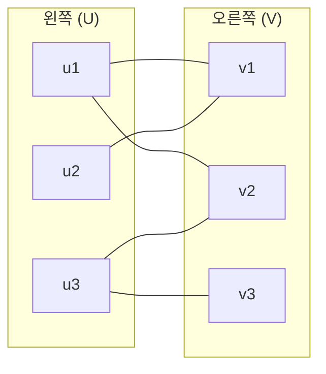
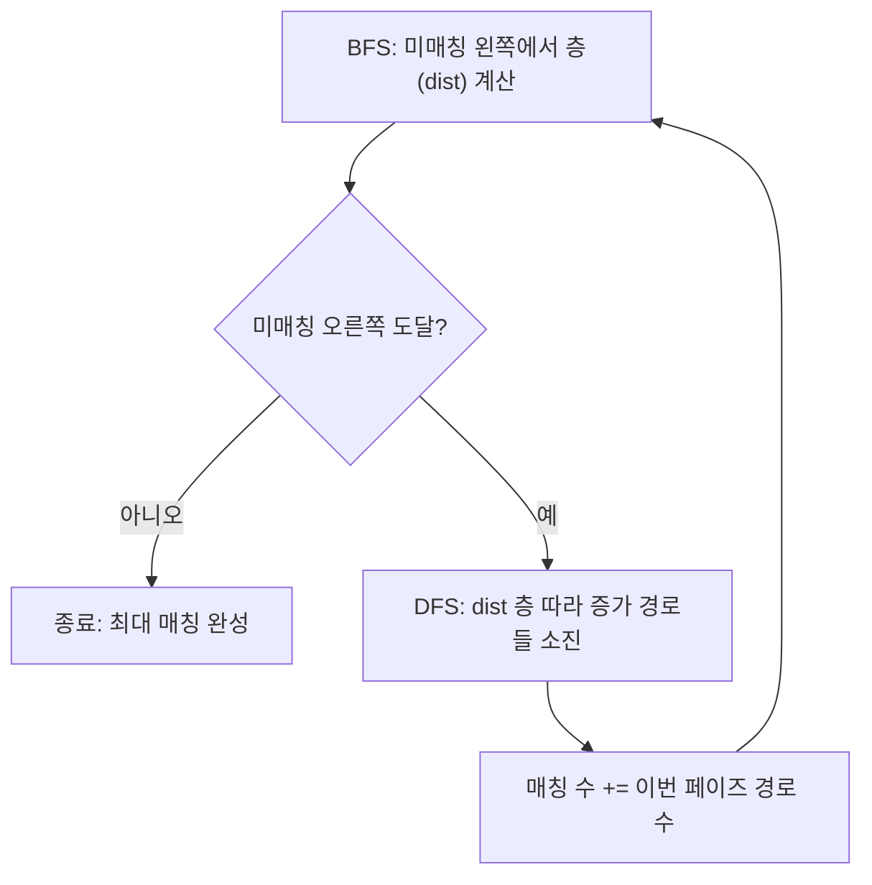

# 오늘의 주제: 홉크로프트–카프 (Hopcroft–Karp) — O(E√V) 이분 매칭

> 기본 이분 매칭은 왼쪽 정점을 하나씩 돌며 증가 경로 DFS를 한다 → **O(V·E)**.
> 홉크로프트–카프는 **"BFS로 최단 증가 경로 층을 만들고, 그 안에서 여러 개의 서로 겹치지 않는 증가 경로를 한 번에 DFS로 흘린다"**.
> 이 "한 페이즈에 여러 경로 동시 처리" 덕분에 **O(E√V)** 로 빨라진다.

정점/간선이 수만~수십만 개인 큰 이분 매칭에서 기본 매칭이 TLE 날 때 꺼내는 카드.
(디닉을 단위 용량 이분 그래프에 돌린 것과 사실상 같은 복잡도지만, 매칭 전용으로 짜면 코드가 더 간결하다.)

---

## 1. 언제 쓰나

- 이분 그래프에서 **최대 매칭**을 구하는데, 정점이 커서 O(V·E)가 부족할 때
- 대표: BOJ 11376/11377 열혈강호 2·3, 큰 축사 배정, 최소 정점 커버·최대 독립집합의 대규모 버전
- 쾨니그 정리(König)로 파생되는 문제(최소 정점 커버 = 최대 매칭)에서 규모가 클 때

> **핵심 기준:** 매칭 자체 로직은 기본 이분 매칭과 같고, "얼마나 빨리 증가 경로를 소진하느냐"만 다르다.
> V ≈ 10^4~10^5, E ≈ 10^5 이상이면 홉크로프트–카프를 고려.

---

## 2. 왜 √V 인가 (정당성/직관)

두 단계로 나눠 생각한다.

1. **각 페이즈는 O(E):** BFS 한 번(층 나누기) + DFS로 그 층의 최단 증가 경로들을 전부 소진 → 합쳐서 O(E).
2. **페이즈 수는 O(√V):**
   - 매 페이즈마다 **최단 증가 경로의 길이가 최소 2씩 증가**한다(단조 증가, 홉크로프트–카프 정리).
   - 최단 증가 경로 길이가 √V를 넘어가는 순간, 남은 (최대매칭 − 현재매칭) 개수가 O(√V) 이하임을 보일 수 있다.
   - 앞쪽 √V 페이즈 + 뒤쪽 √V 개의 남은 증가 → 총 **O(√V) 페이즈**.

∴ 전체 **O(E · √V)**.

> 직관: "짧은 경로를 무더기로 한꺼번에 처리 → 경로가 점점 길어짐 → 길어진 뒤엔 남은 개수가 적다."
> 그래서 페이즈 수가 √V로 눌린다.

---

## 3. 그래프 구조 & 층 분리(BFS)



- **BFS 단계:** 아직 매칭 안 된 왼쪽 정점들을 시작점(거리 0)으로 두고,
  `왼쪽 → (아무 간선) → 오른쪽 → (매칭 간선) → 왼쪽` 순으로 층(dist)을 매긴다.
  매칭 안 된 오른쪽 정점에 닿으면 "증가 경로 존재" 신호.
- **DFS 단계:** BFS가 만든 `dist` 층을 따라서만(딱 한 층씩 내려가며) 증가 경로를 찾아 매칭을 뒤집는다.
  여러 시작점에서 **서로 겹치지 않는** 최단 경로들을 한 페이즈에 모두 흘린다.



---

## 4. Python 템플릿

```python
import sys
from collections import deque
input = sys.stdin.readline
INF = float('inf')

def hopcroft_karp(n, m, adj):
    # 왼쪽 1..n, 오른쪽 1..m, adj[u] = u가 갈 수 있는 오른쪽 정점들
    matchL = [0] * (n + 1)   # matchL[u] = u의 짝 (오른쪽), 0=미매칭
    matchR = [0] * (m + 1)   # matchR[v] = v의 짝 (왼쪽),  0=미매칭
    dist = [0] * (n + 1)

    def bfs():
        q = deque()
        for u in range(1, n + 1):
            if matchL[u] == 0:
                dist[u] = 0
                q.append(u)
            else:
                dist[u] = INF
        found = False
        while q:
            u = q.popleft()
            for v in adj[u]:
                w = matchR[v]            # v의 현재 주인(왼쪽)
                if w == 0:
                    found = True          # 미매칭 오른쪽 도달 = 증가 경로 있음
                elif dist[w] == INF:
                    dist[w] = dist[u] + 1
                    q.append(w)
        return found

    def dfs(u):
        for v in adj[u]:
            w = matchR[v]
            # 비었거나(그 자리 바로 차지) / 다음 층의 주인을 밀어낼 수 있으면
            if w == 0 or (dist[w] == dist[u] + 1 and dfs(w)):
                matchL[u] = v
                matchR[v] = u
                return True
        dist[u] = INF   # 이 페이즈에서 u는 실패 → 재방문 차단
        return False

    matching = 0
    while bfs():
        for u in range(1, n + 1):
            if matchL[u] == 0 and dfs(u):
                matching += 1
    return matching
```

- 재귀 DFS가 깊어질 수 있으니 `sys.setrecursionlimit(10**6)` 잊지 말 것.
- `dist[u] = INF` 로 실패한 왼쪽 정점을 막는 게 기본 매칭의 `visited` 역할을 한다(페이즈 단위).

---

## 5. 예제 — BOJ 11376 열혈강호 2 (한 직원이 최대 2개 일)

각 직원이 **최대 2개**의 일을 할 수 있다 → 직원 `u`를 정점 2개 `u`, `u+N`으로 복제해서
표준 이분 매칭으로 환원. 규모가 커지면 홉크로프트–카프로 안전하게.

```python
import sys
from collections import deque
input = sys.stdin.readline
sys.setrecursionlimit(10**6)
INF = float('inf')

def solve():
    N, M = map(int, input().split())
    n = 2 * N                      # 직원을 2개로 복제
    adj = [[] for _ in range(n + 1)]
    for i in range(1, N + 1):
        data = list(map(int, input().split()))
        for job in data[1:]:
            adj[i].append(job)         # 원본
            adj[i + N].append(job)     # 복제본 (두 번째 일)

    matchL = [0] * (n + 1)
    matchR = [0] * (M + 1)
    dist = [0] * (n + 1)

    def bfs():
        q = deque()
        for u in range(1, n + 1):
            if matchL[u] == 0:
                dist[u] = 0; q.append(u)
            else:
                dist[u] = INF
        found = False
        while q:
            u = q.popleft()
            for v in adj[u]:
                w = matchR[v]
                if w == 0:
                    found = True
                elif dist[w] == INF:
                    dist[w] = dist[u] + 1; q.append(w)
        return found

    def dfs(u):
        for v in adj[u]:
            w = matchR[v]
            if w == 0 or (dist[w] == dist[u] + 1 and dfs(w)):
                matchL[u] = v; matchR[v] = u
                return True
        dist[u] = INF
        return False

    ans = 0
    while bfs():
        for u in range(1, n + 1):
            if matchL[u] == 0 and dfs(u):
                ans += 1
    print(ans)

solve()
```

- **시간복잡도:** O(E√V). 여기서 V는 복제 후 정점 수.
- **핵심 아이디어:** "최대 k개 담당" 제약 → 정점을 k개로 복제해 표준 매칭으로 환원.

---

## 6. 자주 하는 실수

- **`dist` 층 조건 누락:** DFS에서 `dist[w] == dist[u] + 1` 을 빼먹으면 최단 경로 층을 벗어나 O(√V) 보장이 깨진다(느려지거나 틀림).
- **실패 표시 `dist[u] = INF` 누락:** DFS 실패한 왼쪽 정점을 막지 않으면 같은 페이즈에서 재탐색 → 지수적 폭발.
- **matchL / matchR 둘 다 갱신:** 매칭을 뒤집을 때 **양쪽 배열을 동시에** 업데이트해야 일관성 유지.
- **BFS 시작점:** "미매칭 왼쪽 정점만" 큐에 넣는다. 전부 넣으면 층 계산이 틀림.
- **재귀 한도:** `setrecursionlimit` 안 하면 RecursionError. (경로 길이가 √V까지 커질 수 있음)
- **오버킬 주의:** 정점 수천 이하 소규모면 기본 이분 매칭으로 충분. 홉크로프트–카프는 큰 입력용.

---

## 7. 한 줄 요약

> **BFS로 최단 증가 경로 층을 만들고, 그 층 안에서 겹치지 않는 경로를 DFS로 한꺼번에 흘린다.**
> 경로가 페이즈마다 최소 2씩 길어져 페이즈 수가 √V로 눌리므로 **O(E√V)**.
