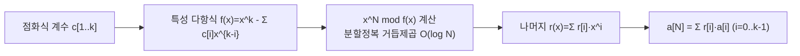

# 킷타마사(Kitamasa) + 베를레캄프-메시(Berlekamp-Massey)

> **오늘의 주제:** 선형 점화식(linear recurrence)의 **N번째 항을 빠르게** 구하기.
> - **킷타마사**: 점화식 계수를 알 때 `a[N]`을 O(k²·log N)에 계산 (k = 점화식 차수).
> - **베를레캄프-메시**: 수열의 앞부분만 보고 **점화식 자체를 복원**.
> 코테 언어는 **Python**.

---

## 1. 문제 상황

`a[n] = c[1]·a[n-1] + c[2]·a[n-2] + ... + c[k]·a[n-k]` 꼴의 점화식이 있다.
- N이 `10^18`처럼 크면 O(N) DP로는 불가능.
- 행렬 거듭제곱은 O(k³·log N). k가 크면 세제곱이 부담.
- **킷타마사는 O(k²·log N)** — 행렬 거듭제곱을 다항식 연산으로 대체해 한 차원을 줄인다.

대표 예: 피보나치 `a[n]=a[n-1]+a[n-2]` → k=2, c=[1,1].

---

## 2. 킷타마사 핵심 아이디어 (왜 동작하는가)

행렬 거듭제곱을 떠올리면, `a[N]`은 전이행렬 `T`의 `T^N`으로 표현된다.
킷타마사는 **"x를 한 칸 이동(shift) 연산자"** 로 보고, `x^N`을
**특성 다항식 `f(x) = x^k − c[1]x^{k-1} − ... − c[k]` 로 나눈 나머지 다항식**으로 바꾼다.

- 케일리-해밀턴 정리에 의해 `f(T) = 0`. 즉 `T^k = c[1]T^{k-1} + ...`.
- 따라서 `x^N mod f(x)` 를 구하면, 그 나머지 다항식 `r(x)=Σ r[i]·x^i` 의 계수로
  `a[N] = Σ r[i]·a[i]` (i=0..k-1) 가 성립.
- `x^N mod f(x)` 는 **다항식에서의 분할정복 거듭제곱**으로 O(log N)번의
  다항식 곱셈(O(k²)) → 전체 **O(k²·log N)**.



### 자주 하는 실수
- **모듈러**: 곱셈 후 반드시 `% MOD`. Python 큰 정수라도 속도·범위 위해 매 스텝 mod.
- **초기값 개수**: `a[0..k-1]` 최소 k개가 필요. 인덱스 오프셋(0-based/1-based) 헷갈림 주의.
- **N < k** 인 경우: 그냥 `a[N]` 초기값을 바로 반환 (거듭제곱 로직 타지 않게 분기).
- 다항식 mod에서 나머지 차수는 항상 `< k` 로 유지되어야 함.

---

## 3. 킷타마사 Python 템플릿

```python
MOD = 10**9 + 7

def kitamasa(rec, init, n):
    """rec: [c1,c2,...,ck]  (a[n]=Σ ci*a[n-i]),  init: [a0,...,a_{k-1}]"""
    k = len(rec)
    if n < k:
        return init[n] % MOD

    # 다항식 곱 후 f(x)로 나눈 나머지 (차수 < k 유지)
    def mul(a, b):
        res = [0] * (len(a) + len(b) - 1)
        for i, av in enumerate(a):
            if av:
                for j, bv in enumerate(b):
                    res[i + j] = (res[i + j] + av * bv) % MOD
        # x^k = Σ rec[i]*x^{k-1-i} 로 차수 내림
        for i in range(len(res) - 1, k - 1, -1):
            coef = res[i]
            if coef:
                for j in range(k):
                    res[i - 1 - j] = (res[i - 1 - j] + coef * rec[j]) % MOD
                res[i] = 0
        return res[:k]

    # x^n mod f(x) 를 분할정복 거듭제곱으로
    result = [1]            # 다항식 1
    base = [0, 1] if k > 1 else [rec[0] % MOD]   # x (k=1이면 x≡rec[0])
    e = n
    while e:
        if e & 1:
            result = mul(result, base)
        base = mul(base, base)
        e >>= 1

    ans = 0
    for i in range(k):
        if i < len(result):
            ans = (ans + result[i] * init[i]) % MOD
    return ans

# 피보나치: a[n]=a[n-1]+a[n-2], a0=0,a1=1
print(kitamasa([1, 1], [0, 1], 10))   # 55
print(kitamasa([1, 1], [0, 1], 10**18) % MOD)
```

- **시간복잡도:** O(k²·log N), **공간:** O(k).

---

## 4. 베를레캄프-메시: 점화식 복원

수열 `a[0..m-1]`만 주어졌을 때, 이를 만족하는 **최단 선형 점화식 계수**를 찾는다.
- 코딩테스트에서 "규칙은 모르지만 앞 몇 항을 손으로/브루트포스로 구할 수 있는" 문제에 강력.
- 앞 항 `2k`개 정도만 정확하면 차수 k 점화식을 복원할 수 있다.

```python
def berlekamp_massey(s):
    """s의 최단 선형점화식 rec 반환: a[n]=Σ rec[i]*a[n-1-i]"""
    ls, cur = [], []
    lf = ld = 0
    for i in range(len(s)):
        t = 0
        for j in range(len(cur)):
            t = (t + cur[j] * s[i - 1 - j]) % MOD
        if (s[i] - t) % MOD == 0:
            continue
        if not cur:
            cur = [0] * (i + 1)
            lf, ld = i, (s[i] - t) % MOD
            continue
        k = (s[i] - t) * pow(ld, MOD - 2, MOD) % MOD  # 페르마 역원
        c = [0] * (i - lf - 1) + [k]
        c += [(-k * x) % MOD for x in ls]
        if len(c) < len(cur):
            c += [0] * (len(cur) - len(c))
        for j in range(len(cur)):
            c[j] = (c[j] + cur[j]) % MOD
        if i - len(cur) >= lf - len(ls):
            ls, lf, ld = cur[:], i, (s[i] - t) % MOD
        cur = c
    return cur

# 앞 항으로부터 점화식 복원 → 킷타마사로 N번째 항
seq = [0, 1, 1, 2, 3, 5, 8, 13]        # 피보나치
rec = berlekamp_massey(seq)             # [1, 1]
print(rec)
print(kitamasa(rec, seq[:len(rec)], 10**18) % MOD)
```

- **베를레캄프-메시:** O(m·k), **활용 패턴:** *앞 항 brute-force → BM으로 점화식 → 킷타마사로 큰 N*.

---

## 5. 정리 / 언제 쓰나

- **선형 점화식 + 매우 큰 N** → 킷타마사 (행렬거듭제곱보다 k 한 차원 이득).
- **점화식을 모르지만 수열 앞부분을 알 때** → BM으로 복원 후 킷타마사.
- 그래프 경로 수, 조합적 카운팅, DP 값이 선형 점화식을 따르면 이 콤보가 매우 강력.
- **주의:** 복원된 점화식이 맞는지 몇 항 검증할 것. 모듈러 소수(1e9+7 등)에서만 역원 사용 가능.
