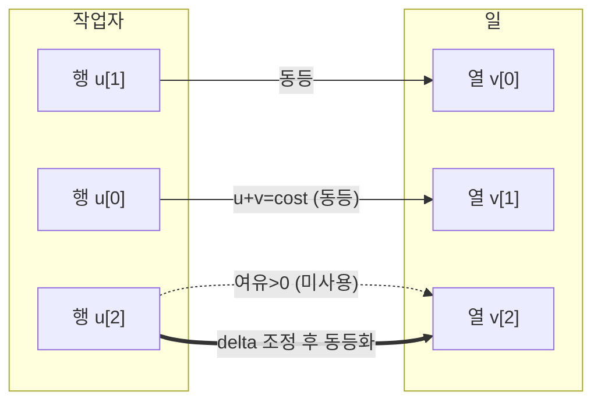

# 오늘의 주제: 헝가리안 알고리즘 (Hungarian / Kuhn–Munkres) — O(n³) 최적 할당

> N명의 작업자를 N개의 일에 **1:1로 배정**할 때, 총비용을 **최소**(또는 최대)로 만드는 문제를 **O(n³)** 에 푼다.
> 비용 행렬 `cost[i][j]` (작업자 i가 일 j를 할 때 비용)가 주어질 때 최적 완전매칭을 찾는다.

---

## 1. 언제 쓰나 — 다른 방법과의 경계

| 방법 | 복잡도 | 한계 |
|---|---|---|
| 비트마스킹 assignment DP | `O(2^N · N)` | N ≤ 20 정도 |
| MCMF (SPFA/다익스트라) | 사실상 `O(V·E·f)` | 상수 크고 구현 번거로움 |
| **헝가리안** | **`O(N³)`** | **N ≤ 500~1000 도 여유** |

- **가중치가 있는** 완전 이분매칭 = 할당 문제(assignment problem)의 정석.
- N이 커서 비트마스킹이 안 되고, MCMF는 상수가 부담될 때 헝가리안이 답.
- **최대화**가 필요하면 `cost[i][j] → -cost[i][j]` 로 부호를 뒤집거나 `M - cost[i][j]` 로 변환.

---

## 2. 왜 동작하는가 — 핵심 아이디어

두 개의 **잠재값(potential)** `u[i]`(행), `v[j]`(열)를 유지한다. 다음 **불변식**을 항상 지킨다.

$$u[i] + v[j] \le cost[i][j] \quad \forall i,j$$

- 이때 임의의 완전매칭 비용은 $\sum cost \ge \sum(u+v)$ 이므로, $\sum u + \sum v$ 는 **최적해의 하한(dual)**.
- 등식 `u[i]+v[j] == cost[i][j]` 인 간선만 모은 **동등 그래프(equality graph)** 에서 완전매칭을 찾으면, 그 매칭이 곧 **최적** (약쌍대성 → 강쌍대성으로 딱 맞음).

**진행 방식**: 행을 하나씩 추가하며(증가경로 탐색) 동등 그래프에서 매칭을 못 늘리면, 잠재값을 최소 여유량 `delta` 만큼 조정해 새 동등 간선을 만든다. 조정은 불변식을 깨지 않으므로 항상 안전하다.



핵심: **한 번에 한 행씩** 매칭에 편입하고, 각 편입마다 `O(N²)` → 전체 `O(N³)`.

---

## 3. 대표 예제 — BOJ 14003류 최소비용 배정 (assignment)

**문제 유형**: N×N 비용 행렬. i번째 사람이 j번째 일을 하면 `a[i][j]` 비용. 모든 사람이 서로 다른 일을 하나씩 맡을 때 **최소 총비용**.

### 시간복잡도
- 각 행 편입 O(N²), 행이 N개 → **O(N³)**. N=500이면 ~1.25억, Python도 PyPy/제출 시 통과권.

### Python 템플릿 (1-indexed, O(n³) 표준형)

```python
import sys
input = sys.stdin.readline
INF = float('inf')

def hungarian(cost):
    """cost: n x n (0-indexed). 최소 할당 비용과 매칭(col->row) 반환."""
    n = len(cost)
    # 1-indexed 잠재값/보조배열
    u = [0] * (n + 1)          # 행 잠재값
    v = [0] * (n + 1)          # 열 잠재값
    p = [0] * (n + 1)          # p[j] = 열 j에 매칭된 행 (0=미매칭)
    way = [0] * (n + 1)        # 증가경로 복원용

    for i in range(1, n + 1):
        p[0] = i               # 현재 편입하려는 행을 가짜 열 0에 걸어둠
        j0 = 0
        minv = [INF] * (n + 1)  # 각 열까지의 최소 여유량
        used = [False] * (n + 1)
        # 동등 그래프에서 증가경로를 찾을 때까지 잠재값 조정 반복
        while True:
            used[j0] = True
            i0 = p[j0]
            delta = INF
            j1 = -1
            for j in range(1, n + 1):
                if not used[j]:
                    cur = cost[i0 - 1][j - 1] - u[i0] - v[j]
                    if cur < minv[j]:
                        minv[j] = cur
                        way[j] = j0
                    if minv[j] < delta:
                        delta = minv[j]
                        j1 = j
            # 잠재값 갱신 (불변식 유지)
            for j in range(n + 1):
                if used[j]:
                    u[p[j]] += delta
                    v[j] -= delta
                else:
                    minv[j] -= delta
            j0 = j1
            if p[j0] == 0:     # 미매칭 열 도달 → 증가경로 완성
                break
        # 증가경로를 따라 매칭 갱신
        while j0:
            j1 = way[j0]
            p[j0] = p[j1]
            j0 = j1

    # 결과 집계
    match = [0] * n            # match[row] = col
    total = 0
    for j in range(1, n + 1):
        match[p[j] - 1] = j - 1
        total += cost[p[j] - 1][j - 1]
    return total, match

n = int(input())
cost = [list(map(int, input().split())) for _ in range(n)]
ans, _ = hungarian(cost)
print(ans)
```

### 핵심 아이디어 요약
- `minv[j]`: 아직 안 쓴 열 j로 가는 **최소 여유량**. 증가경로 탐색을 매번 O(N)에 확장.
- `delta` 만큼 잠재값 밀기 → 새 동등 간선 생성. **used 표시된 행은 u 증가, 열은 v 감소**, 나머지 열은 `minv` 감소로 상쇄.
- `way[]` 로 증가경로를 역추적해 매칭을 뒤집는다.

---

## 4. 자주 하는 실수

- **최대화 문제를 그대로 최소화 코드에 넣기** → 반드시 부호 반전(`-cost`) 또는 `BIG - cost` 변환.
- **직사각형(비정방) 행렬**: N≠M이면 **정사각형으로 패딩**(부족한 쪽을 비용 0/INF 더미로 채움).
- 잠재값 갱신 루프에서 **`j=0`(가짜 열)도 포함**해야 함. 빼먹으면 불변식 깨짐.
- 최댓값/오버플로: Python은 안전하지만, 다른 언어 이식 시 `INF` 덧셈 주의.
- 반환 매칭 인덱스: 위 템플릿은 `p[j]` 가 **1-indexed 행**, `match`는 0-indexed로 변환해 돌려줌 — off-by-one 조심.

---

## 5. Python 치트 (핵심만)

```python
# 최대화하고 싶다면:
BIG = max(max(row) for row in cost)
cost = [[BIG - x for x in row] for row in cost]   # 부호 변환 후 hungarian() 호출
# 결과 total은 다시 (n*BIG - total) 로 환산
```

- 완전매칭 못 찾는 경우(불가능 간선=INF)까지 다루려면 INF를 큰 상수로 두고 결과가 임계 이상이면 "불가능" 판정.
- N ≤ 20 이고 부분집합 상태가 필요하면 비트마스킹 DP가 더 단순 → 노트 `2026-06-25-비트마스킹DP.md` 참고.
