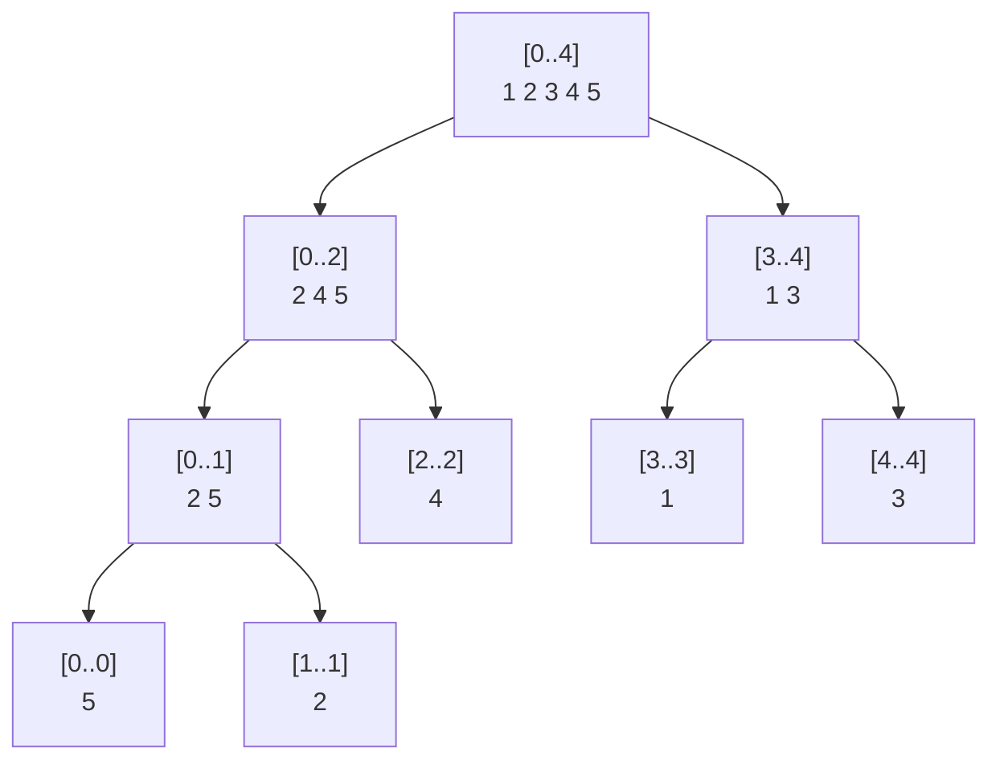

# 머지 소트 트리 (Merge Sort Tree)

> **오늘의 주제: 머지 소트 트리 — 구간 안에서 "특정 값 이하/초과 개수", "k번째 수"를 로그제곱에 세는 자료구조**

---

## 1. 왜 쓰는가

세그먼트 트리는 각 노드에 "구간의 합/최소" 같은 **스칼라** 하나만 담는다.
머지 소트 트리는 각 노드에 그 구간의 **정렬된 원소 리스트 전체**를 담는다.

이렇게 하면 "구간 `[l, r]` 에 값이 `x` 이하인 원소가 몇 개?" 같은 질문에,
구간을 덮는 `O(log n)` 개의 노드마다 정렬된 리스트에서 **이분 탐색**만 하면 된다.

- 쓰는 순간: **정적 배열**(값이 안 바뀜) + **구간 순위/개수 카운트** 쿼리가 여러 번
- 대표 문제: 백준 13537 (수열과 쿼리 1 — 구간 내 x 초과 개수), 7469 (K번째 수), 2517 등

> 값이 바뀌는(업데이트) 버전이 필요하면 → 머지 소트 트리 대신 **PST(퍼시스턴트 세그먼트 트리)** 나 **BIT + 오프라인 정렬**로 간다. 머지 소트 트리는 "정적 + 오프라인/온라인 카운트"에 최적.

---

## 2. 구조

세그먼트 트리와 똑같은 트리 모양이되, 리프에는 원소 하나, 내부 노드에는 **왼쪽·오른쪽 자식 리스트를 병합(merge)** 한 정렬 리스트가 들어간다. 병합 정렬(merge sort)이 트리에 그대로 굳은 형태라 이름이 이렇다.

배열 `[5, 2, 4, 1, 3]` 의 머지 소트 트리:



- 각 레벨의 리스트 길이 합 = `n` → 전체 메모리 **`O(n log n)`**
- 빌드: 자식 두 리스트를 merge → **`O(n log n)`**

---

## 3. 핵심 아이디어 (정당성)

쿼리 `[l, r]` 에서 `x` **초과** 개수를 셀 때:

1. 세그먼트 트리처럼 `[l, r]` 을 완전히 덮는 노드들로 분해 → `O(log n)` 개
2. 각 노드의 **정렬 리스트**에서 `bisect_right(리스트, x)` 로 "x 이하 개수"를 구함
3. `구간길이 - (x 이하 개수)` = x 초과 개수, 다 더한다

각 노드에서 이분 탐색 `O(log n)`, 노드 `O(log n)` 개 → 쿼리당 **`O(log² n)`**.

정당성: 세그먼트 분해가 서로소이고 합집합이 정확히 `[l, r]` 이므로, 노드별 카운트의 합 = 전체 구간의 카운트. 각 노드 리스트는 그 구간 원소를 빠짐없이 담고 정렬돼 있으니 이분 탐색이 정확하다.

---

## 4. 시간복잡도 정리

| 연산 | 복잡도 |
|------|--------|
| 빌드 | `O(n log n)` |
| 구간 "x 이하/초과 개수" | `O(log² n)` |
| 구간 k번째 수 (병렬 이분 탐색) | `O(log² n)` |
| 메모리 | `O(n log n)` |

---

## 5. 예제 1 — 백준 13537 (구간 내 x 초과 개수)

수열이 주어지고, 쿼리 `(l, r, x)` 마다 `[l, r]` 안에서 `x` 보다 큰 원소 개수를 출력.

```python
import sys
from bisect import bisect_right
input = sys.stdin.readline

def build(node, s, e):
    if s == e:
        tree[node] = [arr[s]]
        return
    m = (s + e) // 2
    build(2*node, s, m)
    build(2*node+1, m+1, e)
    # 두 정렬 리스트 병합
    L, R = tree[2*node], tree[2*node+1]
    merged, i, j = [], 0, 0
    while i < len(L) and j < len(R):
        if L[i] <= R[j]: merged.append(L[i]); i += 1
        else:            merged.append(R[j]); j += 1
    merged.extend(L[i:]); merged.extend(R[j:])
    tree[node] = merged

def query(node, s, e, l, r, x):
    if r < s or e < l:
        return 0
    if l <= s and e <= r:
        # x 이하 개수 = bisect_right, 초과 개수 = 길이 - 그 값
        return len(tree[node]) - bisect_right(tree[node], x)
    m = (s + e) // 2
    return query(2*node, s, m, l, r, x) + query(2*node+1, m+1, e, l, r, x)

n = int(input())
arr = list(map(int, input().split()))
tree = [[] for _ in range(4 * n)]
build(1, 0, n-1)

out = []
for _ in range(int(input())):
    l, r, x = map(int, input().split())
    out.append(str(query(1, 0, n-1, l-1, r-1, x)))
print('\n'.join(out))
```

- 핵심: 리프에서 `[arr[s]]`, 내부에서 자식 병합. 쿼리는 `len - bisect_right`.
- 시간복잡도: 빌드 `O(n log n)`, 쿼리 `O(log² n)`.

---

## 6. 예제 2 — 백준 7469 (구간 K번째 수)

`[l, r]` 에서 오름차순 `k`번째 값을 찾는다. **정답 값에 대한 이분 탐색** + 머지 소트 트리로 "≤ mid 개수" 판정.

```python
import sys
from bisect import bisect_right
input = sys.stdin.readline

def count_le(node, s, e, l, r, x):  # [l,r] 안 x 이하 개수
    if r < s or e < l: return 0
    if l <= s and e <= r: return bisect_right(tree[node], x)
    m = (s + e) // 2
    return count_le(2*node, s, m, l, r, x) + count_le(2*node+1, m+1, e, l, r, x)

# ... build 은 예제1과 동일 ...
# 값 좌표를 정렬해두고, lo/hi 를 값의 인덱스 범위로 이분 탐색
def kth(l, r, k, vals):
    lo, hi = 0, len(vals) - 1
    while lo < hi:
        mid = (lo + hi) // 2
        if count_le(1, 0, n-1, l, r, vals[mid]) >= k:
            hi = mid
        else:
            lo = mid + 1
    return vals[lo]
```

- 아이디어: "`x` 이하 개수 ≥ k 를 만족하는 가장 작은 `x`" = k번째 수.
- 값 좌표압축(`vals = sorted(set(arr))`)으로 이분 탐색 범위를 줄인다.

---

## 7. 자주 하는 실수

- **`bisect_right` vs `bisect_left` 혼동**: "x 이하 개수"는 `bisect_right`, "x 미만 개수"는 `bisect_left`. "초과 개수 = 길이 − 이하 개수" 공식을 헷갈리면 오프바이원.
- **1-indexed 입력을 0-indexed로 안 바꿈**: 문제는 보통 `l, r` 이 1부터. `l-1, r-1` 처리 필수.
- **업데이트가 있는 문제에 머지 소트 트리를 씀**: 값이 바뀌면 정렬 리스트를 전부 손봐야 해서 비효율. 그런 경우 PST/BIT-오프라인으로.
- **재귀 병합에서 파이썬 재귀 한계**: `n` 크면 `sys.setrecursionlimit` 올리거나 반복 빌드로.
- **메모리**: `O(n log n)` 이라 `n=10^5` 이면 리스트 총합 약 170만 원소. `4*n` 노드 배열 미리 할당 권장.

---

## 8. Python 템플릿

```python
import sys
from bisect import bisect_left, bisect_right

class MergeSortTree:
    def __init__(self, arr):
        self.n = len(arr)
        self.tree = [[] for _ in range(4 * self.n)]
        self._build(1, 0, self.n - 1, arr)

    def _build(self, node, s, e, arr):
        if s == e:
            self.tree[node] = [arr[s]]
            return
        m = (s + e) // 2
        self._build(2*node, s, m, arr)
        self._build(2*node+1, m+1, e, arr)
        L, R = self.tree[2*node], self.tree[2*node+1]
        merged, i, j = [], 0, 0
        while i < len(L) and j < len(R):
            if L[i] <= R[j]: merged.append(L[i]); i += 1
            else:            merged.append(R[j]); j += 1
        merged.extend(L[i:]); merged.extend(R[j:])
        self.tree[node] = merged

    def _count_le(self, node, s, e, l, r, x):
        if r < s or e < l: return 0
        if l <= s and e <= r: return bisect_right(self.tree[node], x)
        m = (s + e) // 2
        return (self._count_le(2*node, s, m, l, r, x)
              + self._count_le(2*node+1, m+1, e, l, r, x))

    def count_le(self, l, r, x):   # [l,r] 안 x 이하 개수
        return self._count_le(1, 0, self.n-1, l, r, x)

    def count_gt(self, l, r, x):   # [l,r] 안 x 초과 개수
        return (r - l + 1) - self.count_le(l, r, x)
```

---

## 요약

- 노드마다 **정렬 리스트**를 저장 → 구간 카운트/순위를 `O(log² n)` 에 처리.
- 정적 배열 + 반복 카운트 쿼리에 최적. 업데이트 필요하면 PST로.
- 핵심 공식: **초과 개수 = 구간길이 − `bisect_right`(리스트, x)**.
