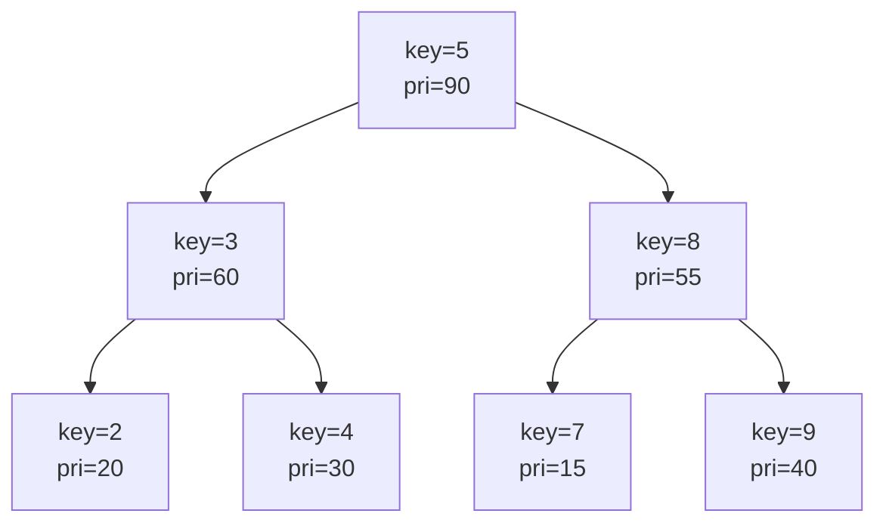

# 트립 (Treap / Cartesian Tree, Merge–Split 기반 균형 BST)

**오늘의 주제: 트립(Treap) — 키(BST 성질) + 우선순위(힙 성질)를 함께 갖는 균형 이진 탐색 트리, 그리고 인덱스를 키로 쓰는 암묵적 트립(Implicit Treap)**

---

## 1. 한 줄 요약

- **Tree + Heap = Treap.** 각 노드에 **키(key)** 와 **랜덤 우선순위(priority)** 를 둔다.
  - **키**는 BST 규칙(왼쪽 < 부모 < 오른쪽)을 만족하고,
  - **우선순위**는 힙 규칙(부모의 우선순위 ≥ 자식)을 만족한다.
- 우선순위를 랜덤으로 뽑으면 트리 모양이 **랜덤 BST와 동일**해져, 기대 높이가 **O(log n)** 이 된다.
- 회전(rotation) 대신 **merge / split** 두 연산만으로 삽입·삭제·구간 연산을 전부 처리 → 구현이 짧고 확장이 쉽다.

> 왜 균형이 잡히나? 서로 다른 랜덤 우선순위 집합에 대해 트립 모양은 **유일하게 결정**된다. 즉 "키를 우선순위 오름차순으로 삽입한 BST"와 같으므로, 랜덤 삽입 순서의 BST 기대 깊이 O(log n)을 그대로 물려받는다.

---

## 2. 구조와 불변식



- 가로로 읽으면(중위순회) 키가 **2,3,4,5,7,8,9** → 정렬 (BST 성질)
- 세로로 읽으면 부모 pri ≥ 자식 pri → 최대 힙 (Heap 성질)

---

## 3. 핵심 연산: split & merge

모든 것이 이 둘로 환원된다.

- **split(t, key)** → `(L, R)`: 트리 t를 "키 < key인 노드들(L)" 과 "키 ≥ key인 노드들(R)"로 쪼갠다.
- **merge(L, R)**: L의 모든 키 < R의 모든 키일 때, 두 트리를 하나로 합친다. (우선순위가 큰 쪽이 루트가 됨)

```python
import sys, random
input = sys.stdin.readline

class Node:
    __slots__ = ('key', 'pri', 'l', 'r', 'size')
    def __init__(self, key):
        self.key = key
        self.pri = random.random()   # 랜덤 우선순위
        self.l = self.r = None
        self.size = 1

def sz(t): return t.size if t else 0
def upd(t):
    if t: t.size = 1 + sz(t.l) + sz(t.r)
    return t

def split(t, key):
    # 키 < key → L, 키 >= key → R
    if not t:
        return (None, None)
    if t.key < key:
        l, r = split(t.r, key)
        t.r = l; upd(t)
        return (t, r)
    else:
        l, r = split(t.l, key)
        t.l = r; upd(t)
        return (l, t)

def merge(a, b):
    if not a or not b:
        return a or b
    if a.pri > b.pri:        # a가 루트
        a.r = merge(a.r, b); return upd(a)
    else:                    # b가 루트
        b.l = merge(a, b.l); return upd(b)
```

---

## 4. 삽입 / 삭제 / 탐색

```python
def insert(t, key):
    l, r = split(t, key)
    # 중복 방지하려면 여기서 존재 검사 후 스킵
    return merge(merge(l, Node(key)), r)

def erase(t, key):
    l, r = split(t, key)          # l: <key, r: >=key
    _, r2 = split(r, key + 1)     # 가운데(=key)를 떼어내 버림 (정수 키 가정)
    return merge(l, r2)

def kth(t, k):                    # 0-indexed k번째로 작은 키
    while t:
        left = sz(t.l)
        if k < left:      t = t.l
        elif k == left:   return t.key
        else:             k -= left + 1; t = t.r
    return None
```

- **핵심 아이디어:** 삽입은 "쪼개고 새 노드 끼워 다시 합치기". 균형은 랜덤 우선순위 + merge가 자동으로 유지.
- **시간복잡도:** split, merge, insert, erase, kth 모두 기대 **O(log n)**.

---

## 5. 암묵적 트립 (Implicit Treap) — 배열을 O(log n)에

키를 값이 아니라 **"현재 왼쪽 서브트리 크기(= 인덱스)"** 로 해석한다. 그러면 트립이 **동적 배열**이 되어, 다음을 전부 O(log n)에 지원한다.

- k번째 위치에 삽입 / 삭제
- **임의 구간 [l, r]을 통째로 잘라 다른 위치로 이동/뒤집기(reverse)**

split의 기준이 "키 비교"에서 "왼쪽 크기 개수"로 바뀐다.

```python
def split_by_size(t, k):
    # 앞에서 k개(L) / 나머지(R)
    if not t:
        return (None, None)
    if sz(t.l) < k:
        l, r = split_by_size(t.r, k - sz(t.l) - 1)
        t.r = l; upd(t)
        return (t, r)
    else:
        l, r = split_by_size(t.l, k)
        t.l = r; upd(t)
        return (l, t)
```

**구간 뒤집기**는 lazy 플래그를 얹는다: `[l,r]`을 split 3조각으로 떼어, 가운데 조각 루트에 `rev` 토글 → merge. push down 시 좌우 자식을 swap.

```python
def push(t):
    if t and t.rev:
        t.l, t.r = t.r, t.l
        if t.l: t.l.rev ^= True
        if t.r: t.r.rev ^= True
        t.rev = False
```

> 백준 예: **13159 배열**(구간 뒤집기·이동·min/max/sum 쿼리)이 암묵적 트립의 대표 문제.

---

## 6. 자주 하는 실수

- **upd 누락:** split/merge 후 `size`(및 sum 등 집계값) 갱신을 빼먹으면 kth·구간쿼리가 조용히 틀린다. 자식 포인터를 바꾸면 **항상** upd.
- **split 경계:** "`< key` vs `>= key`" 규칙을 함수마다 뒤섞으면 중복/누락. 한 컨벤션으로 통일.
- **재귀 깊이:** Python은 기본 재귀 한도가 낮다. `sys.setrecursionlimit(300000)` + 되도록 iterative(kth 등). 큰 n은 재귀 split이 스택을 먹으니 주의.
- **lazy 미전파:** 암묵적 트립에서 split/merge 진입 전에 `push(t)`를 먼저 호출하지 않으면 뒤집기 상태가 꼬인다.
- **우선순위 충돌:** `random.random()`(float) 또는 64bit 정수 랜덤 사용. `randint(1,100)`처럼 좁은 범위는 충돌 → 편향된 트리.

---

## 7. Python 템플릿 (일반 트립: 정렬셋 + kth + 순위)

```python
import sys, random
sys.setrecursionlimit(1 << 20)

class Node:
    __slots__ = ('key','pri','l','r','size')
    def __init__(s,k): s.key=k; s.pri=random.random(); s.l=s.r=None; s.size=1

def sz(t): return t.size if t else 0
def upd(t):
    if t: t.size = 1 + sz(t.l) + sz(t.r)
    return t

def split(t,key):
    if not t: return (None,None)
    if t.key < key:
        l,r = split(t.r,key); t.r=l; return (upd(t), r)
    else:
        l,r = split(t.l,key); t.l=r; return (l, upd(t))

def merge(a,b):
    if not a or not b: return a or b
    if a.pri > b.pri: a.r=merge(a.r,b);   return upd(a)
    else:             b.l=merge(a,b.l);   return upd(b)

def insert(t,key):
    l,r = split(t,key); return merge(merge(l,Node(key)),r)

def erase(t,key):
    l,r = split(t,key); _,r2 = split(r,key+1); return merge(l,r2)

def order_of(t,key):        # key보다 작은 원소 개수 (rank)
    l,r = split(t,key); c = sz(l); return merge(l,r), c

def kth(t,k):               # 0-indexed
    while t:
        left = sz(t.l)
        if k<left: t=t.l
        elif k==left: return t.key
        else: k-=left+1; t=t.r
    return None
```

- **언제 쓰나:** `SortedList`가 필요한데 커스텀 집계(구간 합/최댓값)까지 얹고 싶을 때, 혹은 **구간 이동/뒤집기**가 필요할 때. 단순 순위/kth만이면 펜윅+좌표압축이 상수가 더 빠르다.

---

## 8. 복잡도 요약

| 연산 | 기대 시간 |
|------|-----------|
| split / merge | O(log n) |
| insert / erase / find | O(log n) |
| kth / rank(order_of) | O(log n) |
| 구간 뒤집기·이동 (implicit) | O(log n) |
| 전체 높이 | 기대 O(log n) (최악 O(n)이나 확률적으로 무시 가능) |

---

## 9. 대표 문제

- **BOJ 13159 배열** — 암묵적 트립: 구간 뒤집기·이동 + min/max/sum 쿼리 (대표 종합 문제)
- **BOJ 3392 / SortedList류** — kth·rank로 트립 연습
- 코드포스: implicit treap로 "insert/erase at position + range reverse" 유형 다수
