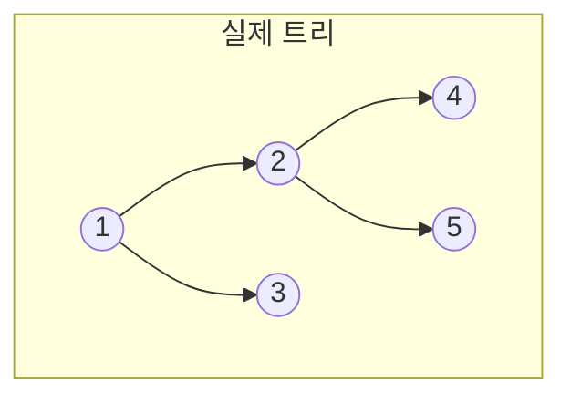
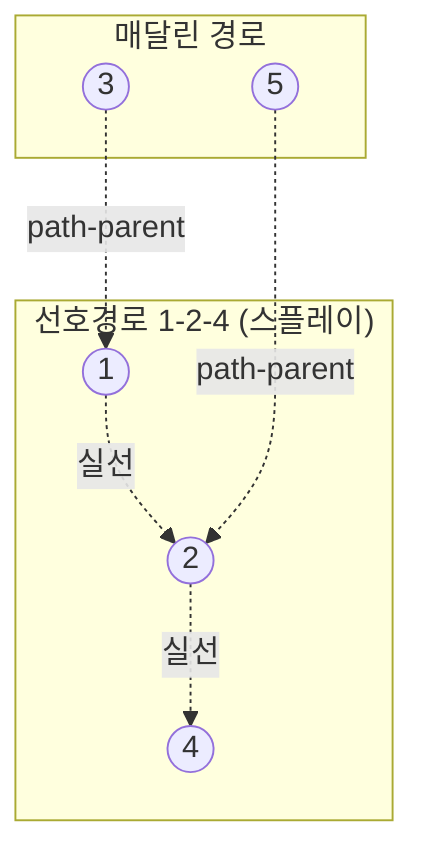

# 링크컷 트리 (Link-Cut Tree, LCT / 동적 트리)

> **오늘의 주제: 링크컷 트리 (Link-Cut Tree, 동적 트리)**
> 간선이 **추가·삭제되는 포레스트(숲)** 에서 경로 쿼리(합/최댓값), 루트 변경, 연결성 판정을
> **모두 O(log N) 상각(amortized)** 으로 처리하는 자료구조. HLD가 *정적* 트리의 경로 분해라면,
> LCT는 그 경로 분해를 **동적으로** 유지한다.

---

## 1. 왜 필요한가 — HLD로는 부족한 순간

HLD(Heavy-Light Decomposition)는 트리 구조가 **고정**일 때 경로 쿼리를 O(log²N)에 처리한다.
하지만 문제가 이렇게 나오면 막힌다:

- `link(u, v)` : 두 트리를 간선으로 연결
- `cut(u, v)` : 간선을 끊어 트리를 분리
- `path_query(u, v)` : 그 순간의 트리에서 u–v 경로 쿼리
- `same_tree(u, v)` : 두 정점이 같은 트리에 속하는가?

간선이 바뀌면 HLD의 체인 구조 자체가 무너지므로 재구축이 필요하다.
**LCT는 "선호 경로(preferred path)"** 라는 개념으로 이 분해를 스플레이 트리 위에서 동적으로 유지한다.

> 유니온파인드는 **연결만** 되고 끊기지 않는다(간선 삭제 불가). LCT는 **끊기까지** 되는 상위호환.

---

## 2. 핵심 아이디어 — Preferred Path Decomposition

트리를 여러 개의 **선호 경로(preferred path)** 로 쪼갠다. 각 선호 경로는
정점의 깊이 순서(위→아래)를 키로 하는 **스플레이 트리** 하나로 표현한다.

- **스플레이 트리 내부(실선, solid edge)**: 같은 선호 경로에 속한 정점들. 중위순회 = 깊이 오름차순.
- **경로 부모(점선, path-parent)**: 한 선호 경로의 최상단 정점이 자기 위 경로의 어떤 정점에 매달려 있는지.
  이 링크는 **자식→부모 단방향**만 존재(부모는 이 자식을 모름). 그래서 "가상 자식"이라 부른다.



위 트리에서 선호 경로가 `1-2-4`, `3`, `5` 로 나뉘었다면:



핵심 연산은 단 하나, **`access(x)`**:
> x에서 트리의 루트까지의 경로를 **하나의 선호 경로로 만든다**.
> 실행 후 x는 자기 스플레이 트리의 루트가 되고, 그 트리는 정확히 "루트~x 경로"를 담는다.

`access` 만 있으면 나머지 연산이 전부 파생된다. 상각 O(log N)임이 **무거운/가벼운 간선 + 스플레이 포텐셜** 논증으로 증명된다.

---

## 3. 구성 요소

### (a) 스플레이 트리 (기반)
각 노드는 `ch[0], ch[1]`(자식), `fa`(부모), `rev`(뒤집기 lazy) 를 가진다.
- `is_root(x)`: 부모가 x를 자식으로 인정하지 않으면(=path-parent 링크면) x는 스플레이 트리의 루트.
- `rotate`, `splay`: 일반 스플레이. 단 회전 전 **경로 조상들의 lazy를 위에서부터 push**해야 함.

### (b) 방향 뒤집기 `rev` (make_root 용)
`make_root(x)` = x를 트리의 루트로 만들기. `access(x)` 후 그 경로의 깊이 순서를 통째로 뒤집으면 됨 → 구간 reverse lazy.

### (c) 경로 집계 (`sum`, `mx` 등)
`pushup`에서 서브트리 값을 합침. 경로 쿼리는 `make_root(u); access(v)` 후 v의 집계값을 읽으면 끝.

---

## 4. Python 템플릿

> Python은 재귀·상수가 무거우니 **반복 스플레이 + sys.setrecursionlimit 회피**로 작성.

```python
import sys
input = sys.stdin.readline

class LCT:
    def __init__(self, n, vals=None):
        self.ch = [[0, 0] for _ in range(n + 1)]  # 1-indexed, 0 = null
        self.fa = [0] * (n + 1)
        self.rev = [False] * (n + 1)
        self.val = [0] * (n + 1)
        self.sm  = [0] * (n + 1)   # 경로 합 집계
        if vals:
            for i, v in enumerate(vals, 1):
                self.val[i] = self.sm[i] = v

    def _is_root(self, x):
        f = self.fa[x]
        return self.ch[f][0] != x and self.ch[f][1] != x

    def _pushup(self, x):
        l, r = self.ch[x]
        self.sm[x] = self.sm[l] + self.val[x] + self.sm[r]

    def _apply_rev(self, x):
        if x:
            self.ch[x][0], self.ch[x][1] = self.ch[x][1], self.ch[x][0]
            self.rev[x] = not self.rev[x]

    def _pushdown(self, x):
        if self.rev[x]:
            l, r = self.ch[x]
            self._apply_rev(l); self._apply_rev(r)
            self.rev[x] = False

    def _rotate(self, x):
        f = self.fa[x]; g = self.fa[f]
        k = 1 if self.ch[f][1] == x else 0
        if not self._is_root(f):
            self.ch[g][1 if self.ch[g][1] == f else 0] = x
        self.fa[x] = g
        self.ch[f][k] = self.ch[x][k ^ 1]
        if self.ch[x][k ^ 1]:
            self.fa[self.ch[x][k ^ 1]] = f
        self.ch[x][k ^ 1] = f
        self.fa[f] = x
        self._pushup(f); self._pushup(x)

    def _splay(self, x):
        # 루트까지 조상 스택을 만들어 위에서부터 push
        stk = [x]; y = x
        while not self._is_root(y):
            y = self.fa[y]; stk.append(y)
        while stk:
            self._pushdown(stk.pop())
        while not self._is_root(x):
            f = self.fa[x]; g = self.fa[f]
            if not self._is_root(f):
                if (self.ch[g][1] == f) == (self.ch[f][1] == x):
                    self._rotate(f)
                else:
                    self._rotate(x)
            self._rotate(x)
        self._pushup(x)

    def access(self, x):
        last = 0
        y = x
        while y:
            self._splay(y)
            self.ch[y][1] = last   # 오른쪽(더 깊은 쪽)을 새 선호경로로 교체
            self._pushup(y)
            last = y
            y = self.fa[y]
        self._splay(x)
        return last

    def make_root(self, x):
        self.access(x)
        self._apply_rev(x)

    def find_root(self, x):
        self.access(x)
        while self.ch[x][0]:
            self._pushdown(x)
            x = self.ch[x][0]
        self._splay(x)
        return x

    def connected(self, x, y):
        return self.find_root(x) == self.find_root(y)

    def link(self, x, y):
        self.make_root(x)
        if self.find_root(y) != x:
            self.fa[x] = y      # path-parent 링크만 건다

    def cut(self, x, y):
        self.make_root(x)
        self.access(y)
        # 이제 x는 y 왼쪽 자식이고 사이에 아무도 없어야 인접
        if self.ch[y][0] == x and self.ch[x][1] == 0:
            self.ch[y][0] = 0
            self.fa[x] = 0
            self._pushup(y)

    def path_sum(self, x, y):
        self.make_root(x)
        self.access(y)
        return self.sm[y]

    def update(self, x, v):
        self.access(x)
        self.val[x] = v
        self._pushup(x)
```

**사용 예:**
```python
lct = LCT(5, [10, 20, 30, 40, 50])
lct.link(1, 2); lct.link(2, 4); lct.link(1, 3)
print(lct.path_sum(3, 4))   # 3-1-2-4 = 30+10+20+40 = 100
lct.cut(1, 2)
print(lct.connected(3, 4))  # False
```

---

## 5. 대표 문제

### 예제 A. 동적 연결성 + 경로 합 (BOJ 13511류 응용)
간선 추가/삭제가 섞인 쿼리에서 두 정점 경로의 가중치 합을 구하라.
→ 위 `link / cut / path_sum` 을 그대로 사용. 정점 가중치면 val, 간선 가중치면 **간선을 보조 정점으로** 만들어 얹는다.

### 예제 B. 오프라인 대신 온라인 MST 유지 (링크컷으로 최대 간선 찾기)
사이클을 만드는 간선이 들어오면, 경로 상 **최대 가중치 간선**을 찾아 그것보다 작으면 교체.
→ 집계를 `sum` 대신 `max`(+ 간선 id)로 두면 **온라인 최소 스패닝 포레스트** 유지가 된다.

---

## 6. 시간복잡도
- `access` / `link` / `cut` / `find_root` / `path_query` : **상각 O(log N)**
- 스플레이의 상각 분석 + preferred-child 변경 횟수 논증으로 증명.
- Python 실측은 상수가 커서 N,Q ≤ 1e5 정도가 현실적. 더 크면 PyPy 권장.

---

## 7. 자주 하는 실수 (⚠️ 반드시 체크)
- **splay 전에 lazy(rev) push를 위에서부터** 하지 않음 → 방향 꼬여 경로가 깨짐. (스택으로 조상 모아 push)
- `cut(x,y)` 전에 **인접 검증** 없이 끊음 → 실제로 인접하지 않은데 끊으면 트리 파손. `ch[y][0]==x and ch[x][1]==0` 확인.
- `link(x,y)` 시 이미 같은 트리면 사이클 발생 → **find_root로 먼저 확인**.
- 경로 쿼리 전에 `make_root(x)` 를 빼먹음 → v 스플레이 트리가 "루트~v"라서 원하는 구간이 아님. **make_root(u) 후 access(v)** 세트로 기억.
- **간선 가중치**를 정점에 직접 넣으면 안 됨 → 간선마다 보조 정점을 두거나, "자식 정점이 부모로 가는 간선값을 대표"하도록 규칙을 고정.
- `is_root` 판정을 `fa[x]==0` 로 하면 틀림 → path-parent 링크가 있어도 스플레이 루트일 수 있다. **부모가 나를 자식으로 인정하는가**로 판정.

---

## 8. 언제 쓰나 / 대안
| 상황 | 도구 |
|---|---|
| 정적 트리 경로 쿼리 | HLD + 세그트리 |
| 연결만(삭제 X) | 유니온파인드 |
| 간선 추가·삭제 + 경로 쿼리(온라인) | **링크컷 트리** |
| 오프라인이어도 되는 동적 연결성 | 세그트리 위 분할정복(offline dynamic connectivity) |

> 한 줄 요약: **"끊을 수 있는 유니온파인드 + 동적 HLD"** = 링크컷 트리. 핵심은 `access` 하나.
