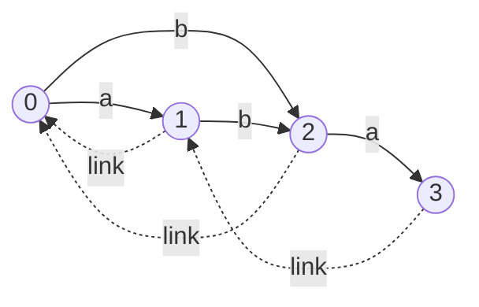

# 오늘의 주제: 접미사 오토마톤 (Suffix Automaton, SAM)

> 한 문자열 `s`의 **모든 부분 문자열**을 인식하는 **최소 결정적 유한 오토마톤(DFA)**.
> 상태 수 ≤ `2n-1`, 전이 수 ≤ `3n-4` 로 **선형 크기**, 온라인으로 **O(n)** 구성.
> 접미사 배열/아호코라식과 함께 문자열 문제의 강력한 무기. "서로 다른 부분 문자열 개수", "두 문자열 최장 공통 부분 문자열(LCS)", "각 부분 문자열의 등장 횟수" 등을 한 자료구조로.

---

## 1. 핵심 개념 — 왜 선형인가?

SAM의 각 상태는 `s`의 부분 문자열들을 **endpos(끝 위치 집합)** 기준으로 묶은 **동치류(equivalence class)** 하나다.

- `endpos(t)` = 부분 문자열 `t`가 `s` 안에서 끝나는 모든 위치 집합.
- 두 부분 문자열의 `endpos`가 **같으면 같은 상태**로 표현된다.
- 한 상태 안의 문자열들은 길이가 연속 구간을 이루고, 짧은 것이 긴 것의 접미사다.
  - `len[v]` = 그 상태가 나타내는 **가장 긴** 문자열의 길이.
  - **suffix link** `link[v]` = `v`의 문자열에서 접미사를 계속 줄이다 `endpos`가 커지는(=다른 동치류로 넘어가는) 순간 만나는 상태.

**정당성 직관:** endpos 집합들은 서로 포함하거나 완전히 분리된다(라미네이션 성질). 그래서 suffix link들이 **트리**를 이루고, 서로 다른 endpos 종류는 O(n)개뿐 → 상태도 O(n)개.


*문자열 `"aba"`의 SAM. 실선=문자 전이, 점선=suffix link. 상태 0에서 출발해 임의 경로를 따라가면 정확히 `s`의 모든 부분 문자열이 만들어진다.*

---

## 2. 온라인 구성 (extend) — 핵심 아이디어

문자를 하나씩 붙이며 확장한다. 마지막 상태 `last`에서 새 상태 `cur`를 만들고, suffix link를 타고 올라가며 새 문자 전이를 추가한다. 이미 그 문자 전이가 있으면 **clone**(상태 분할)으로 최소성을 유지한다.

- **경우 A**: 끝까지(`p == -1`) 전이가 없으면 → `link[cur] = 0`.
- **경우 B**: `q = next[p][c]`가 있고 `len[p]+1 == len[q]`이면 → `link[cur] = q` (바로 접속).
- **경우 C**: `len[p]+1 != len[q]`이면 → `q`를 **clone**해서 길이 `len[p]+1`짜리 상태를 끼워 넣는다. (가장 헷갈리는 부분!)

**시간복잡도:** 상각 **O(n · |Σ|)** (dict 전이면 O(n log|Σ|) 또는 O(n)). suffix link 재방문 총량이 선형임이 보장된다.

---

## 3. Python 템플릿

```python
class SuffixAutomaton:
    def __init__(self):
        self.nxt = [dict()]   # 상태별 문자 전이
        self.link = [-1]      # suffix link
        self.length = [0]     # 상태가 나타내는 가장 긴 문자열 길이
        self.last = 0

    def extend(self, c):
        cur = len(self.length)
        self.length.append(self.length[self.last] + 1)
        self.link.append(-1); self.nxt.append(dict())
        p = self.last
        while p != -1 and c not in self.nxt[p]:
            self.nxt[p][c] = cur
            p = self.link[p]
        if p == -1:
            self.link[cur] = 0                      # 경우 A
        else:
            q = self.nxt[p][c]
            if self.length[p] + 1 == self.length[q]:
                self.link[cur] = q                  # 경우 B
            else:                                   # 경우 C: clone
                clone = len(self.length)
                self.length.append(self.length[p] + 1)
                self.link.append(self.link[q])
                self.nxt.append(dict(self.nxt[q]))  # 전이 복사 (얕은 복사 X)
                while p != -1 and self.nxt[p].get(c) == q:
                    self.nxt[p][c] = clone
                    p = self.link[p]
                self.link[q] = clone
                self.link[cur] = clone
        self.last = cur

    def build(self, s):
        for ch in s: self.extend(ch)
        return self
```

---

## 4. 대표 예제

### 예제 1 — 서로 다른 부분 문자열의 개수

각 상태 `v(≠0)`는 길이 `link[v].len+1 ~ len[v]` 의 서로 다른 부분 문자열들을 담는다.
→ **정답 = Σ (len[v] − len[link[v]])**. 구성만 하면 O(n)에 끝난다.

```python
def count_distinct_substrings(s):
    sam = SuffixAutomaton().build(s)
    return sum(sam.length[v] - sam.length[sam.link[v]]
               for v in range(1, len(sam.length)))
# "aba" -> (1-0)+(2-0)+(3-1) = 5  → a,b,ab,ba,aba ✓
```
- **시간복잡도:** 구성 O(n), 집계 O(상태수)=O(n).

### 예제 2 — 두 문자열의 최장 공통 부분 문자열 (LCS)

`s`로 SAM을 만들고 `t`를 오토마톤 위에서 **한 글자씩 따라 걷는다**. 막히면 suffix link로 후퇴(현재 매칭 길이 `l`을 `len[link]`로 줄임). 걷는 동안의 최대 길이가 답.

```python
def lcs_two_strings(s, t):
    sam = SuffixAutomaton().build(s)
    v, l, best = 0, 0, 0
    for c in t:
        while v and c not in sam.nxt[v]:
            v = sam.link[v]         # 매칭 실패 → 접미사로 후퇴
            l = sam.length[v]
        if c in sam.nxt[v]:
            v = sam.nxt[v][c]; l += 1
        else:
            v, l = 0, 0             # 초기 상태에서도 실패
        best = max(best, l)
    return best
# lcs("abcde","bcdx") -> 3  ("bcd")
```
- **시간복잡도:** O(|s| + |t|). 여러 문자열 공통이면 각 상태에 도달 길이 min을 누적.

---

## 5. 자주 하는 실수

- **clone 전이 복사를 얕게** 하기: `dict(self.nxt[q])`로 **복사본**을 넣어야 함. 참조 공유하면 오염된다.
- clone의 `link`는 **원래 `q`의 link**를 그대로 받고(`link[clone]=link[q]`), 그다음 `link[q]=clone`, `link[cur]=clone`으로 재배선. 순서 헷갈리면 트리가 깨진다.
- **경우 B / C 구분**은 `len[p]+1 == len[q]` 로 판정. 이걸 빼먹으면 오토마톤이 최소가 아니게 되고 상태가 폭발.
- 등장 횟수(occurrences)를 셀 때는 **clone이 아닌** 원본(각 extend의 `cur`)에만 `cnt=1`을 주고, `len` 내림차순(=위상순)으로 자식 cnt를 부모로 전파해야 함.
- Python 재귀로 suffix link 트리를 타면 깊이 n에서 터진다 → **`len` 기준 카운팅 정렬**로 반복 처리.

---

## 6. 어디에 쓰나 (판별 포인트)

- "서로 다른 부분 문자열 개수 / k번째 부분 문자열" → SAM 전이 DAG 위 DP.
- "각 부분 문자열이 몇 번 등장?" → suffix link 트리에서 endpos 크기 = cnt.
- "두(여러) 문자열의 최장 공통 부분 문자열" → 한쪽 SAM 위를 다른 쪽이 걷기.
- 온라인으로 문자가 계속 추가되는 부분 문자열 질의.

접미사 배열이 "정렬된 접미사 + LCP"로 접근한다면, SAM은 "부분 문자열 = 자동자 경로"로 접근한다. 온라인·부분 문자열 카운팅 계열에서 특히 강하다.
