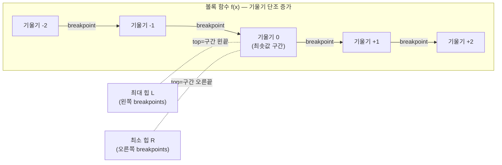

# 오늘의 주제: 슬로프 트릭 (Slope Trick)

> **한 줄 요약**: DP 값 함수 `f(x)`가 **볼록(convex)한 조각별 선형(piecewise linear)** 함수일 때, 함수 전체를 저장하지 말고 **기울기가 꺾이는 지점(breakpoint)들만 우선순위 큐로 관리**해서 상태 전이를 `O(log n)`에 처리하는 DP 최적화 기법.

---

## 1. 언제 쓰는가

전형적인 신호:
- `dp[i][x]` = "앞의 i개를 처리했고, 마지막 값(또는 어떤 파라미터)이 x일 때의 최소 비용" 꼴.
- 각 x에 대한 함수 `f_i(x) = dp[i][x]`가 **볼록**이고, 전이가 다음 중 하나:
  1. `f(x) += |x - a|`  (점 a에 대한 절댓값 비용 추가)
  2. `g(x) = min_{y ≤ x} f(y)`  (누적 최소, 단조 증가 제약 → 왼쪽 기울기 평탄화)
  3. `g(x) = f(x - k)` / `f(x + k)`  (평행이동)
  4. `f(x) += max(0, x - a)` 또는 `+= max(0, a - x)`  (한쪽만 비용)

대표 문제: **수열을 비감소(non-decreasing)로 만드는 최소 비용** (각 원소를 ±1 하는 비용의 합 최소화). BOJ 13323/13324/13325, Codeforces 713C, APIO 2016 "Fireworks" 등.

---

## 2. 왜 볼록성이 핵심인가

`|x - a|` 는 볼록이고, **볼록 함수의 합은 볼록**이다. 그래서 절댓값 비용을 계속 더해도 함수는 볼록을 유지한다.

볼록한 조각별 선형 함수는:
- 기울기가 **왼쪽에서 오른쪽으로 단조 증가**(… -2, -1, 0, +1, +2 …).
- 최솟값을 주는 구간(기울기 0 구간)을 경계로 **왼쪽 부분(기울기 음수)**과 **오른쪽 부분(기울기 양수)**으로 나뉜다.

핵심 아이디어: 기울기가 1씩 꺾이는 **breakpoint**들만 저장한다.
- 왼쪽 breakpoint들 → **최대 힙 `L`** (최솟값 구간 왼쪽 경계가 top)
- 오른쪽 breakpoint들 → **최소 힙 `R`** (최솟값 구간 오른쪽 경계가 top)
- 최솟값 자체 `min_f` 는 스칼라로 따로 관리.



---

## 3. 핵심 연산: `f(x) += |x - a|` 추가

`|x - a|` 를 더하면 최솟값 구간이 a 쪽으로 당겨지고, 최솟값이 커질 수 있다. 표준 트릭:

```python
import heapq

L = []  # 최대 힙 (부호 반전 저장)
R = []  # 최소 힙
min_f = 0

def add_abs(a):
    global min_f
    # a를 양쪽에 후보로 넣고, 겹치면 교정
    heapq.heappush(L, -a)   # 왼쪽 후보
    heapq.heappush(R, a)    # 오른쪽 후보
    l = -L[0]               # 왼쪽 최대
    r = R[0]                # 오른쪽 최소
    if l > r:               # 순서가 뒤집혔으면 교환
        heapq.heapreplace(L, -r)
        heapq.heapreplace(R, l)
        min_f += l - r      # 최솟값 증가량 = 벌어진 폭
```

직관: 새 breakpoint a가 최솟값 구간의 오른쪽 경계보다 작으면(`a < r`인데 왼쪽에 넣었을 때 정렬이 깨지면), 두 힙 사이에서 값을 교환해 "왼쪽은 항상 최솟값 구간 왼끝 이하, 오른쪽은 오른끝 이상"이라는 불변식을 복구한다. 그때 벌어진 폭만큼 `min_f`가 늘어난다.

---

## 4. 대표 예제: 비감소 수열 만들기 최소 비용

**문제**: 정수 수열 `a[0..n-1]`가 주어질 때, 각 원소를 원하는 값 `b[i]`로 바꾸되 `b`가 **비감소**(b[0] ≤ b[1] ≤ … ≤ b[n-1])가 되도록 하며, 비용 `Σ|a[i] - b[i]|`를 최소화. (BOJ 13323 "How To Type" 계열)

**DP 정의**: `f_i(x)` = "앞 i+1개를 처리하고 `b[i] = x`일 때 최소 비용, 단 `x`는 지금까지의 최댓값". 실제로는 `f_i(x)` = "b[i] ≤ x 라는 제약 하의 최소 비용"으로 두고 볼록성을 유지한다.

전이:
1. **비감소 제약** `b[i] ≥ b[i-1]`: 이전 함수에서 `f(x) = min_{y ≤ x} f(y)` (왼쪽을 평탄화). → **오른쪽 힙 R을 통째로 비운다**(오른쪽 기울기를 없애 단조 증가 함수로).
2. **비용 추가** `+= |x - a[i]|`: 위 `add_abs(a[i])`.
3. 답 = 모든 원소 처리 후 `min_f`.

```python
import sys, heapq

def solve():
    input = sys.stdin.readline
    n = int(input())
    a = [int(input()) for _ in range(n)]

    L = []          # 최대 힙 (부호 반전)
    min_f = 0

    for v in a:
        # (1) 비감소 제약이면 R을 안 쓰고 L만 유지하는 단조 버전
        # (2) |x - v| 추가: L에 v 두 번 넣고 top 교정
        heapq.heappush(L, -v)
        heapq.heappush(L, -v)
        top = -heapq.heappop(L)   # 현재 왼쪽 최대
        min_f += top - v          # 벌어진 만큼 비용 증가
        # (교정된) top은 다시 안 넣음 → L 크기 유지

    print(min_f)

solve()
```

> **핵심 아이디어**: 비감소 제약에서는 오른쪽 힙이 필요 없다. 각 원소마다 v를 **두 번** 밀어넣고 최댓값 하나를 빼면, "왼쪽 breakpoint 두 개 추가 후 최솟값 구간 오른끝을 v로 고정"하는 효과가 나서 볼록·단조 불변식이 유지된다.

- **시간복잡도**: 원소당 힙 연산 O(log n) → 전체 **O(n log n)**.
- **공간**: 힙 크기 O(n).

---

## 5. 또 다른 예제: APIO 2016 Fireworks (트리 위 슬로프 트릭)

각 정점에서 "리프까지 거리를 모두 같게 만드는 최소 비용" 함수 `f_v(x)`(x=루트~v 경로 길이)를 볼록으로 유지하고, **자식들의 함수를 합친 뒤**(볼록 함수 합 = breakpoint 힙 병합) 간선 길이만큼 최솟값 구간을 오른쪽으로 늘린다. 병합은 **작은 힙을 큰 힙에 붓는(small-to-large)** 방식으로 전체 O(n log n). 트리 DP + 슬로프 트릭의 정석 결합이다.

---

## 6. 자주 하는 실수

- **볼록성 확인 누락**: 전이가 볼록을 깨면(예: 곱셈, 비볼록 비용) 슬로프 트릭 자체가 성립 안 됨. 반드시 `f`가 볼록 조각별 선형인지 먼저 증명.
- **`min_f` 업데이트 빼먹기**: breakpoint 교환/교정 시 최솟값이 얼마나 오르는지 스칼라에 더하는 걸 잊으면 답이 틀림. **breakpoint만 옮기면 함수 모양은 알지만 절대 높이를 잃는다.**
- **최대 힙을 파이썬 `heapq`로 그냥 씀**: `heapq`는 최소 힙뿐. 왼쪽 힙은 **부호 반전**으로 최대 힙을 흉내.
- **비감소/비증가 제약 방향 혼동**: 비감소면 오른쪽(R) 비우기, 비증가면 왼쪽(L) 비우기. 방향 반대로 하면 제약이 거꾸로 걸림.
- **함수 값 자체가 필요한 문제**: 최종적으로 특정 x에서의 `f(x)`가 필요하면, `min_f`에서 시작해 breakpoint를 되짚어 기울기를 적분해야 함(단순 `min_f`만으론 부족).

---

## 7. Python 템플릿 (양쪽 힙 + |x−a| 추가)

```python
import heapq

class SlopeTrick:
    """볼록 조각별 선형 함수 f를 유지. 최소 f값과 argmin 구간을 관리."""
    def __init__(self):
        self.L = []          # 최대 힙 (부호 반전): 최솟값 구간 왼끝 이하 breakpoints
        self.R = []          # 최소 힙: 최솟값 구간 오른끝 이상 breakpoints
        self.min_f = 0       # 현재 최솟값
        self.add_l = 0       # L 전체 평행이동 lazy
        self.add_r = 0       # R 전체 평행이동 lazy

    def _lmax(self):  return -self.L[0] + self.add_l
    def _rmin(self):  return  self.R[0] + self.add_r

    def add_all(self, c):        # f(x) += c
        self.min_f += c

    def add_right(self, a):      # f(x) += max(0, x - a)  (오른쪽만 비용)
        l = self._lmax() if self.L else -float('inf')
        self.min_f += max(0, l - a)
        heapq.heappush(self.L, -(a - self.add_l))
        heapq.heappush(self.R, self._pop_l() - self.add_r)

    def _pop_l(self):
        return -heapq.heappop(self.L) + self.add_l

    def add_abs(self, a):        # f(x) += |x - a|
        # 오른쪽만 + 왼쪽만 을 합친 것과 동등: 아래는 간단 버전
        heapq.heappush(self.L, -(a - self.add_l))
        heapq.heappush(self.R,  (a - self.add_r))
        l = self._lmax(); r = self._rmin()
        if l > r:
            self.min_f += l - r
            heapq.heapreplace(self.L, -(r - self.add_l))
            heapq.heapreplace(self.R,  (l - self.add_r))

    def shift_min_left(self):    # 비증가 제약: g(x)=min_{y>=x} f(y) → 왼쪽 없앰
        self.L.clear()
    def shift_min_right(self):   # 비감소 제약: g(x)=min_{y<=x} f(y) → 오른쪽 없앰
        self.R.clear()

    def slide(self, dl, dr):     # argmin 구간을 [dl, dr] 만큼 넓힘/이동
        self.add_l += dl
        self.add_r += dr
```

> 실전에선 문제에 필요한 연산(`add_abs`, `shift_min_*`, `slide`)만 골라 쓰면 된다. 평행이동 lazy(`add_l/add_r`)는 Fireworks처럼 구간을 계속 미는 문제에서 유용.

---

## 8. 요약

| 항목 | 내용 |
|------|------|
| 핵심 조건 | DP 함수 `f(x)`가 **볼록 조각별 선형** |
| 저장 대상 | 함수 전체가 아니라 **기울기 꺾임점(breakpoint) 힙 2개 + 최솟값 스칼라** |
| 대표 전이 | `+= |x-a|`, `min_{y≤x}`(오른쪽 비우기), 평행이동 |
| 복잡도 | 연산당 `O(log n)`, 전체 `O(n log n)` |
| 대표 문제 | 비감소 수열 만들기(BOJ 13323~13325), CF 713C, APIO Fireworks |
