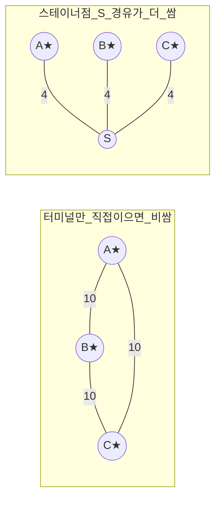

# 스테이너 트리 (Steiner Tree, 부분집합 DP)

**오늘의 주제: 스테이너 트리 (Steiner Tree DP)** — 그래프에서 지정된 `k`개의 **터미널 정점**을 모두 연결하는 **최소 가중치 부분 트리**를 구하는 문제. 일반 그래프에서는 NP-hard지만, 터미널 수 `k`가 작을 때(보통 `k ≤ 10~12`) 비트마스크 DP로 다항식처럼 풀린다.

---

## 1. 무슨 문제인가

- **입력:** 가중 (무향) 그래프 `G=(V,E)`, 터미널 집합 `T ⊆ V`, `|T| = k`.
- **출력:** `T`의 모든 정점을 포함하는 연결 부분그래프 중 간선 가중치 합이 최소인 것. 최적해는 항상 **트리**(사이클이 있으면 간선 하나 제거 가능).
- MST와의 차이: MST는 **모든** 정점을 이어야 하지만, 스테이너 트리는 **터미널만** 이으면 되고 나머지 정점(=스테이너 점)은 "경유해도 되고 안 해도 되는" 자유가 있다. 그래서 더 싸질 수 있다.



> ★ = 터미널. 왼쪽은 어떻게 이어도 20, 오른쪽은 중앙점 S를 경유해 **12**. 이게 "스테이너 점"의 이득.

---

## 2. 핵심 DP 정의

`dp[mask][v]` = **터미널 집합 `mask`를 모두 포함하고, 정점 `v`를 트리의 일부로 갖는** 최소 비용.

- `mask`는 `k`비트: `i`번째 비트가 켜져 있으면 `i`번 터미널이 트리에 포함됨.
- `v`는 트리에 속한 아무 정점(터미널일 수도, 스테이너 점일 수도 있음).

**초기값:** `i`번 터미널 정점 `t_i`에 대해 `dp[1<<i][t_i] = 0`. 나머지는 ∞.

### 전이 1 — 서브트리 병합 (같은 루트 v에서 두 조각 합치기)
```
dp[mask][v] = min over 부분집합 sub ⊂ mask:
              dp[sub][v] + dp[mask ^ sub][v]
```
`v`에서 뻗어나간 두 개의 독립된 부분 트리를 붙인다. `v`는 공유되므로 중복 없음.

### 전이 2 — 간선으로 확장 (트리를 이웃 정점까지 늘리기)
```
dp[mask][v] = min over 간선 (u,v,w):
              dp[mask][u] + w
```
같은 `mask`에 대해 이건 **정확히 최단경로 완화**다 → **다익스트라**로 한 방에 처리.

**정답:** `min over v: dp[full][v]` (`full = (1<<k)-1`).

### 왜 동작하나 (정당성)
최적 스테이너 트리를 아무 정점 `v`에서 루팅하면, `v`의 자식 방향으로 트리가 여러 조각으로 갈라진다. 각 조각은 "일부 터미널 + v"를 잇는 더 작은 스테이너 트리 → **전이 1**이 이 분할을 포착. 조각 내부에서 스테이너 점을 경유하는 것은 같은 `mask`에서 정점만 옮겨가는 것 → **전이 2**(최단경로)가 포착. 두 전이의 결합이 모든 최적 트리 구조를 만들어낸다.

---

## 3. 시간 복잡도

- 전이 1(부분집합 순회): 모든 `mask`의 부분집합 합은 `Σ 2^popcount = 3^k` → `O(3^k · V)`.
- 전이 2(각 mask마다 다익스트라): `O(2^k · E log V)`.
- **총 `O(3^k · V + 2^k · E log V)`.** `k ≤ 10`이면 `3^10 ≈ 5.9만`이라 충분히 빠름.

---

## 4. 대표 예제 — 터미널 연결 최소 비용

정점 `1..n`, 무향 가중 간선, 터미널 목록이 주어질 때 모두 잇는 최소 비용.

```python
import sys, heapq

def steiner_tree(n, edges, terminals):
    INF = float('inf')
    g = [[] for _ in range(n + 1)]
    for u, v, w in edges:
        g[u].append((v, w)); g[v].append((u, w))

    k = len(terminals)
    full = (1 << k) - 1
    # dp[mask][v]
    dp = [[INF] * (n + 1) for _ in range(1 << k)]
    for i, t in enumerate(terminals):
        dp[1 << i][t] = 0

    for mask in range(1, 1 << k):
        # 전이 1: 같은 v에서 두 서브트리 병합
        sub = (mask - 1) & mask
        while sub:
            other = mask ^ sub
            row, a, b = dp[mask], dp[sub], dp[other]
            for v in range(1, n + 1):
                cand = a[v] + b[v]
                if cand < row[v]:
                    row[v] = cand
            sub = (sub - 1) & mask

        # 전이 2: 이 mask에 대해 다익스트라로 간선 확장
        pq = [(dp[mask][v], v) for v in range(1, n + 1) if dp[mask][v] < INF]
        heapq.heapify(pq)
        row = dp[mask]
        while pq:
            d, u = heapq.heappop(pq)
            if d > row[u]:
                continue
            for v, w in g[u]:
                nd = d + w
                if nd < row[v]:
                    row[v] = nd
                    heapq.heappush(pq, (nd, v))

    return min(dp[full][v] for v in range(1, n + 1))

# 위 mermaid 예제: A=1,B=2,C=3,S=4, 터미널=[1,2,3]
edges = [(1,4,4),(2,4,4),(3,4,4),(1,2,10),(2,3,10),(1,3,10)]
print(steiner_tree(4, edges, [1,2,3]))  # -> 12
```

**핵심 아이디어:** `mask` 오름차순으로 채운다(전이 1은 더 작은 부분집합을 참조하므로). 각 `mask`마다 병합 후 다익스트라로 정점 간 이동을 마무리.

---

## 5. 그리드 변형 (자주 나오는 형태)

R×C 격자에서 어떤 칸들을 모두 연결(상하좌우 이동, 칸마다 비용). 정점 = 칸(`r*C+c`), 간선 = 인접 칸. DP 배열 크기 `2^k × (R·C)`. 로직은 동일하고, 다익스트라 대신 격자 완화를 써도 됨.

```python
# dp[mask][cell], 초기값: 각 터미널 칸 dp[1<<i][cell]=cost[cell] 처럼
# 칸 비용 모델이면 시작 비용도 반영. 이후 전이 1 + 전이 2 동일.
```

---

## 6. 자주 하는 실수

- **전이 순서:** 반드시 `mask`를 작은 값부터. 전이 1이 `sub`, `mask^sub`(둘 다 `< mask`가 아님에 주의 — `sub`, `mask^sub`는 `mask`의 진부분집합이라 값이 더 작음)를 참조.
- **전이 2를 mask별로 재실행:** 병합만 하고 다익스트라를 빼먹으면 스테이너 점 경유가 반영 안 됨.
- **부분집합 순회 관용구:** `sub = (sub-1) & mask`로 `mask`의 모든 진부분집합을 도는 표준 패턴. 공집합(0)은 자동 제외됨(초기 `sub=(mask-1)&mask`).
- **간선 비용 모델 vs 정점 비용 모델** 구분: 정점에 비용이 있으면 초기값과 완화에 정점 비용을 더해야 함.
- `k`가 크면(>12) 이 방법은 터짐 — 그때는 근사/다른 접근.

---

## 7. Python 템플릿 (요약)

```python
def steiner(n, g, terminals):        # g[u] = [(v,w),...]
    import heapq
    INF = float('inf'); k = len(terminals)
    dp = [[INF]*(n+1) for _ in range(1<<k)]
    for i,t in enumerate(terminals): dp[1<<i][t] = 0
    for mask in range(1, 1<<k):
        sub = (mask-1)&mask
        while sub:
            o = mask^sub
            for v in range(1,n+1):
                dp[mask][v] = min(dp[mask][v], dp[sub][v]+dp[o][v])
            sub = (sub-1)&mask
        pq = [(dp[mask][v],v) for v in range(1,n+1) if dp[mask][v]<INF]
        heapq.heapify(pq)
        while pq:
            d,u = heapq.heappop(pq)
            if d>dp[mask][u]: continue
            for v,w in g[u]:
                if d+w < dp[mask][v]:
                    dp[mask][v]=d+w; heapq.heappush(pq,(d+w,v))
    return min(dp[(1<<k)-1])
```

**한 줄 요약:** 터미널을 비트마스크로 잡고, `dp[mask][v]` = "이 정점을 뿌리로 mask 터미널을 잇는 최소 비용". **부분집합 병합 + 다익스트라**를 mask마다 반복하면 `O(3^k·V + 2^k·E log V)`에 최적 스테이너 트리를 얻는다.
