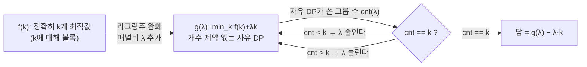

# 앨리언스 트릭 (Aliens Trick / WQS 이분탐색 / 라그랑주 완화)

> **오늘의 주제:** **정확히 k개**를 골라야 하는 최적화 DP를, 개수 제약을 **비용 λ(패널티)** 로 바꿔 이분탐색으로 푸는 기법. IOI 2016 "Aliens" 문제에서 이름이 붙었다. (= WQS Binary Search, Lagrangian Relaxation)

---

## 1. 언제 쓰나 — 핵심 상황

전형적인 형태의 문제다.

- "정확히 **k개**의 구간/그룹으로 나눠라" 또는 "정확히 k번 연산해라" 라는 **개수 제약**이 있고,
- 그 제약이 없다면(개수 자유) DP가 쉽거나 빠른데,
- 개수 j를 상태에 넣으면 `dp[i][j]` 가 되어 **O(N·k)** 이상으로 느려지는 경우.

> **한 줄 요약:** "정확히 k개" 제약을 상태에서 떼어내고, 대신 **그룹 하나 만들 때마다 λ의 벌점**을 부과한다. λ를 이분탐색으로 조절해 "최적해가 정확히 k개를 쓰도록" 맞춘다.

---

## 2. 왜 동작하는가 — 볼록성이 전부

핵심 함수를 정의하자.

- `f(k)` = **정확히 k개**를 쓸 때의 최적값 (최소화 문제라 가정).

**앨리언스 트릭이 성립할 필요충분에 가까운 조건: `f(k)`가 k에 대해 볼록(convex)해야 한다.**
즉 개수를 하나 늘릴 때 이득의 증가폭이 점점 줄어든다(오목) / 비용의 감소폭이 점점 줄어든다(볼록). 대부분의 "구간 분할 비용" 문제는 이 성질을 가진다.

이제 **라그랑주 완화**를 한다. 패널티 λ를 도입해

```
g(λ) = min over all k [ f(k) + λ·k ]
```

를 정의한다. 이건 **개수 제약이 사라진** 문제라서 빠르게 풀린다(그냥 "그룹 하나당 λ 추가비용"인 자유 DP).

`f`가 볼록이면, 직선 `y = -λ·k + g(λ)` 는 `f(k)` 그래프의 **기울기 -λ인 접선**이 된다. 접점이 되는 k는 λ가 커질수록 **단조 감소**한다(패널티가 크면 그룹을 적게 씀). 따라서:

> **λ를 이분탐색** → 자유 DP를 풀 때 "최적해가 사용한 그룹 수 cnt(λ)"가 나온다 → cnt가 k와 같아지도록 λ를 조인다. 답은 `g(λ) − λ·k`.



**직관:** λ는 "그룹 하나 만드는 입장료". 입장료가 비싸면 그룹을 조금만, 싸면 많이 만든다. 입장료를 잘 조절하면 자유 DP가 알아서 딱 k개를 쓴다.

---

## 3. 대표 예제 1 — 정확히 k개 구간으로 분할 (비용 최소)

배열을 **정확히 k개의 연속 구간**으로 나눈다. 구간 `[l, r]`의 비용은 `cost(l, r)`. 전체 비용 합을 최소화하라. (`f(k)`가 볼록이라고 가정 — 대부분의 자연스러운 cost에서 성립)

### 핵심 아이디어
- 자유 DP: `dp[i]` = 앞의 i개를 몇 개든 상관없이 나눴을 때 최소 (비용 + λ×그룹수).
  전이: `dp[i] = min_{0<=j<i} ( dp[j] + cost(j+1, i) + λ )`.
- 이 자유 DP를 풀 때 **사용한 그룹 개수 cnt[i]** 도 같이 추적한다(같은 값이면 그룹 수가 적은/많은 쪽으로 tie-break을 일관되게).
- λ를 실수/정수 이분탐색하며 `cnt[N]` 이 k에 수렴하도록 한다.

### 시간복잡도
- 자유 DP 한 번이 O(N²)라면 전체 **O(N² · log(값범위))**.
- 자유 DP를 CHT나 분할정복 DP 최적화로 O(N log N)까지 줄이면 전체 **O(N log N · log(값범위))**. → k가 상태에서 사라져 O(N·k)가 O(N log·log)로 개선되는 게 이 트릭의 이득.

### Python 풀이 (자유 DP가 O(N²)인 기본형)

```python
import sys
from math import inf

def solve(n, k, cost):
    # cost(l, r): 0-indexed 폐구간 [l, r] 비용 함수
    # f(k)가 k에 대해 볼록이라고 가정
    def free_dp(lam):
        # dp[i] = (최소비용+lam*그룹수, 그 때 그룹수)
        # 그룹수는 tie일 때 '적게 쓰는' 쪽으로 골라 하한을 얻는다
        dp = [(0, 0)] + [(inf, 0)] * n
        for i in range(1, n + 1):
            best = (inf, 0)
            for j in range(i):
                val = dp[j][0] + cost(j, i - 1) + lam
                cnt = dp[j][1] + 1
                # 값이 작으면 갱신, 같으면 그룹수 적은 쪽 선택
                if (val, cnt) < best:
                    best = (val, cnt)
            dp[i] = best
        return dp[n]  # (g(lam), cnt)

    # lam 이분탐색: cnt가 k 이하가 되는 최소 lam 근처를 찾는다
    lo, hi = 0, 10**18   # lam 범위는 비용 스케일에 맞춰 잡는다
    while lo < hi:
        mid = (lo + hi) // 2
        _, cnt = free_dp(mid)
        if cnt <= k:      # 패널티가 충분히 커서 그룹 수가 k 이하
            hi = mid
        else:
            lo = mid + 1
    g, cnt = free_dp(lo)
    return g - lo * k     # 정확히 k개일 때의 실제 비용
```

> **주의:** 정수 이분탐색이 깔끔하려면 비용이 정수여야 한다. 실수라면 `for _ in range(100)` 식 고정 반복으로 이분탐색한다. tie-break(그룹 수를 min/max 중 어디로 고를지)을 **일관되게** 하지 않으면 `cnt`가 k를 건너뛰어 수렴이 깨진다.

---

## 4. 대표 예제 2 — IOI 2016 "Aliens" (트릭의 원조)

`n`개의 점을 정확히 **k개의 정사각형**으로 덮되, 정사각형 넓이 합을 최소화(겹치는 부분은 한 번만). 전처리하면 "정확히 k개 구간 분할 + cost는 CHT로 O(N log N)" 형태가 된다.

- 개수 k를 상태로 넣으면 O(N·k) → TLE.
- 앨리언스 트릭: "정사각형 하나당 λ 벌점" → 자유 DP는 CHT로 O(N log N), 바깥에 λ 이분탐색 O(log) → **O(N log N · log)**.

핵심 골격만:

```python
# lam 고정 시 자유 DP (CHT/단조성으로 O(N) 또는 O(N log N)),
# dp[i], cnt[i]를 동시에 계산. lam 이분탐색으로 cnt[n]==k 맞춤.
# 답 = dp[n] - lam*k  (lam이 벌점이므로 다시 빼줌)
```

패턴은 예제 1과 완전히 동일하다. **바뀌는 건 "자유 DP를 얼마나 빠르게 푸느냐" 뿐**이고, 앨리언스 트릭 껍데기(λ 이분탐색 + `− λ·k` 보정)는 그대로다.

---

## 5. 자주 하는 실수 (체크리스트)

- **볼록성 확인 안 함:** `f(k)`가 볼록이 아니면 이분탐색이 k를 못 맞춘다. 작은 케이스로 `f(0..n)`을 완전탐색해 볼록인지 먼저 검증하라.
- **최대화/최소화 부호 혼동:** 최대화 문제면 `f`는 오목. 그러면 패널티를 `− λ·k`로 넣고 부등호 방향을 뒤집는다. 마지막 보정도 부호에 맞춘다.
- **tie-break 미고정:** 같은 값에서 그룹 수 min/max 선택을 안 정하면 `cnt`가 k에서 튄다. **λ가 정수인데 f 그래프에 일직선(같은 기울기) 구간이 있으면** cnt가 k를 건너뛰므로, "cnt ≤ k인 최소 λ"를 찾고 그 λ의 min-cnt/max-cnt로 k를 감싸 보정.
- **보정 빼먹기:** 최종 답은 반드시 `g(λ) ∓ λ·k`. λ·k 되돌리는 걸 잊으면 값이 어긋난다.
- **λ 범위:** λ의 상한은 "그룹 하나 비용의 최대치"보다 커야 한다. 너무 작으면 cnt가 k 밑으로 안 내려간다.

---

## 6. Python 템플릿 (정수 이분탐색, 최소화)

```python
from math import inf

def aliens_trick(n, k, free_dp, lam_hi):
    """
    free_dp(lam) -> (g(lam), used_cnt)
      : 그룹 하나당 lam 벌점을 준 '개수 제약 없는' 최적 DP.
        used_cnt는 tie일 때 그룹 수 '최소'로 고른 값(하한).
    f(k)가 k에 대해 볼록(최소화)이라고 가정.
    반환: 정확히 k개 썼을 때의 최적값.
    """
    lo, hi = 0, lam_hi
    while lo < hi:                 # cnt <= k 되는 최소 lam
        mid = (lo + hi) // 2
        _, cnt = free_dp(mid)
        if cnt <= k:
            hi = mid
        else:
            lo = mid + 1
    g, _ = free_dp(lo)
    return g - lo * k
```

---

## 7. 정리

- **한 문장:** "정확히 k개" 제약을 **그룹당 λ 벌점**으로 바꿔 자유 DP로 풀고, λ를 이분탐색해 k를 맞춘 뒤 `−λk`로 보정.
- **전제:** `f(k)`가 k에 대해 **볼록/오목** (반드시 확인).
- **이득:** 상태 차원 k 제거 → `O(N·k)` 를 `O(자유DP · log)` 로. 자유 DP를 CHT/D&C opt로 가속하면 시너지.
- **친척 기법:** 다른 DP 최적화(CHT, D&C opt, Knuth opt, Li Chao, 슬로프 트릭)와 **조합**해서 자유 DP 부분을 빠르게 만드는 게 실전 포인트.
