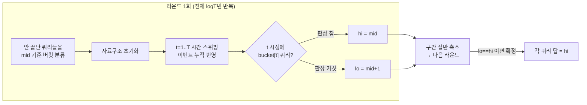

# 병렬 이분탐색 (Parallel Binary Search, PBS)

> **오늘의 주제: 병렬 이분탐색 (Parallel Binary Search)**
> "쿼리마다 답을 이분탐색해야 하는데, 조건 판정이 비싸서 하나씩 돌리면 시간 초과" 상황을 **모든 쿼리를 동시에** 이분탐색해 뚫는 오프라인 기법.

---

## 1. 언제 쓰나 (핵심)

다음이 모두 성립할 때 강력하다.

1. **쿼리가 여러 개**다. 각 쿼리는 "조건을 만족하는 **가장 이른 시점 t**를 찾아라" 형태.
2. **단조성**: 시점 `t`가 커질수록(이벤트가 누적될수록) 조건이 한 번 참이 되면 계속 참. → 이분탐색 가능.
3. **판정 비용이 비싸다**: 쿼리 하나만 따로 판정하려 해도 이벤트를 처음부터 쌓아야 함(자료구조 필요). 쿼리마다 독립적으로 이분탐색하면 `O(Q · logT · (판정비용))`으로 폭발.
4. **이벤트를 시간순으로 한 번 훑으며** 자료구조(펜윅/유니온파인드 등)에 누적 반영할 수 있다.

> 대표 신호: "각 나라가 필요량을 채우는 첫 번째 시점", "두 정점이 처음 연결되는 간선 가중치", "각 쿼리에 대해 K번째 이벤트" 처럼 **쿼리 × 시간축**이 얽혀 있고, 시간축을 한 번 스위핑하면 여러 쿼리를 싸게 처리할 수 있는 구조.

---

## 2. 왜 동작하나 / 아이디어

각 쿼리를 **따로** 이분탐색하면 `logT` 번의 판정이 필요하고, 판정마다 이벤트를 0부터 mid까지 다시 쌓아야 한다 → `O(Q · logT · T)`.

**병렬 이분탐색**은 순서를 뒤집는다.

- 모든 쿼리가 각자 구간 `[lo, hi]`를 들고 있고, 현재 후보는 `mid = (lo+hi)//2`.
- **라운드 하나**에서:
  1. 아직 안 끝난 쿼리들을 각자의 `mid` 값으로 **버킷에 분류**한다 (`bucket[mid].append(query)`).
  2. 시간 `t = 1..T`를 **딱 한 번** 스위핑하며 이벤트를 자료구조에 반영.
  3. `t` 시점에서 `bucket[t]`에 담긴 쿼리들을 지금 상태로 판정 → 참이면 `hi=mid`, 거짓이면 `lo=mid+1`.
- 한 라운드에 모든 쿼리의 탐색 구간이 절반으로 줄어든다. **총 `logT` 라운드**면 모두 수렴.

즉 "쿼리 × logT × 시간" 이 아니라 **"logT × (시간 스위핑 1회 + 전체 쿼리 판정 1회)"** 로 바뀐다.



---

## 3. 시간복잡도

- 라운드 수: `O(log T)` (T = 이벤트/시간 개수)
- 라운드당: 시간 스위핑 `O(T · 이벤트반영)` + 전체 쿼리 판정 `O(Σ 판정비용)`
- 펜윅을 쓰면 흔히 **`O((N + K) · log N · log K)`** 급. 쿼리별 독립 이분탐색 대비 `Q/logT` 이상 빨라진다.

---

## 4. 대표 예제 ① — 유성 (BOJ 8217, POI 2011 Meteors)

**문제 요약**: 원형으로 `N`개 구역이 있고 각 구역은 `M`개 나라 중 하나 소유. 나라 `j`는 `need[j]`만큼 모아야 한다. `K`번의 유성우 각각은 원형 구간 `[l, r]`에 `a`씩 더한다. 각 나라가 필요량을 처음 채우는 **유성우 번호**를 구하라 (불가능하면 `NIE`).

**핵심 아이디어**
- 나라별 답 = "몇 번째 유성우까지 쌓으면 `need` 달성?" → 유성우 개수에 대한 **이분탐색** (누적이므로 단조).
- 판정: 첫 `t`개 유성우를 반영한 뒤 그 나라 소유 구역들의 합 ≥ `need`?
- 유성우는 **구간 덧셈**, 판정은 **점(구역) 값의 합**. → *구간 덧셈 + 점 조회* 펜윅(차분 BIT)으로 시간 스위핑.
- 원형 구간 `l > r` 은 `[l,N]` 과 `[1,r]` 두 번으로 쪼갠다.

```python
import sys
input = sys.stdin.readline

def solve():
    m, n = map(int, input().split())               # m개 나라, n개 구역 (BOJ 입력 순서: 국가 M, 구역 N)
    owner = list(map(int, input().split()))         # 길이 n(구역), owner[i] ∈ 1..m
    need  = list(map(int, input().split()))         # 길이 m(나라), need[j-1] : 나라 j의 목표
    k = int(input())
    showers = [tuple(map(int, input().split())) for _ in range(k)]  # (l, r, a)

    sectors = [[] for _ in range(m + 1)]            # 나라별 소유 구역
    for i, o in enumerate(owner, start=1):
        sectors[o].append(i)

    # 펜윅: 구간 덧셈 + 점 조회 (차분 방식)
    bit = [0] * (n + 2)
    def add(i, v):
        while i <= n:
            bit[i] += v
            i += i & -i
    def point(i):                                   # i 지점의 현재 값 = prefix sum
        s = 0
        while i > 0:
            s += bit[i]; i -= i & -i
        return s
    def range_add(l, r, v):
        add(l, v); add(r + 1, -v)

    INF = k + 1
    lo = [1]   * (m + 1)
    hi = [INF] * (m + 1)                            # INF = 불가능(NIE)

    while True:
        buckets = [[] for _ in range(k + 2)]
        active = False
        for j in range(1, m + 1):
            if lo[j] < hi[j]:
                active = True
                mid = (lo[j] + hi[j]) // 2
                buckets[mid].append(j)              # mid 번째 유성우 시점에 판정 예약
        if not active:
            break

        for i in range(n + 2):                      # 자료구조 초기화
            bit[i] = 0

        for t in range(1, k + 1):                   # 시간축 1회 스위핑
            l, r, a = showers[t - 1]
            if l <= r:
                range_add(l, r, a)
            else:                                   # 원형 wrap
                range_add(l, n, a); range_add(1, r, a)
            for j in buckets[t]:                    # 지금(=t개 반영) 상태로 판정
                goal, tot = need[j - 1], 0
                for s in sectors[j]:
                    tot += point(s)
                    if tot >= goal:
                        break
                if tot >= goal:
                    hi[j] = t                       # t(=mid) 이하로 충분 → 더 당김
                else:
                    lo[j] = t + 1                   # t로 부족 → 더 뒤로

    print('\n'.join("NIE" if hi[j] == INF else str(hi[j]) for j in range(1, m + 1)))

solve()
```

- **시간복잡도**: `O((N + K) · log N · log K)`. 나라별 소유 구역 합은 라운드당 총 `N`이라 안전.

---

## 5. 대표 예제 ② — 크루스칼의 공 (BOJ 1396, 간단 스케치)

각 쿼리 `(x, y)`: `x, y`가 처음으로 **연결되는 최소 간선 가중치**와, 그때의 정점 개수를 구하라.

- 이벤트 = 간선을 **가중치 오름차순**으로 하나씩 유니온파인드에 합치기.
- 쿼리 답 = "몇 번째 간선까지 합쳐야 `x,y`가 같은 집합?" → 간선 개수(=시간)에 대한 이분탐색. 단조.
- 라운드마다 유니온파인드를 **처음부터 다시** 만들며 시간 스위핑, `bucket[mid]`에서 `find(x)==find(y)` 판정.
- 정점 개수는 그 시점 대표원소의 집합 크기.

> 패턴이 유성과 동일: **자료구조를 라운드마다 리셋 → 시간순 이벤트 누적 → 예약된 쿼리 판정**. 자료구조만 BIT ↔ 유니온파인드로 바뀔 뿐.

---

## 6. 자주 하는 실수

- **라운드마다 자료구조 초기화를 빼먹음** → 이전 라운드 상태가 남아 오답. 반드시 리셋 (또는 롤백).
- **`mid`와 판정 시점 `t`를 헷갈림**: 버킷은 `mid`로 담고, 스위핑에서 `t==mid`인 순간에 판정해야 "첫 `mid`개 이벤트 반영" 상태가 정확히 맞는다.
- **`hi/lo` 갱신 방향**: 판정 참 → `hi=mid`(더 이른 시점 시도), 거짓 → `lo=mid+1`. 파라메트릭 서치의 lower_bound 형태.
- **불가능 처리**: `hi` 초기값을 `T+1`(범위 밖)로 두고, 끝까지 `T+1`이면 답 없음(`NIE`).
- **원형/경계 구간**: `l>r` 분할, `r+1`이 배열 밖으로 나가지 않게 BIT 크기 `+2`.
- **단조성 없음**: 이벤트가 값을 빼기도 하는 등 단조가 깨지면 PBS 적용 불가 → 다른 오프라인 기법(Mo's, 세그 위 이분 등) 고려.

---

## 7. Python 템플릿

```python
# 병렬 이분탐색 뼈대
# 조건: 쿼리별로 "조건 만족 최소 시점 t" 를 찾고, 이벤트는 시간순 누적 + 단조.

def parallel_binary_search(Q, T, apply_event, check, reset):
    lo = [1]   * Q
    hi = [T+1] * Q                       # T+1 = 불가능
    while True:
        buckets = [[] for _ in range(T + 2)]
        active = False
        for q in range(Q):
            if lo[q] < hi[q]:
                active = True
                buckets[(lo[q] + hi[q]) // 2].append(q)
        if not active:
            break
        reset()                          # 자료구조 초기화 (핵심!)
        for t in range(1, T + 1):
            apply_event(t)               # t번째 이벤트 반영
            for q in buckets[t]:         # 지금 상태(=t개 반영)로 판정
                if check(q):
                    hi[q] = t
                else:
                    lo[q] = t + 1
    return [None if hi[q] == T + 1 else hi[q] for q in range(Q)]
```

---

**요약**: 쿼리마다 이분탐색이 필요하고 판정이 비싼 오프라인 문제에서, `logT` 번의 시간축 스위핑으로 **모든 쿼리를 동시에** 수렴시키는 기법. 자료구조 리셋 + `mid`/`t` 정합 + 단조성만 지키면 된다.
