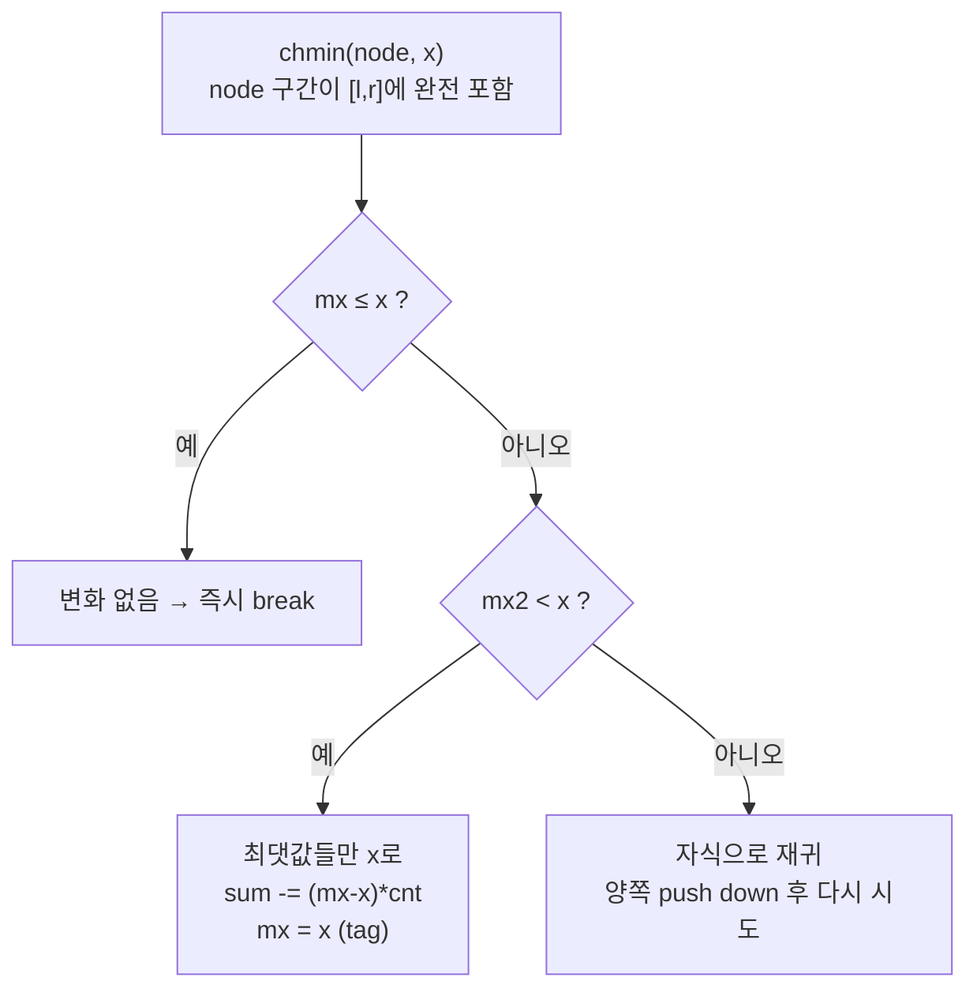

# 세그먼트 트리 비츠 (Segment Tree Beats)

> **오늘의 주제: 세그먼트 트리 비츠 (Segment Tree Beats)**
> 일반 레이지 세그먼트 트리로는 못 미는 **구간 chmin/chmax** (`a[i] = min(a[i], x)` 를 구간에 적용) 갱신을, "조건부로 재귀를 더 내려간다"는 아이디어로 **분할상환 O(log²N)** 에 처리하는 기법. 구간 합/최댓값 쿼리와 함께 쓴다.

---

## 1. 언제 쓰나 (핵심)

다음 연산들이 **섞여서** 나올 때.

1. **구간 chmin**: `for i in [l, r]: a[i] = min(a[i], x)`
2. **구간 chmax**: `for i in [l, r]: a[i] = max(a[i], x)`
3. **구간 합** / **구간 최댓값(최솟값)** 쿼리

> 대표 신호: "구간의 모든 원소를 x 이하로 눌러라(초과분만 x로)", "물을 부어 수위를 x로 맞춰라", "구간 합을 유지하며 값 상한을 반복해서 씌워라". 일반 레이지는 "구간에 x를 더하기/x로 덮어쓰기"만 O(log N)에 되지만, `min(a[i], x)`는 **원소마다 바뀔지 안 바뀔지가 다르다** → 단순 태그로 못 미룬다.

---

## 2. 왜 일반 레이지로 안 되나

구간 갱신을 O(log N)에 미루려면, "이 노드 아래 전부에 같은 효과"라고 태그 하나로 요약할 수 있어야 한다.
그런데 `a[i] = min(a[i], x)`는 **x보다 큰 원소만** x로 줄고, x 이하는 그대로다. 노드마다 영향받는 원소 집합이 달라서 태그 하나로 요약이 안 된다.

**비츠의 관찰**: 그래도 각 노드에서 **최댓값 `mx`, 두 번째 최댓값 `mx2`, 최댓값의 개수 `cnt`** 를 들고 있으면, chmin(x)를 만났을 때 세 경우로 나눌 수 있다.

- `mx <= x` → **아무 변화 없음.** 즉시 리턴 (break 조건).
- `mx2 < x < mx` → **최댓값들만** x로 바뀐다. 합은 `(mx - x) * cnt` 만큼 감소, `mx = x`. **태그로 처리 가능** (tag 조건).
- `x <= mx2` → 두 번째 최댓값까지 걸린다. 요약 불가 → **자식으로 재귀** (계속 내려감).

이 "**멈추거나 / 태그 걸거나 / 더 내려가거나**" 세 갈래가 세그먼트 트리 비츠의 전부다.



---

## 3. 왜 빠른가 (정당성 / 분할상환)

핵심 의문: "조건 안 맞으면 더 내려간다"면 최악에 O(N)이 아닌가? → **분할상환으로 O(log²N)** 임이 증명돼 있다.

직관은 **서로 다른 값의 종류 수**를 퍼텐셜로 잡는 것. 한 서브트리 안에 "구분되는 값의 층(distinct value tag)"의 총합을 Φ라 하면,

- chmin(x)가 **태그로 끝나는** 경우: 최댓값 층 하나가 아래 층에 흡수되어 Φ가 줄어든다.
- **재귀로 더 내려가는** 경우: 내려가며 값 층을 합치므로 Φ가 감소, 이 감소량이 재귀 비용을 상쇄한다.

전체적으로 갱신 M번에 대해 총 작업량이 `O((N + M) log N)`(합/max만) ~ `O((N+M) log²N)`(chmin·chmax 동시)로 묶인다. **한 번의 갱신이 O(log²N)** 이라 생각하고 쓰면 된다.

> 주의: 이건 **분할상환**이라, "최악 한 방"이 아니라 "전체 평균"이 빠른 것. 문제의 연산 수 전체로 복잡도를 계산해야 한다.

---

## 4. 대표 예제 ① — 구간 chmin + 구간 합/최댓값 (BOJ 17474 / HDU 5306)

문제: 배열에 (1) 구간 chmin, (2) 구간 합, (3) 구간 최댓값 쿼리.

### 핵심 아이디어
- 각 노드에 `sum, mx(최댓값), mx2(엄격히 작은 두 번째 최댓값), cnt(최댓값 개수)` 저장.
- chmin 갱신에서 위의 3분기(break / tag / recurse) 적용.
- 병합(merge)에서 `mx, mx2, cnt`를 정확히 합치는 게 관건.

### 시간복잡도
- 갱신·쿼리 각 **분할상환 O(log²N)**, 전체 `O((N+Q) log²N)`.

### 자주 하는 실수
- `mx2`를 "두 번째로 큰 값"으로 두되 **최댓값과 같으면 안 됨** (엄격히 작아야 함). 병합에서 `mx2` 갱신 조건을 틀리기 쉽다.
- tag(chmin) push down 시 **자식의 `mx`가 부모 tag보다 클 때만** 눌러야 한다. 자식 `mx <= tag`면 건드리지 않는다.
- 재귀형 구현이라 **재귀 깊이/속도** 주의. 파이썬은 `sys.setrecursionlimit` 필수, 큰 N은 반복문 최적화나 PyPy 권장.

### Python 풀이

```python
import sys
input = sys.stdin.readline

def solve():
    n = int(input()); q = int(input())
    a = list(map(int, input().split()))
    INF = float('inf')
    size = 1
    while size < n: size <<= 1
    mx  = [-INF]*(2*size)   # 최댓값
    mx2 = [-INF]*(2*size)   # 엄격히 작은 두 번째 최댓값
    cnt = [0]*(2*size)      # 최댓값 개수
    s   = [0]*(2*size)      # 구간 합

    def pull(k):
        l, r = 2*k, 2*k+1
        s[k] = s[l] + s[r]
        if mx[l] == mx[r]:
            mx[k] = mx[l]; cnt[k] = cnt[l] + cnt[r]
            mx2[k] = max(mx2[l], mx2[r])
        elif mx[l] > mx[r]:
            mx[k] = mx[l]; cnt[k] = cnt[l]
            mx2[k] = max(mx2[l], mx[r])
        else:
            mx[k] = mx[r]; cnt[k] = cnt[r]
            mx2[k] = max(mx[l], mx2[r])

    def apply_chmin(k, x):        # x < mx[k], mx2[k] < x 보장된 상태
        if x < mx[k]:
            s[k] -= (mx[k]-x)*cnt[k]
            mx[k] = x

    def push(k):
        for c in (2*k, 2*k+1):
            apply_chmin(c, mx[k])   # 부모 최댓값 상한을 자식에 전파

    def build(k, l, r):
        if l == r:
            v = a[l] if l < n else -INF
            mx[k] = v; mx2[k] = -INF; cnt[k] = 1; s[k] = max(v, 0) if v==-INF else v
            if v == -INF: s[k] = 0; cnt[k] = 0
            return
        m = (l+r)//2
        build(2*k, l, m); build(2*k+1, m+1, r); pull(k)

    def update(k, l, r, ql, qr, x):   # 구간 chmin: a[i]=min(a[i],x)
        if qr < l or r < ql or mx[k] <= x:   # break: 걸릴 것 없음
            return
        if ql <= l and r <= qr and mx2[k] < x:  # tag: 최댓값만 x로
            apply_chmin(k, x); return
        push(k); m = (l+r)//2                    # recurse
        update(2*k, l, m, ql, qr, x)
        update(2*k+1, m+1, r, ql, qr, x)
        pull(k)

    def query_sum(k, l, r, ql, qr):
        if qr < l or r < ql: return 0
        if ql <= l and r <= qr: return s[k]
        push(k); m = (l+r)//2
        return query_sum(2*k, l, m, ql, qr) + query_sum(2*k+1, m+1, r, ql, qr)

    def query_max(k, l, r, ql, qr):
        if qr < l or r < ql: return -INF
        if ql <= l and r <= qr: return mx[k]
        push(k); m = (l+r)//2
        return max(query_max(2*k, l, m, ql, qr), query_max(2*k+1, m+1, r, ql, qr))

    build(1, 0, size-1)
    # 예: update(1,0,size-1,l,r,x) / query_sum(1,0,size-1,l,r) / query_max(...)

# solve()
```

---

## 5. 대표 예제 ② — chmin + chmax + 합 (물 붓기류, BOJ 17476 계열)

chmin과 chmax가 **둘 다** 나오면, 각 노드에 대칭으로

- 최댓값 정보: `mx, mx2, cnt_mx`  (chmin용)
- 최솟값 정보: `mn, mn2, cnt_mn`  (chmax용)
- (필요시) 구간 덧셈 `add` 태그도 함께

를 유지한다. chmin은 "최댓값 층만" 누르고, chmax는 "최솟값 층만" 올린다. 두 태그가 상호작용하므로 push down 순서/일관성 관리가 까다롭다. 복잡도는 **분할상환 O(log²N)** 로 유지된다.

### 핵심 포인트
- chmin(x): `mx <= x`면 무시 / `mx2 < x`면 최댓값만 x로 / 아니면 재귀.
- chmax(x): `mn >= x`면 무시 / `mn2 > x`면 최솟값만 x로 / 아니면 재귀.
- 구간에 원소가 하나만 남은 노드(리프 근처)에선 항상 tag로 끝나므로 무한 재귀 없음.

---

## 6. 언제 안 쓰나 / 주의

- chmin/chmax 없이 "구간 덧셈 + 구간 합"만이면 **그냥 레이지 세그먼트 트리**가 정답. 비츠는 오버킬.
- "구간 대입(assign, 전부 x로 덮기)"만이면 일반 레이지로 충분.
- 파이썬 재귀는 느리다. 큰 입력(수십만 이상)은 **PyPy** 또는 반복/비재귀 구현 고려.
- 복잡도는 항상 **전체 연산 수 기준 분할상환**으로 판단할 것.

---

## 7. Python 템플릿 (chmin + 합/최댓값, 재귀형 요약)

```python
# 노드: mx(최댓값), mx2(둘째 최댓값,엄격), cnt(최댓값 개수), s(합)
# 갱신 3분기가 핵심:
#   mx[k] <= x            → break  (변화 없음)
#   mx2[k] <  x  < mx[k]  → tag    (최댓값만 x로: s -= (mx-x)*cnt; mx=x)
#   x <= mx2[k]           → recurse(push→자식 갱신→pull)
def update(k, l, r, ql, qr, x):
    if qr < l or r < ql or mx[k] <= x:
        return
    if ql <= l and r <= qr and mx2[k] < x:
        s[k] -= (mx[k]-x)*cnt[k]; mx[k] = x
        return
    push(k); m = (l+r)//2
    update(2*k, l, m, ql, qr, x)
    update(2*k+1, m+1, r, ql, qr, x)
    pull(k)
```

---

## 8. 한 줄 요약

- **구간 chmin/chmax + 합/최값**은 일반 레이지로 안 된다 → 각 노드에 `(mx, mx2, cnt)`를 들고 **break / tag / recurse** 3분기로 처리.
- 분할상환 **O(log²N)**. 핵심은 "**둘째 최댓값 `mx2` 을 넘지 않을 때만 태그로 끝내고, 넘으면 더 내려간다**".
