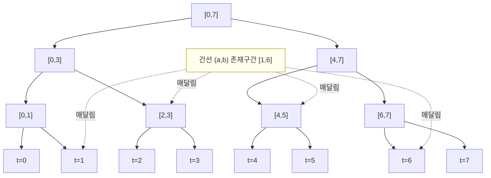

# 오프라인 동적 연결성 (Offline Dynamic Connectivity)

> **오늘의 주제:** 간선이 **추가·삭제**되는 그래프에서 연결성 질의를, **시간 축 세그먼트 트리 + 롤백 유니온파인드**로 오프라인 처리하기.

---

## 1. 언제 쓰나

유니온파인드는 **합치기(union)** 만 되고 **끊기(split)** 는 안 된다. 경로 압축이 구조를 파괴해서 되돌릴 수 없기 때문이다. 그런데 문제는 이렇게 나온다.

- `1 a b` : 간선 (a,b) 추가
- `2 a b` : 간선 (a,b) 삭제
- `3 a b` : a와 b가 같은 컴포넌트인가?

간선이 사라지므로 일반 DSU로는 못 푼다. **오프라인**(모든 쿼리를 미리 읽을 수 있음)이라면, 핵심 관찰 하나로 해결된다.

> **각 간선은 "생성된 시각 ~ 삭제된 시각" 이라는 시간 구간 `[l, r]` 동안만 존재한다.**

즉 "동적으로 켜졌다 꺼지는 간선"을 **시간 구간에 놓인 정적인 존재**로 바꾼다. 그러면 시간 축 위의 구간 갱신 문제가 되고, 세그먼트 트리로 분해할 수 있다.

---

## 2. 핵심 아이디어

### (a) 간선을 시간 구간으로

쿼리를 시각 `0..M-1` 로 본다. 간선 (a,b)가 시각 `l`에 추가되고 시각 `r+1`에 삭제되면, 이 간선은 **시각 `l`부터 `r`까지** 그래프에 존재한다. 끝까지 안 지워지면 `r = M-1`.

### (b) 시간 축 세그먼트 트리에 구간 등록

리프가 시각 `0..M-1`인 세그먼트 트리를 만들고, 각 간선을 자기 존재 구간 `[l, r]`에 대응하는 **O(log M)개의 노드**에 매달아 둔다. (구간 업데이트를 "값 더하기" 대신 "간선 리스트에 append"로 하는 것.)

### (c) 세그먼트 트리를 DFS하며 롤백 DSU

루트에서 DFS로 내려간다.
- 노드에 들어갈 때: 그 노드에 매달린 간선들을 **union** (union by size, **경로 압축 없음**).
- 리프에 도착하면: 그 시각의 `3 a b` 질의에 답한다 (`find(a)==find(b)`).
- 노드에서 **나갈 때**: 방금 한 union들을 **정확히 역순으로 되돌린다(rollback)**.

리프 `t`에 도착했을 때 DSU에는 **루트→리프 경로 위 모든 노드의 간선들**이 합쳐져 있다. 이 간선들의 합집합이 바로 "시각 `t`에 존재하는 간선 전체"다. 세그먼트 트리 구간 분해의 성질 덕분이다.



위 그림에서 존재 구간 `[1,6]`인 간선은 `{t1, [2,3], [4,5], t6}` 네 노드에만 매달린다. 리프 `t=3`로 내려가는 경로는 루트→`[0,3]`→`[2,3]`→`t3`을 지나며 `[2,3]`에서 이 간선을 만나므로, 시각 3에 이 간선이 살아있음이 자동 반영된다.

### 왜 롤백이 가능한가 (정당성)

경로 압축을 **버리고** union by size/rank만 쓰면, union 한 번은 "자식 루트 `b`를 부모 루트 `a` 밑에 붙이고 `sz[a] += sz[b]`" 라는 **딱 두 줄 상태 변화**뿐이다. 스택에 `b`만 기록해 두면 `par[b]=b; sz[a]-=sz[b]` 로 완벽히 되돌릴 수 있다. 경로 압축이 없어 `find`는 O(log N)이지만(union by size가 트리 높이를 log로 보장), 그 대가로 **되돌리기가 O(1)** 가 된다.

---

## 3. 시간 복잡도

- 간선 하나당 세그먼트 트리 노드 O(log M)개에 등록 → 전체 union 호출 O(M log M)회.
- union/find 각각 O(log N) (경로 압축 없는 union by size).
- **총 O((N + M log M) · log N)**, 공간 O(M log M).

M, N ≤ 10⁵ 규모에서 잘 돈다.

---

## 4. 대표 예제 — 백준 16911 그래프와 쿼리

정점 N, 쿼리 M. `1 a b`(간선 추가), `2 a b`(간선 삭제, 존재 보장), `3 a b`(연결 여부 출력).

### 아이디어
1. 쿼리를 순서대로 읽으며, `1`이면 간선 `(a,b)`의 **시작 시각**을 dict에 기록.
2. `2`이면 dict에서 시작 시각 `l`을 꺼내 존재 구간 `[l, 현재-1]`을 세그먼트 트리에 등록.
3. 끝까지 남은 간선은 구간 `[l, M-1]`로 등록.
4. `3`이면 `(t, a, b)`를 답할 질의로 저장.
5. 세그먼트 트리 DFS로 롤백 DSU를 굴리며 리프마다 질의에 답한다.

```python
import sys
input = sys.stdin.buffer.read

def solve():
    data = input().split()
    idx = 0
    n = int(data[idx]); m = int(data[idx+1]); idx += 2

    # ---- 롤백 유니온파인드 (union by size, 경로압축 없음) ----
    par = list(range(n + 1))
    sz = [1] * (n + 1)
    hist = []  # 되돌릴 자식 루트들의 스택 (-1은 no-op 마커)

    def find(x):
        while par[x] != x:
            x = par[x]
        return x

    def union(a, b):
        a, b = find(a), find(b)
        if a == b:
            hist.append(-1)
            return
        if sz[a] < sz[b]:
            a, b = b, a
        par[b] = a
        sz[a] += sz[b]
        hist.append(b)

    def rollback(snap):
        while len(hist) > snap:
            b = hist.pop()
            if b == -1:
                continue
            a = par[b]
            sz[a] -= sz[b]
            par[b] = b

    # ---- 시간 축 세그먼트 트리에 간선 구간 등록 ----
    size = 1
    while size < m:
        size <<= 1
    seg = [[] for _ in range(2 * size)]

    def add_edge(l, r, a, b):  # 시각 [l, r] 에 간선 (a,b)
        l += size; r += size + 1
        while l < r:
            if l & 1:
                seg[l].append((a, b)); l += 1
            if r & 1:
                r -= 1; seg[r].append((a, b))
            l >>= 1; r >>= 1

    active = {}          # (min,max) -> 시작 시각
    queries = [None] * m # 시각별 (a,b) 연결 질의

    for t in range(m):
        c = int(data[idx]); a = int(data[idx+1]); b = int(data[idx+2]); idx += 3
        if a > b:
            a, b = b, a
        if c == 1:
            active[(a, b)] = t
        elif c == 2:
            l = active.pop((a, b))
            add_edge(l, t - 1, a, b)
        else:
            queries[t] = (a, b)

    for (a, b), l in active.items():     # 끝까지 남은 간선
        add_edge(l, m - 1, a, b)

    # ---- 세그먼트 트리 DFS + 롤백 (재귀 깊이 O(log M)) ----
    out = []
    def dfs(node, ns, ne):
        snap = len(hist)
        for a, b in seg[node]:
            union(a, b)
        if ns == ne:
            if ns < m and queries[ns] is not None:
                a, b = queries[ns]
                out.append('1' if find(a) == find(b) else '0')
        else:
            mid = (ns + ne) // 2
            dfs(2 * node, ns, mid)
            dfs(2 * node + 1, mid + 1, ne)
        rollback(snap)

    dfs(1, 0, size - 1)
    sys.stdout.write('\n'.join(out) + ('\n' if out else ''))

solve()
```

핵심은 **경로 압축을 포기하는 대신 되돌릴 수 있게 만든 것**과, **간선을 시간 구간에 못 박아 정적 문제로 바꾼 것** 두 가지다.

---

## 5. 자주 하는 실수

- **경로 압축을 넣어버림.** `find`에서 `par[x] = root` 하면 스택으로 못 되돌린다. 반드시 union by size/rank만.
- **rollback을 DFS `return` 직전에 안 함.** 형제 서브트리로 넘어갈 때 이전 union이 남아 오답. `snap` 찍고 나갈 때 그 지점까지 정확히 pop.
- **삭제 안 된 간선 처리 누락.** 마지막에 `active`에 남은 간선을 `[l, m-1]`로 꼭 등록.
- **간선 키 정규화 안 함.** `(a,b)`와 `(b,a)`를 다르게 보면 삭제 시 못 찾는다. 항상 `a<b`로 정렬.
- **union이 no-op(같은 루트)인데 스택에 안 남김.** 그러면 rollback 개수가 어긋난다. `-1` 마커라도 push해서 union 호출 1회 = 스택 1개를 유지.
- **재귀 한도.** 세그먼트 트리 DFS 깊이는 O(log M)라 얕지만, 습관적으로 `sys.setrecursionlimit` 걱정할 필요는 없다(간선 union은 반복문이므로).

---

## 6. Python 템플릿 (재사용용)

```python
class OfflineDynamicConnectivity:
    """간선 시간구간 등록 → DFS로 시각별 연결성 질의."""
    def __init__(self, n, T):
        self.par = list(range(n + 1)); self.sz = [1] * (n + 1)
        self.hist = []
        self.size = 1
        while self.size < T: self.size <<= 1
        self.seg = [[] for _ in range(2 * self.size)]
        self.q = [None] * T; self.T = T

    def find(self, x):
        while self.par[x] != x: x = self.par[x]
        return x

    def _union(self, a, b):
        a, b = self.find(a), self.find(b)
        if a == b: self.hist.append(-1); return
        if self.sz[a] < self.sz[b]: a, b = b, a
        self.par[b] = a; self.sz[a] += self.sz[b]; self.hist.append(b)

    def _rollback(self, snap):
        while len(self.hist) > snap:
            b = self.hist.pop()
            if b == -1: continue
            self.sz[self.par[b]] -= self.sz[b]; self.par[b] = b

    def add_edge(self, l, r, a, b):   # 시각 [l,r] 동안 간선 존재
        l += self.size; r += self.size + 1
        while l < r:
            if l & 1: self.seg[l].append((a, b)); l += 1
            if r & 1: r -= 1; self.seg[r].append((a, b))
            l >>= 1; r >>= 1

    def ask(self, t, a, b):           # 시각 t에 a,b 연결 여부 질의
        self.q[t] = (a, b)

    def run(self):
        res = [None] * self.T
        def dfs(node, ns, ne):
            snap = len(self.hist)
            for a, b in self.seg[node]: self._union(a, b)
            if ns == ne:
                if ns < self.T and self.q[ns] is not None:
                    a, b = self.q[ns]
                    res[ns] = (self.find(a) == self.find(b))
            else:
                mid = (ns + ne) // 2
                dfs(2 * node, ns, mid); dfs(2 * node + 1, mid + 1, ne)
            self._rollback(snap)
        dfs(1, 0, self.size - 1)
        return res
```

---

## 7. 한 줄 정리

> **"삭제되는 간선 = 시간 구간에 놓인 정적 간선."** 시간 축 세그먼트 트리에 구간으로 매달고, **경로 압축 없는 롤백 DSU**로 DFS하며 리프마다 질의에 답한다. O((N+M log M) log N).
