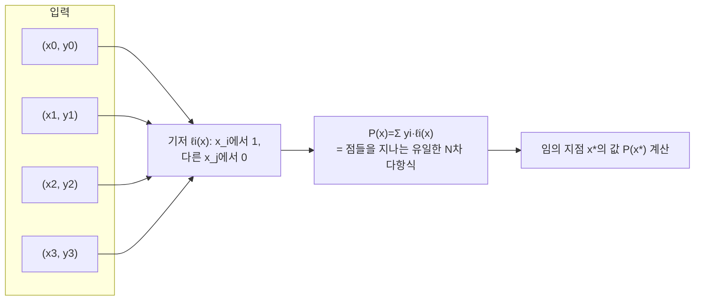

# 라그랑주 보간법 (Lagrange Interpolation)

> **오늘의 주제: 라그랑주 보간법 (Lagrange Interpolation)**
> 서로 다른 N+1개의 점 $(x_i, y_i)$ 을 정확히 지나는 **유일한 N차 이하 다항식**을 복원하고, 임의의 지점 값을 계산한다.

---

## 1. 왜 동작하는가 (핵심 아이디어)

차수 $\le N$ 인 다항식은 계수가 $N+1$ 개다. 서로 다른 $x$ 값 $N+1$ 개에서의 함수값이 주어지면
**반더몬드 행렬이 가역**이므로 다항식은 **유일하게** 결정된다.

라그랑주는 이 다항식을 계수 없이 바로 써낸다:

$$
P(x) \;=\; \sum_{i=0}^{N} y_i \cdot \ell_i(x),
\qquad
\ell_i(x) \;=\; \prod_{j \ne i} \frac{x - x_j}{x_i - x_j}
$$

**핵심 트릭**: 기저 다항식 $\ell_i(x)$ 는
- $x = x_i$ 에서 값이 **1** (분자·분모가 같음)
- $x = x_j\ (j\ne i)$ 에서 값이 **0** (분자에 $(x-x_j)$ 인수)

따라서 $P(x_k) = \sum_i y_i \ell_i(x_k) = y_k$ 가 자동으로 맞는다. 이게 정당성의 전부다.



## 2. 언제 쓰나

- **점 집합만 알고 다항식 값을 알고 싶을 때** (계수 복원까지 필요 없을 때가 많음).
- 답이 $k$ 차 **다항식임이 보장**될 때 → 점 $k+1$ 개만 뽑아 나머지 값을 보간.
  - 대표 예: **자연수 거듭제곱의 합** $S_k(n)=\sum_{i=1}^{n} i^k$ 는 $n$ 에 대한 $(k+1)$ 차 다항식.
  - DP 결과가 $n$ 에 대해 다항식일 때, 작은 $n$ 몇 개만 계산 후 큰 $n$ 값을 보간.
- 보통 **모듈러 소수 $p$** 아래에서 정수 연산 + 역원으로 계산.

## 3. 시간복잡도

- **일반 (임의 $x_i$)**: 각 점마다 $\ell_i$ 계산에 $O(N)$ → 전체 **$O(N^2)$**.
- **연속 정수점** $x_i = 0,1,\dots,N$ 인 특수 케이스: 접두/접미곱 + 팩토리얼 전처리로 **$O(N)$** (아래 템플릿).

---

## 4. 예제 1 — 일반 점에서 한 지점 보간 (O(N²))

임의의 서로 다른 점들에서 목표 $x^*$ 의 값을 모듈러로 구한다.

```python
import sys
MOD = 10**9 + 7

def lagrange_eval(xs, ys, x, mod=MOD):
    n = len(xs)
    x %= mod
    res = 0
    for i in range(n):
        num = den = 1
        for j in range(n):
            if i == j:
                continue
            num = num * ((x - xs[j]) % mod) % mod
            den = den * ((xs[i] - xs[j]) % mod) % mod
        term = ys[i] * num % mod * pow(den, mod - 2, mod) % mod
        res = (res + term) % mod
    return res

# 예: (0,0),(1,1),(2,4),(3,9) -> f(x)=x^2, f(5)=25
print(lagrange_eval([0,1,2,3], [0,1,4,9], 5))  # 25
```

**아이디어**: 정의 그대로. 분모는 페르마 소정리 $a^{-1}\equiv a^{p-2}$ 로 역원.
**주의**: 음수 $(x-x_j)$ 는 `% mod` 로 항상 0~mod-1 로 정규화.

## 5. 예제 2 — 거듭제곱 합 $\sum_{i=1}^{n} i^k \bmod p$ (연속점 O(k) 보간)

$S_k(n)$ 은 $(k+1)$ 차 다항식이므로 점 $x=0,1,\dots,k+1$ ($k+2$ 개)만 있으면
큰 $n$ 에서의 값을 $O(k)$ 로 얻는다.

```python
import sys
MOD = 10**9 + 7

def sum_of_powers(n, k, mod=MOD):
    m = k + 2                    # 필요한 점 개수 (차수 k+1 -> 점 k+2)
    # y[i] = S_k(i) = 0^k + 1^k + ... + i^k, i = 0..m-1
    y = [0] * m
    for i in range(1, m):
        y[i] = (y[i-1] + pow(i, k, mod)) % mod
    if n < m:                   # 작은 n은 표에서 바로
        return y[n] % mod
    n %= mod
    # 접두곱 pre[i] = ∏_{j<i}(n-j), 접미곱 suf[i] = ∏_{j>i}(n-j)
    pre = [1] * (m + 1)
    suf = [1] * (m + 1)
    for i in range(m):
        pre[i+1] = pre[i] * ((n - i) % mod) % mod
    for i in range(m - 1, -1, -1):
        suf[i] = suf[i+1] * ((n - i) % mod) % mod
    # 팩토리얼 전처리 (분모: i! * (m-1-i)! 에 부호)
    fact = [1] * m
    for i in range(1, m):
        fact[i] = fact[i-1] * i % mod
    inv_fact = [1] * m
    inv_fact[m-1] = pow(fact[m-1], mod - 2, mod)
    for i in range(m - 2, -1, -1):
        inv_fact[i] = inv_fact[i+1] * (i+1) % mod
    res = 0
    for i in range(m):
        num = pre[i] * suf[i+1] % mod          # ∏_{j≠i}(n-j)
        den = inv_fact[i] * inv_fact[m-1-i] % mod
        term = y[i] * num % mod * den % mod
        if (m - 1 - i) & 1:                     # 분모의 부호 (-1)^(m-1-i)
            term = mod - term
        res = (res + term) % mod
    return res % mod

# 예: 1^2+2^2+...+10^2 = 385
print(sum_of_powers(10, 2))   # 385
```

**핵심**: 연속점이면 분모 $\prod_{j\ne i}(x_i-x_j) = i!\,(m-1-i)!\cdot(-1)^{m-1-i}$ 로 **팩토리얼 한 번**에 처리, 분자는 접두·접미곱으로 각 $i$ 마다 $O(1)$ → 전체 $O(m)=O(k)$.

---

## 6. 자주 하는 실수

- **중복된 $x_i$**: 분모가 0 → 정의 불가. 반드시 서로 다른 $x$.
- **점 개수 부족**: 답이 $d$ 차인데 점을 $d$ 개만 뽑으면 오답. **$d+1$ 개** 필요. (거듭제곱 합은 $k+2$ 개!)
- **음수 모듈러**: `(x - xj) % mod` 로 정규화 안 하면 역원 계산이 어긋남.
- **역원 남발**: 점마다 `pow(den, mod-2)` 를 부르면 $O(N\log p)$. 연속점은 팩토리얼 역원 전처리로 로그 제거.
- **작은 $n$ 예외**: 보간 대상 $n$ 이 표 범위 안이면 그냥 표에서 읽기 (위 코드의 `n < m`).

## 7. Python 템플릿 (일반 점 · 안전 버전)

```python
def lagrange(xs, ys, x, mod=10**9+7):
    n = len(xs); x %= mod; res = 0
    for i in range(n):
        num = den = 1
        for j in range(n):
            if i != j:
                num = num * ((x - xs[j]) % mod) % mod
                den = den * ((xs[i] - xs[j]) % mod) % mod
        res = (res + ys[i] * num % mod * pow(den, mod-2, mod)) % mod
    return res
```

**한 줄 요약**: "점 N+1개 → 유일한 N차 다항식." 답이 다항식임이 보이면, 작은 점 몇 개만 계산하고 나머지는 보간으로 건너뛴다. 연속 정수점이면 팩토리얼 전처리로 $O(N)$.
