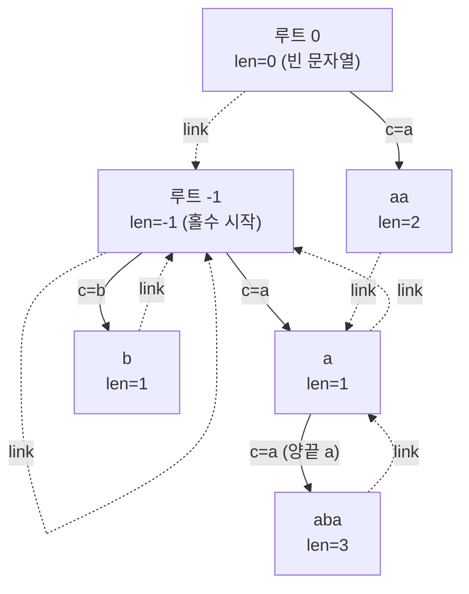

# 회문 트리 (Eertree / Palindromic Tree)

> **오늘의 주제:** 문자열의 **모든 서로 다른 회문 부분문자열**을 O(N)에 관리하는 자료구조 — 회문 트리(Eertree).
> 언어: **Python**

---

## 왜 배우나 / 언제 쓰나

매내처(Manacher)는 "각 중심의 가장 긴 회문 반지름"을 O(N)에 구해준다. 하지만
- 문자열에 **서로 다른 회문이 몇 종류** 있는지
- 각 회문이 **몇 번 등장**하는지
- 회문끼리의 **포함(접미사 링크) 구조**

같은 걸 통째로 다뤄야 하면 매내처만으로는 부족하다. **회문 트리**는 이 모든 정보를 담는다.

**핵심 사실:** 길이 N 문자열이 가질 수 있는 **서로 다른 회문(distinct palindrome)의 개수는 최대 N개**다. 문자를 하나 붙일 때 "새로 생기는 회문"은 많아야 1개이기 때문. → 그래서 노드 수가 O(N), 전체 구축이 O(N·σ) 또는 해시맵으로 O(N).

**주로 쓰는 곳**
- 서로 다른 회문 개수 / 각 회문 등장 횟수
- 가장 긴/짧은 회문, 회문 관련 DP(예: 문자열을 회문으로 분할)
- "모든 위치에서 끝나는 회문 종류 수" 같은 온라인 질의

---

## 구조: 노드 · 링크 · 두 개의 루트

회문 트리는 각 노드가 **하나의 서로 다른 회문**을 나타낸다.

- **`len[v]`** : 그 회문의 길이
- **자식 간선 `to[v][c]`** : 회문 `P`의 **양 끝에 문자 c를 덧댄** 회문 `cPc` 로 가는 간선 (그래서 길이가 +2)
- **접미사 링크 `link[v]`** : `P`의 **가장 긴 진 회문 접미사(proper palindromic suffix)** 로 가는 링크
- **두 개의 가상 루트**
  - **루트 −1 (imaginary):** `len = -1`. "가짜 홀수 루트". 여기 자식 `c`는 길이 1 회문(문자 하나).
  - **루트 0 (empty):** `len = 0`. 빈 문자열. 여기 자식 `c`는 길이 2 회문 `cc`.
  - `link[0] = -1`, `link[-1] = -1`.

`len = -1`인 가상 루트가 이 자료구조의 트릭이다. 새 문자 `s[i]`를 붙일 때 "양끝에 s[i]가 오는 회문"을 찾는데, `X + a·X·a` 꼴에서 X의 길이가 -1이면 결과가 길이 1인 단일 문자 회문이 되어 **경계 처리 없이 자연스럽게** 홀수 회문이 시작된다.



*(간선 = 양끝에 문자 덧대기 / 점선 = 접미사 링크. `aba`는 양끝이 `a`, 안쪽이 `b`이므로 `b`(len1)에 a를 덧댄 것 — 위 그림은 개념 예시)*

---

## 삽입 알고리즘 (문자 하나 추가)

문자열을 왼쪽부터 한 글자씩 넣는다. 상태로 **`last`** (직전 위치에서 끝나는 **가장 긴 회문** 노드)를 유지한다.

`s[i]`를 붙일 때:

1. `last`에서 접미사 링크를 타고 올라가며, **`s[i - len[v] - 1] == s[i]`** 를 만족하는 노드 `v`를 찾는다.
   → `v`가 나타내는 회문 앞뒤로 `s[i]`를 붙일 수 있다는 뜻. (가상 루트 −1이면 항상 만족 → 홀수 회문 시작)
2. 이미 `to[v][s[i]]`가 있으면 그게 새 `last`. (기존 회문 재등장) 끝.
3. 없으면 **새 노드** `cur`를 만든다. `len[cur] = len[v] + 2`.
4. `cur`의 **접미사 링크**를 정한다:
   - `len[cur] == 1`이면 `link = 0`(빈 문자열).
   - 아니면 `v`의 링크에서 다시 위로 올라가며 **같은 조건** `s[i - len[u] - 1] == s[i]`를 만족하는 `u`를 찾고, `link[cur] = to[u][s[i]]`.
5. `to[v][s[i]] = cur`, `last = cur`.

각 문자를 넣을 때 접미사 링크를 타고 올라가는 총 횟수가 분할상환 O(1) → **전체 O(N)**.

---

## 대표 예제 1 — 서로 다른 회문 개수 (BOJ 스타일)

문자열 `s`에 등장하는 **서로 다른 회문 부분문자열의 개수**를 구하라.
→ 회문 트리의 **노드 수 − 2**(가상 루트 2개 제외)가 답.

```python
import sys

def count_distinct_palindromes(s: str) -> int:
    n = len(s)
    # 노드 0 = 빈 문자열(len 0), 노드 1 = 가상 루트(len -1)
    length = [0, -1]
    link   = [1, 1]          # link[0]=1(가상루트), link[1]=1
    to     = [dict(), dict()]
    last = 1                 # 시작은 가상 루트(-1)

    def get_link(v, i):      # s[i]를 양끝에 붙일 수 있는 노드까지 링크 타고 올라감
        while i - length[v] - 1 < 0 or s[i - length[v] - 1] != s[i]:
            v = link[v]      # 앞에 문자가 없으면(경계) 링크로 상승
        return v

    for i in range(n):
        c = s[i]
        v = get_link(last, i)
        if c in to[v]:
            last = to[v][c]
            continue
        # 새 회문 노드 생성
        cur = len(length)
        length.append(length[v] + 2)
        to.append(dict())
        if length[cur] == 1:
            link.append(0)          # 길이 1 회문의 접미사 링크는 빈 문자열
        else:
            u = get_link(link[v], i)
            link.append(to[u][c])
        to[v][c] = cur
        last = cur

    return len(length) - 2          # 가상 루트 2개 제외

if __name__ == "__main__":
    s = sys.stdin.readline().strip()
    print(count_distinct_palindromes(s))
```

- **핵심 아이디어:** 노드 = 서로 다른 회문 1개. 노드 수 − 2 = 답.
- **시간복잡도:** O(N)  (문자당 링크 상승 분할상환 O(1), 간선 저장은 dict)
- **자주 하는 실수:**
  - 가상 루트 `len=-1` 을 빼먹고 홀수 회문 경계를 특수 처리하려다 버그.
  - **Python 음수 인덱스 함정:** `s[i - length[v] - 1]` 이 −1이 되면 Python은 뒤에서부터 wrap해 **엉뚱한 문자와 비교**한다. 반드시 `i - length[v] - 1 < 0` 경계 체크를 먼저 넣어 링크로 올라가게 할 것. (C++ 배열이면 범위 밖 접근 → UB이므로 마찬가지로 가드 필요) 가상 루트 `len=-1`에선 `i-(-1)-1 = i ≥ 0`이라 언제나 안전하게 멈춘다.

---

## 대표 예제 2 — 각 회문의 등장 횟수 (빈도 세기)

각 서로 다른 회문이 문자열 전체에서 **몇 번 나타나는지** 합을 구하자.
(예: "a
aa" 에서 회문 `a`는 3번, `aa`는 2번, `aaa`는 1번 → 합 6)

삽입 시 `cnt[cur] += 1` 로 "그 위치에서 끝나는 최장 회문"만 센 다음,
**노드를 len 내림차순(= 생성 역순)으로 접미사 링크를 따라 누적**하면 각 회문의 진짜 등장 횟수가 된다.

```python
def sum_palindrome_occurrences(s: str) -> int:
    n = len(s)
    length = [0, -1]; link = [1, 1]; to = [dict(), dict()]
    cnt = [0, 0]
    last = 1

    def get_link(v, i):
        while i - length[v] - 1 < 0 or s[i - length[v] - 1] != s[i]:
            v = link[v]
        return v

    for i in range(n):
        c = s[i]
        v = get_link(last, i)
        if c in to[v]:
            last = to[v][c]
        else:
            cur = len(length)
            length.append(length[v] + 2); to.append(dict()); cnt.append(0)
            link.append(0 if length[cur] == 1 else to[get_link(link[v], i)][c])
            to[v][c] = cur
            last = cur
        cnt[last] += 1        # 이 위치에서 끝나는 최장 회문에만 +1

    # 생성 역순(= 긴 회문 → 짧은 회문)으로 자식 카운트를 부모(접미사 링크)에 전파
    total = 0
    for v in range(len(length) - 1, 1, -1):   # 가상 루트 0,1 제외
        cnt[link[v]] += cnt[v]
        total += cnt[v]                        # 각 회문 등장 횟수의 총합
        # (변형: total += cnt[v] * length[v] 로 하면 '등장횟수 × 길이' 가공값)
    return total   # "aaa" → a×3 + aa×2 + aaa×1 = 6
```

- **핵심:** `cnt`를 "그 위치에서 끝나는 최장 회문"에만 +1 → 접미사 링크로 역순 전파하면 짧은 회문들의 등장이 자동 합산.
- **정당성:** 어떤 회문이 위치 `i`에서 끝난다면, 그 위치의 최장 회문의 **회문 접미사**로 반드시 포함된다 → 링크 전파가 곧 "포함 관계 합산".
- **주의:** 반드시 **len 내림차순(생성 역순)** 으로 전파해야 부모가 자식 값을 다 받는다.

---

## Python 템플릿 (재사용용)

```python
class Eertree:
    def __init__(self, s):
        self.s = s
        self.len  = [0, -1]      # 0: 빈문자열, 1: 가상루트(-1)
        self.link = [1, 1]
        self.to   = [dict(), dict()]
        self.cnt  = [0, 0]
        self.last = 1
        for i in range(len(s)):
            self._add(i)

    def _get_link(self, v, i):
        while i - self.len[v] - 1 < 0 or self.s[i - self.len[v] - 1] != self.s[i]:
            v = self.link[v]
        return v

    def _add(self, i):
        c = self.s[i]
        v = self._get_link(self.last, i)
        if c in self.to[v]:
            self.last = self.to[v][c]
            self.cnt[self.last] += 1
            return
        cur = len(self.len)
        self.len.append(self.len[v] + 2)
        self.to.append(dict())
        self.cnt.append(1)
        if self.len[cur] == 1:
            self.link.append(0)
        else:
            u = self._get_link(self.link[v], i)
            self.link.append(self.to[u][c])
        self.to[v][c] = cur
        self.last = cur

    def distinct_count(self):
        return len(self.len) - 2

    def propagate(self):          # 각 회문 등장 횟수 확정
        for v in range(len(self.len) - 1, 1, -1):
            self.cnt[self.link[v]] += self.cnt[v]
```

- **복잡도:** 구축 O(N), 노드 수 ≤ N+2.
- **팁:** 알파벳이 작고 속도가 급하면 `dict` 대신 크기 σ 배열을 써도 되지만, 파이썬에선 dict가 메모리·속도 균형이 좋다. PyPy면 배열이 더 빠름.

---

## 요약

- 회문 트리 = 서로 다른 회문마다 노드 1개(**최대 N개**), 접미사 링크로 포함 구조 관리.
- 가상 루트 `len=-1` 트릭으로 홀수/짝수 회문을 **경계 없이** 통합 처리.
- 삽입마다 `last`에서 링크 상승 → 분할상환 **O(N)**.
- 노드 수 − 2 = 서로 다른 회문 개수 / 링크 역순 전파 = 각 회문 등장 횟수.
- 매내처는 "가장 긴 회문 반지름", 회문 트리는 "회문들의 집합·구조·빈도" — 목적이 다르다.
