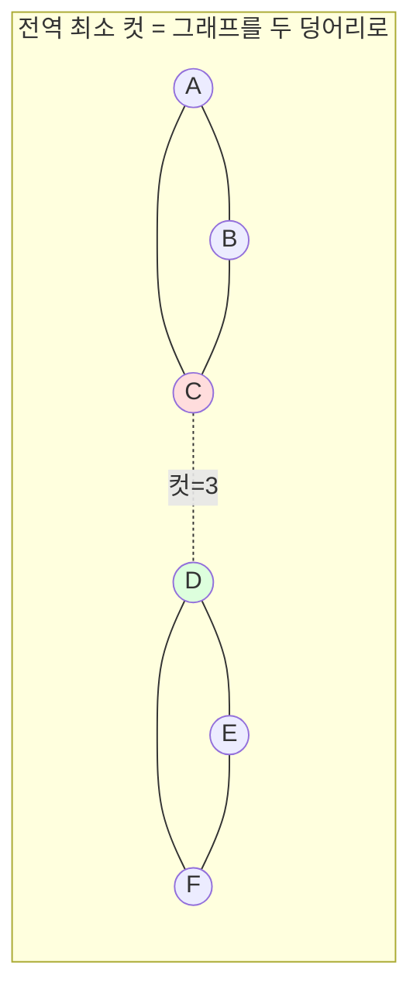

# 오늘의 주제: 스토어-바그너 전역 최소 컷 (Stoer-Wagner Global Minimum Cut)

> **한 줄 요약**: 무방향 가중 그래프에서 **정점 집합을 두 개로 나누는 모든 방법 중 가로지르는 간선 가중치 합이 최소**인 컷을, s·t를 지정하지 않고 통째로 구한다. 최대유량 없이 O(V³)으로.

---

## 1. s-t 컷 vs 전역 최소 컷 — 무엇이 다른가

이미 배운 **최대유량 = 최소컷** (디닉/포드-풀커슨)은 **s와 t가 정해진** 상태의 최소 s-t 컷이다.
전역 최소 컷은 s·t를 **아무렇게나 잡아도 좋으니** 그래프를 두 덩어리로 쪼개는 최소 비용을 찾는다.

- 순진한 방법: s를 고정하고 나머지 V−1개를 각각 t로 놓아 최대유량을 V−1번 → O(V) 번의 flow. 느리고 무겁다.
- **스토어-바그너**: 유량 없이, 그래프를 점점 축약(contraction)하며 **O(V)번의 "최대 인접성 순서(maximum adjacency order)" 탐색**만으로 전역 최소 컷을 얻는다. 총 O(V³) (또는 힙으로 O(VE + V²logV)).

**중요**: 방향이 없는 **무방향** 그래프에서만 성립한다. 간선 가중치는 음이 아니어야 한다.


> 위 그림에서 A·B·C와 D·E·F를 나누는 컷(간선 C–D 하나, 가중치 3)이 전역 최소일 수 있다. s·t를 지정하지 않았다는 점이 핵심.

---

## 2. 핵심 아이디어 — "최소 컷 위상(Minimum Cut Phase)"

한 **phase**는 다음을 한다.

1. 임의의 정점 하나에서 시작해, 매 단계 **"이미 뽑은 집합 A와의 연결 가중치 합이 가장 큰"** 정점을 골라 A에 추가한다 (최대 인접성 순서).
2. 이 순서로 정점을 다 뽑으면, **마지막에서 두 번째로 뽑힌 정점 `s`와 마지막 정점 `t`**가 생긴다.
3. 이때 **"t를 나머지 전부와 분리하는 컷(cut-of-the-phase)"의 값 = t를 A에 넣을 때의 연결 가중치 합**이다. 이것이 **최소 s-t 컷**임이 보장된다 (핵심 정리).
4. `s`와 `t`를 **하나의 정점으로 합친다(contract)**. 둘 사이 간선은 없애고, 다른 정점 v로 가던 두 간선 가중치는 더한다.

phase를 V−1번 반복하면 정점이 하나로 줄고, 그동안 나온 cut-of-the-phase 값들의 **최솟값이 곧 전역 최소 컷**이다.

### 왜 동작하는가 (정당성 스케치)
- **정리**: 최대 인접성 순서로 뽑았을 때 마지막 두 정점 s, t에 대해, cut-of-the-phase는 s와 t를 분리하는 **최소 s-t 컷**과 같다.
- 전역 최소 컷은 s·t를 어떻게 잡든 "그 컷이 s와 t를 분리하는가"로 나뉜다.
  - 분리한다면 → 그 phase의 cut-of-the-phase(=최소 s-t 컷)가 이미 그 이하다.
  - 분리 안 한다면 → s와 t는 같은 편이므로 **합쳐도(contract) 전역 최소 컷은 보존**된다.
- 따라서 매 phase마다 후보를 하나씩 확정하고 축약해도 최적해를 놓치지 않는다.

---

## 3. 대표 예제 — 백준 13158 / 개념: 무방향 그래프 전역 최소 컷

인접 행렬 `w[i][j]`(무방향, 가중치 합)로 주어진 그래프의 전역 최소 컷을 구한다.

### 핵심 아이디어
- 인접 행렬 하나로 축약을 표현한다. 정점을 "살아있음/죽음(merged)"으로 관리.
- 매 phase: `dist[v]` = 현재 A와 v의 연결 가중치 합. 가장 큰 v를 계속 A에 추가.
- phase 끝에서 마지막 두 정점 prev(s), last(t)를 얻고 `dist[last]`가 cut-of-the-phase.
- s에 t를 합치기: 모든 살아있는 v에 대해 `w[s][v] += w[t][v]`, 대칭도 갱신. t는 죽음 처리.

### 시간복잡도
- phase마다 정점 선택 V번, 각 선택마다 `dist` 갱신 O(V) → phase 하나 O(V²). phase가 V−1번 → **O(V³)**.
- 조밀 그래프(인접 행렬)에서 실용적. V ≤ 500 정도까지 무난.

### Python 풀이

```python
import sys
input = sys.stdin.readline
INF = float('inf')

def stoer_wagner(n, w):
    # w: n x n 인접 행렬(무방향, 대칭). 자기 자신 0.
    alive = [True] * n
    vertices = list(range(n))
    best = INF

    for phase in range(n - 1):
        dist = [0] * n          # A와의 연결 가중치 합
        added = [False] * n
        prev = last = -1
        # 살아있는 정점 개수만큼 최대 인접성 순서로 뽑기
        cnt = sum(alive)
        for _ in range(cnt):
            # dist 최대인, 아직 안 뽑힌 살아있는 정점 선택
            sel = -1
            for v in range(n):
                if alive[v] and not added[v] and (sel == -1 or dist[v] > dist[sel]):
                    sel = v
            added[sel] = True
            prev, last = last, sel
            for v in range(n):
                if alive[v] and not added[v]:
                    dist[v] += w[sel][v]
        # cut-of-the-phase = dist[last] (last를 나머지와 분리하는 컷)
        best = min(best, dist[last])
        # prev(s)에 last(t) 합치기 (contract)
        for v in range(n):
            w[prev][v] += w[last][v]
            w[v][prev] += w[v][last]
        alive[last] = False
    return best

n, m = map(int, input().split())
w = [[0] * n for _ in range(n)]
for _ in range(m):
    a, b, c = map(int, input().split())   # 0-indexed 무방향 간선
    w[a][b] += c
    w[b][a] += c
print(stoer_wagner(n, w))
```

> 주의: 다중 간선은 **가중치를 더해** 하나로 합쳐야 한다(위 입력부의 `+=`). 그래야 축약 로직과 일관된다.

---

## 4. 자주 하는 실수

- **방향 그래프에 적용**: 스토어-바그너는 무방향 전용. 방향 그래프 전역 최소 컷은 각 정점을 s로 고정해 최대유량을 여러 번 돌려야 한다.
- **cut-of-the-phase를 잘못 읽음**: 값은 반드시 **마지막 정점 `last`의 `dist`**다. `prev`가 아니다.
- **contract 방향 혼동**: 살아남는 쪽(prev=s)에 죽는 쪽(last=t)의 간선을 더한다. 반대로 하면 다음 phase에서 죽은 정점을 참조한다.
- **다중 간선/자기루프**: 다중 간선은 합치고, 자기루프(w[i][i])는 컷에 기여하지 않으니 무시(0으로 둠).
- **`best` 초기값을 0으로**: 반드시 INF로. 컷 값은 0 이상이라 0으로 두면 항상 0이 나온다.
- **V=1**: 정점 하나면 컷이 정의 안 됨. 문제 제약을 확인.

---

## 5. Python 템플릿 (힙 없이 O(V³), 인접 행렬)

```python
INF = float('inf')

def global_min_cut(n, w):
    """w: n×n 대칭 인접행렬(가중치 합). 반환: 전역 최소 컷 값."""
    alive = [True] * n
    best = INF
    for _ in range(n - 1):
        dist = [0] * n
        added = [False] * n
        prev = last = -1
        for _ in range(sum(alive)):
            sel = max((v for v in range(n) if alive[v] and not added[v]),
                      key=lambda v: dist[v])
            added[sel] = True
            prev, last = last, sel
            for v in range(n):
                if alive[v] and not added[v]:
                    dist[v] += w[sel][v]
        best = min(best, dist[last])
        for v in range(n):
            w[prev][v] += w[last][v]
            w[v][prev] += w[v][last]
        alive[last] = False
    return best
```

**언제 쓰나**: "네트워크를 최소 비용으로 두 조각으로 끊기", "가장 약하게 연결된 부분 찾기", 신뢰도/취약점 분석 등 **s·t가 지정되지 않은** 무방향 최소 컷 문제. s·t가 고정이면 그냥 최대유량(디닉)을 쓴다.
