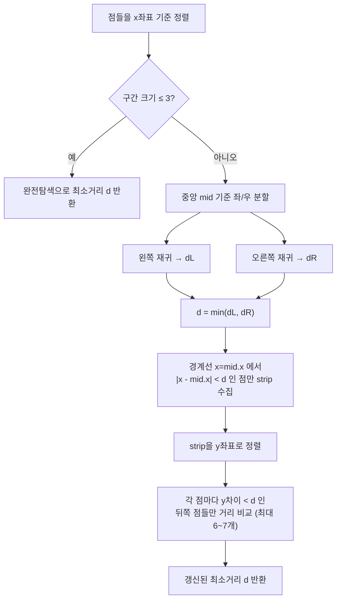

# 가장 가까운 두 점 (Closest Pair of Points, 분할 정복)

> **오늘의 주제:** 평면 위 N개의 점에서 **거리가 최소인 두 점 쌍**을 찾는다.
> 모든 쌍을 비교하면 O(N²)이지만, **분할 정복 + 경계 띠(strip) 검사**로 **O(N log N)**에 푼다.

---

## 1. 왜 이 알고리즘인가

- 점이 N ≤ 10만이면 O(N²) = 100억 → 시간 초과.
- 핵심 통찰: 점들을 x좌표로 정렬해 **왼쪽 절반 / 오른쪽 절반**으로 나누면,
  - 각 절반 내부의 최소 거리는 재귀로 구할 수 있다.
  - 남은 경우는 **한 점은 왼쪽, 한 점은 오른쪽**인 쌍뿐인데, 이건 경계선 근처의 좁은 띠만 보면 된다.
- 이 "띠 안에서는 각 점당 상수 개의 이웃만 검사하면 충분하다"는 성질 덕분에 병합 단계가 O(N)이 된다.

---

## 2. 알고리즘 흐름



### 핵심 아이디어
1. **분할**: x 정렬 후 중앙에서 좌/우로 나눠 각각 재귀 → 두 절반의 최소거리 `d = min(dL, dR)`.
2. **경계 띠(strip)**: 경계선에서 x거리가 `d` 미만인 점만 모은다. (더 멀면 좌↔우 쌍이 `d`보다 가까울 수 없음)
3. **띠 검사**: strip을 y로 정렬한 뒤, 각 점에서 **y차이가 `d` 미만인 점들**하고만 비교.

### 왜 각 점당 상수 번만 보면 되는가 (정당성)
- 경계 띠는 폭 `2d`(양쪽 `d`)인 세로 구간. 여기서 이미 알려진 최소거리는 `d`.
- 한 점 기준 아래 방향 `d × 2d` 사각형 안에는, "서로 `d` 이상 떨어진 점"이 최대 **8개**(각 `d/2 × d/2` 셀에 1개씩)밖에 못 들어간다.
- 따라서 y 정렬 후 **뒤쪽 6~7개**만 비교하면 충분 → 병합 단계 O(N).

---

## 3. 시간복잡도

- 정렬 O(N log N) + 분할정복 재귀 `T(N) = 2T(N/2) + O(N)` = **O(N log N)**.
- strip을 매번 정렬하면 O(N log² N)이 되므로, 큰 입력에선 y정렬을 미리 해두거나 병합정렬처럼 y순서를 올려보내면 O(N log N).

---

## 4. 대표 예제 — 백준 2261 「가장 가까운 두 점」

N개의 점(중복 가능) 중 가장 가까운 두 점의 **거리의 제곱**을 출력. (N ≤ 100,000)

> 거리 비교엔 **제곱 거리**만 쓰면 실수 오차·`sqrt` 비용을 피할 수 있다. 정답도 제곱값.

### 풀이 A: 분할 정복 (정석)

```python
import sys
input = sys.stdin.readline

def dist2(a, b):
    return (a[0]-b[0])**2 + (a[1]-b[1])**2

def closest(pts):
    n = len(pts)
    if n <= 3:                      # 기저: 완전탐색
        return min(dist2(pts[i], pts[j])
                   for i in range(n) for j in range(i+1, n))
    mid = n // 2
    mx = pts[mid][0]
    d = min(closest(pts[:mid]), closest(pts[mid:]))  # 좌/우 재귀

    strip = [p for p in pts if (p[0]-mx)**2 < d]      # 경계 띠
    strip.sort(key=lambda p: p[1])                    # y 정렬
    m = len(strip)
    for i in range(m):
        for j in range(i+1, m):
            if (strip[j][1]-strip[i][1])**2 >= d:     # y차이 벗어나면 중단
                break
            d = min(d, dist2(strip[i], strip[j]))
    return d

n = int(input())
pts = sorted(tuple(map(int, input().split())) for _ in range(n))  # x, then y
print(closest(pts))
```

### 풀이 B: 스위핑 + 정렬셋 (파이썬에서 안정적, 실전 추천)

파이썬은 재귀·슬라이싱 오버헤드가 커서 D&C가 아슬아슬할 수 있다.
x로 정렬해 훑으면서 **폭 `√best` 윈도우**만 y정렬 상태로 유지하면 각 점당 상수 개만 비교한다.

```python
import sys
from math import isqrt
from bisect import insort, bisect_left
input = sys.stdin.readline

n = int(input())
pts = sorted(tuple(map(int, input().split())) for _ in range(n))  # x 오름차순

INF = float('inf')
best = INF
active = []          # 현재 윈도우, (y, x) 로 정렬 유지
left = 0             # 윈도우 왼쪽 경계 (pts 인덱스)
for x, y in pts:
    r = isqrt(best) if best != INF else 10**9   # x·y 차이가 r 이하인 점만 후보
    while pts[left][0] < x - r:                  # x거리 너무 먼 점은 윈도우에서 제거
        px, py = pts[left]
        active.pop(bisect_left(active, (py, px)))
        left += 1
    lo = bisect_left(active, (y - r, -10**9))     # y가 [y-r, y+r] 인 점만 검사
    hi = bisect_left(active, (y + r + 1, -10**9))
    for j in range(lo, hi):
        ay, ax = active[j]
        d = (x-ax)**2 + (y-ay)**2
        if d < best:
            best = d
    insort(active, (y, x))
print(best)
```

> `best`는 항상 **제곱 거리**. x윈도우(`left` 포인터)와 y구간(`bisect`)을 동시에 좁혀
> 각 점이 실제로 비교하는 이웃은 상수 개다. **BOJ 2261은 A·B 둘 다 통과** 가능.

---

## 5. 자주 하는 실수

- **strip 비교에서 y 조건 없이 이중 루프** → O(N²)로 퇴화. 반드시 `y차이² ≥ d`이면 `break`.
- **`d`를 실제 거리(sqrt)로 관리** → 부동소수 오차. **제곱 거리 정수**로만 비교.
- **중복 좌표**(같은 점이 두 개) → 거리 0. `n <= 3` 기저와 strip 검사에서 자연히 처리됨.
- **재귀 전에 x 정렬 안 함** → 분할이 무의미. 입력 즉시 `sorted`로 x정렬.
- strip 폭 조건을 `abs(p[0]-mx) < sqrt(d)`로 쓰지 말고 **`(p[0]-mx)**2 < d`** 로 (정수 비교).

---

## 6. 파이썬 템플릿 (제곱거리, D&C)

```python
import sys
input = sys.stdin.readline

def solve():
    n = int(input())
    pts = sorted(tuple(map(int, input().split())) for _ in range(n))

    def d2(a, b):
        return (a[0]-b[0])**2 + (a[1]-b[1])**2

    def rec(arr):
        m = len(arr)
        if m <= 3:
            return min((d2(arr[i], arr[j])
                        for i in range(m) for j in range(i+1, m)), default=float('inf'))
        h = m // 2
        midx = arr[h][0]
        d = min(rec(arr[:h]), rec(arr[h:]))
        strip = sorted((p for p in arr if (p[0]-midx)**2 < d), key=lambda p: p[1])
        for i in range(len(strip)):
            for j in range(i+1, len(strip)):
                if (strip[j][1]-strip[i][1])**2 >= d:
                    break
                d = min(d, d2(strip[i], strip[j]))
        return d

    print(rec(pts))

solve()
```

---

## 한 줄 요약

평면 최소 거리 쌍 = **x정렬 → 좌/우 재귀 → 폭 `d` 경계 띠를 y정렬해 각 점당 6~7개만 검사** = **O(N log N)**.
거리는 항상 **제곱 정수**로 비교해 오차·`sqrt` 비용을 없앤다.
