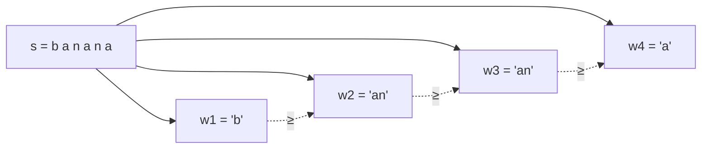

# 린든 워드 · 듀발 알고리즘 (Lyndon Words & Duval's Algorithm)

> **오늘의 주제: 린든 워드 분해(Duval) & 최소 문자열 회전**
> 문자열을 **사전순으로 비증가하는 린든 워드들의 곱**으로 유일하게 쪼개는 `O(n)` 알고리즘(Duval). 이 분해를 응용하면 **모든 회전(rotation) 중 사전순 최소**를 `O(n)` 시간·`O(1)` 추가 공간으로 찾을 수 있다. Booth 알고리즘의 대안.

---

## 1. 린든 워드(Lyndon word)란?

문자열 `w`가 **린든 워드**라는 것은:

> `w`가 자기 자신의 모든 **진짜 접미사(proper suffix)** 보다 **사전순으로 엄격히 작다**.

동치 정의: `w`가 자기 회전들 중 **유일한 최소**이면서, 그 회전이 자기 자신뿐(= 원시적, aperiodic)일 때.

예:
- `a`, `b` → 린든 (길이 1은 항상 린든)
- `ab`, `aab`, `abb`, `aabb`, `abcb` → 린든
- `aa` → **아님** (접미사 `a` ≤ `aa` 위배, 주기적)
- `ba` → **아님** (접미사 `a` < `ba` 이지만... `ba`의 접미사는 `a`. `a < ba` 이므로 조건 만족? 아니다: 린든은 접미사보다 "작아야" 하는데 `ba > a`. 위배)

> **핵심 감각:** 린든 워드는 "첫 글자가 전체에서 유일하게 가장 작은 쪽으로 시작하는, 주기 없는 최소 조각"이다.

### Chen–Fox–Lyndon 정리
모든 문자열 `s`는 다음을 만족하는 린든 워드들의 곱으로 **유일하게** 분해된다.

```
s = w1 w2 ... wk   (각 wi는 린든 워드,  w1 ≥ w2 ≥ ... ≥ wk  사전순)
```

예: `s = "banana"` → `b | an | an | a` → `b ≥ an ≥ an ≥ a` ✅



---

## 2. 듀발 알고리즘 (Duval, O(n))

세 포인터 `i, j, k`로 스캔한다.

- `i` : 현재 처리 중인 린든 조각의 **시작 위치**
- `j` : 현재 비교 중인 뒤쪽 포인터 (`j`는 앞으로만 감)
- `k` : 현재 "린든 후보"의 주기 비교용 포인터 (`s[k]` 와 `s[j]` 비교)

각 단계에서 `s[k]` 와 `s[j]` 를 비교:

1. `s[k] == s[j]` : 주기가 이어짐 → `k += 1`, `j += 1`
2. `s[k] < s[j]` : 더 큰 문자가 나옴 → 후보 확장, 주기 리셋 `k = i`, `j += 1`
3. `s[k] > s[j]` : 린든 조각 하나 확정. 주기 길이 `p = j - k`. 위치 `i`부터 `p`씩 끊어 조각들을 방출하고 `i += p` 반복.

```python
def duval(s):
    """s를 린든 워드들로 분해. 각 조각의 (시작, 끝) 리스트 반환. O(n)."""
    n, i = len(s), 0
    factors = []
    while i < n:
        j, k = i + 1, i
        while j < n and s[k] <= s[j]:
            if s[k] < s[j]:
                k = i          # 더 큰 문자 → 주기 리셋
            else:
                k += 1         # 같은 문자 → 주기 진행
            j += 1
        # s[k] > s[j] (또는 j 끝) → 주기 p로 조각 방출
        p = j - k
        while i <= k:
            factors.append((i, i + p))   # [i, i+p) 가 린든 워드
            i += p
    return factors

# 예시
s = "banana"
print([s[a:b] for a, b in duval(s)])   # ['b', 'an', 'an', 'a']
```

- **시간복잡도:** `O(n)` (각 문자 상수 번 비교, `j`는 단조 증가)
- **공간:** `O(1)` 추가 (분해 결과 제외)

> **왜 O(n)?** `j`는 뒤로 가지 않고 최대 `n`까지. `k` 리셋이 있어도 한 outer 루프에서 전진한 만큼만 다시 밟으므로 상각 선형. 실패 비교(`s[k] > s[j]`)는 조각을 확정하며 `i`를 전진시킨다.

---

## 3. 응용 — 최소 회전 (Least Rotation), O(n)

문자열 `s`의 회전들 `s[i:] + s[:i]` (i=0..n-1) 중 **사전순 최소**를 찾는 문제.
`s+s` 에 듀발을 돌리되, **길이 `n`을 넘지 않는 마지막 린든 시작 위치**가 답이다.

```python
def least_rotation(s):
    """s의 모든 회전 중 사전순 최소가 시작하는 인덱스 반환. O(n)."""
    ss = s + s
    n = len(ss)
    i, ans = 0, 0
    while i < len(s):
        ans = i
        j, k = i + 1, i
        while j < n and ss[k] <= ss[j]:
            k = i if ss[k] < ss[j] else k + 1
            j += 1
        while i <= k:
            i += j - k
    return ans

s = "bbaaccaadd"
idx = least_rotation(s)
print(idx, s[idx:] + s[:idx])   # 최소 회전 문자열
```

핵심: 마지막으로 `ans = i` 로 갱신된, `len(s)` 미만인 시작점이 최소 회전 시작 인덱스.

> **주의:** `ss = s+s` 로 순환을 펴되, `while i < len(s)` 로 첫 바퀴 안의 시작점만 후보로 본다. `ss[k] > ss[j]` 로 끊길 때의 `i`가 곧 "그 지점부터가 사전순으로 더 작다"는 신호.

---

## 4. 대표 예제

### 예제 1 — BOJ 1029 유형 / 최소 사전순 회전
원형 문자열(목걸이 등)에서 대표형(canonical form)을 정할 때 최소 회전을 쓴다. 두 원형 문자열이 같은지 판정: `least_rotation` 결과가 같으면 동일 회전류.

```python
def canonical(s):
    i = least_rotation(s)
    return s[i:] + s[:i]

print(canonical("abcab") == canonical("cababc" if False else "bcaba"))  # 회전 동치 판정
```

### 예제 2 — 길이 n 이하 모든 린든 워드 생성 (Duval의 생성판)
알파벳 `k`, 길이 `≤ n`인 린든 워드를 사전순으로 모두 생성 (조합론/카운팅 문제에 등장).

```python
def gen_lyndon(n, k):
    """알파벳 크기 k, 길이 ≤ n 인 린든 워드를 사전순으로 생성."""
    w = [-1]
    res = []
    while w:
        w[-1] += 1
        m = len(w)
        if m == n:
            res.append(''.join(chr(ord('a') + c) for c in w))
        # 길이 m 프리픽스를 반복해 길이 n 후보로 확장
        while len(w) < n:
            w.append(w[len(w) - m])
        while w and w[-1] == k - 1:
            w.pop()
    return res

print(gen_lyndon(3, 2))  # ['aab', 'abb'] 등 (길이 3, {a,b})
```

---

## 5. 자주 하는 실수

- **린든 정의 혼동**: "접미사보다 작다" vs "접두사보다 작다" — 접미사 기준이다. 등호 불가(엄격히 작음).
- **최소 회전에서 `i < len(s)` 조건 누락**: `s+s` 전체를 돌면 두 번째 바퀴 시작점까지 후보가 되어 틀림.
- **`<=` vs `<` 비교 방향**: Duval 내부 루프는 `s[k] <= s[j]` (같으면 진행). 부등호를 `<`로 바꾸면 주기 처리가 깨진다.
- **최대 회전을 원할 때**: 문자 순서를 뒤집어(비교를 반대로) 같은 코드 재사용. 별도 구현 불필요.
- **동점 조각 개수**: `while i <= k: i += p` 로 여러 개를 한 번에 방출해야 함. 한 번만 append 하면 반복 주기가 있는 경우 누락.

---

## 6. Python 템플릿

```python
# 린든 분해 (Duval)
def duval(s):
    n, i, res = len(s), 0, []
    while i < n:
        j, k = i + 1, i
        while j < n and s[k] <= s[j]:
            k = i if s[k] < s[j] else k + 1
            j += 1
        p = j - k
        while i <= k:
            res.append(s[i:i+p]); i += p
    return res

# 최소 회전 시작 인덱스 (O(n), O(1) 공간)
def least_rotation(s):
    ss, n, i, ans = s + s, 2 * len(s), 0, 0
    while i < len(s):
        ans = i; j, k = i + 1, i
        while j < n and ss[k] <= ss[j]:
            k = i if ss[k] < ss[j] else k + 1
            j += 1
        while i <= k:
            i += j - k
    return ans
```

---

## 한눈 요약

- **린든 워드** = 자기 모든 진짜 접미사보다 사전순으로 엄격히 작은 문자열(= 주기 없는 최소 회전).
- **Duval** = 임의 문자열을 비증가 린든 곱으로 유일 분해, `O(n)` / `O(1)`.
- **응용**: 최소·최대 회전(canonical form), 원형 문자열 동치 판정, 린든 워드 열거, de Bruijn 수열 생성.
- 세 포인터 `i(시작)·j(전진)·k(주기)` 와 `<=` 비교가 전부.
