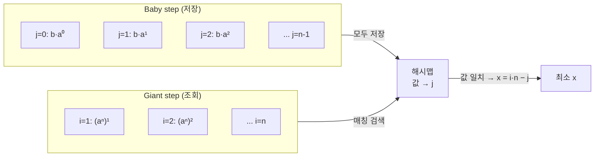

# 오늘의 주제: 이산로그 — 베이비 스텝 자이언트 스텝 (BSGS)

> **문제 형태:** `aˣ ≡ b (mod m)` 를 만족하는 **최소 음이 아닌 정수 x** 를 구하라.
> 곱셈 세계에서의 "로그" 를 모듈러 산술 안에서 푸는 것이라 **이산 로그(discrete logarithm)** 라고 부른다.
> 핵심 아이디어는 **중간에서 만나기(meet-in-the-middle)** — 지수를 두 조각으로 쪼개 √m 규모로 줄인다.

---

## 1. 왜 동작하는가 — 지수를 두 덩어리로 쪼갠다

`x` 를 0부터 하나씩 시도하면 최악 `O(m)` 이라 `m ≈ 10⁹` 이면 불가능하다.
BSGS 는 **`x = i·n − j`** 로 표현한다. 여기서 `n = ⌈√m⌉`, `0 ≤ j < n`, `1 ≤ i ≤ n`.

이렇게 두면 답 `x` 는 항상 `[1, n²] ⊇ [0, m)` 범위 안에서 이 꼴로 표현된다
(모든 지수는 `mod (m−1)` 로 순환하므로 `n² ≥ m` 이면 충분).

식을 대입하면:

```
aˣ ≡ b
a^(i·n − j) ≡ b
a^(i·n) ≡ b · a^j   (mod m)
```

- **오른쪽 `b · aʲ` (j = 0..n−1)** → "작은 걸음(baby step)". 미리 전부 계산해 **해시맵에 저장**.
- **왼쪽 `(aⁿ)^i` (i = 1..n)** → "큰 걸음(giant step)". `aⁿ` 을 한 번 곱해 나가며 해시맵을 **조회**.

한쪽에 √m 개, 다른 쪽에 √m 개 → 전체 **O(√m)** 곱셈. 이게 핵심.



> **한 줄 정리:** `aⁱⁿ = b·aʲ` 가 되는 `(i, j)` 를 √m × √m 두 테이블의 교집합으로 찾는다.
> 지수 공간 `m` 을 두 개의 √m 공간으로 쪼갠 **MITM** 이 본질.

---

## 2. 대표 예제 — BOJ 13446 "이산 로그"

- `a, b, m` 이 주어짐 (`m` 은 소수). `aˣ ≡ b (mod m)` 인 최소 `x ≥ 0` 출력, 없으면 `-1`.
- `m` 이 소수이므로 `gcd(a, m) = 1` 이 보장 → 아래 표준(coprime) 템플릿이 그대로 통한다.

### 핵심 아이디어
1. `n = ⌈√m⌉`.
2. Baby step: `cur = b`, `j = 0..n−1` 동안 `table[cur] = j`, `cur = cur·a % m`.
   (같은 값이 여러 j 에 나오면 **더 큰 j 로 덮어써야** 최소 x 가 나온다 → 그냥 덮어쓰기.)
3. `factor = aⁿ % m` (거듭제곱).
4. Giant step: `cur = factor`, `i = 1..n` 동안 `cur` 이 table 에 있으면 `x = i·n − table[cur]` → 후보. 최초로 찾은 게 **가장 작은 x** (i 오름차순 + 덮어쓴 최대 j).
5. `cur = cur·factor % m`.

### Python 풀이

```python
import sys
from math import isqrt, gcd

def bsgs(a, b, m):
    a %= m; b %= m
    if m == 1:
        return 0                 # 모든 게 0 ≡ 0
    if b == 1:
        return 0                 # a^0 = 1
    n = isqrt(m) + 1             # ⌈√m⌉ 안전하게

    # baby step: b · a^j 저장 (j 큰 값으로 덮어쓰기 → 최소 x 보장)
    table = {}
    cur = b % m
    for j in range(n + 1):
        table[cur] = j
        cur = cur * a % m

    # giant step: (a^n)^i 조회
    factor = pow(a, n, m)
    cur = factor
    for i in range(1, n + 2):
        if cur in table:
            x = i * n - table[cur]
            if x >= 0:
                return x
        cur = cur * factor % m
    return -1

def main():
    input = sys.stdin.readline
    a, b, m = map(int, input().split())
    print(bsgs(a, b, m))

main()
```

- **시간복잡도:** `O(√m · log m)` (해시맵 조회 + pow). `m ≈ 10⁹` 에서도 √m ≈ 3.2만 → 여유.
- **공간복잡도:** `O(√m)` (해시맵).

---

## 3. 정당성 / 주의점

- **왜 `i` 는 1부터?** `x = i·n − j` 에서 `i = 0` 이면 `x = −j ≤ 0` 이라 baby step 이 이미 `j=0` (x=0) 을 커버.
  giant step 은 양수 영역을 훑으므로 `i ≥ 1`.
- **최소 x 보장:** giant step 을 `i` 오름차순으로 돌면 `i·n` 이 작을수록 우선.
  같은 `i` 안에서는 `j` 가 클수록 `x` 가 작으므로 baby step 에서 **큰 j 로 덮어쓴** 게 유리 → 자동으로 최소.
- **소수가 아닌 m (gcd(a,m) ≠ 1):** 표준 BSGS 는 곧바로 안 됨.
  공통 인수 `g = gcd(a,m)` 로 나눠 재귀적으로 줄이는 **확장 BSGS** 가 필요 (경계 케이스 `x < log₂m` 는 완전탐색으로 선처리).

---

## 4. 자주 하는 실수

- `b`, `a` 를 `% m` 안 하고 넣어서 첫 항이 어긋남 → **항상 먼저 mod**.
- baby step 에서 **작은 j 로 덮어써** 최소 x 를 놓침 (반대로 해야 함, 위 코드는 큰 j 로 덮음).
- `x = 0` (즉 `b ≡ 1`) 케이스 누락 → 별도 처리하거나 baby step 범위에 `j=0` 포함.
- `n` 을 `int(sqrt(m))` 로 잡아 `n² < m` 이 되는 오프바이원 → `isqrt(m)+1` 로 안전하게.
- `gcd(a,m) ≠ 1` 인데 표준 템플릿 그대로 써서 오답 (소수 m 문제만 안전).

---

## 5. Python 템플릿 (coprime 표준형)

```python
from math import isqrt

def bsgs(a, b, m):
    """a^x ≡ b (mod m), gcd(a,m)=1 가정. 최소 x≥0 또는 -1."""
    a %= m; b %= m
    if b == 1 or m == 1:
        return 0
    n = isqrt(m) + 1
    table = {}
    cur = b
    for j in range(n + 1):        # baby: b·a^j
        table[cur] = j
        cur = cur * a % m
    factor = pow(a, n, m)
    cur = factor
    for i in range(1, n + 2):     # giant: (a^n)^i
        if cur in table:
            return i * n - table[cur]
        cur = cur * factor % m
    return -1
```

**한 줄 암기:** *"지수를 `i·n − j` 로 쪼개고, `b·aʲ` 저장 → `(aⁿ)ⁱ` 조회 = √m 두 테이블의 만남."*
