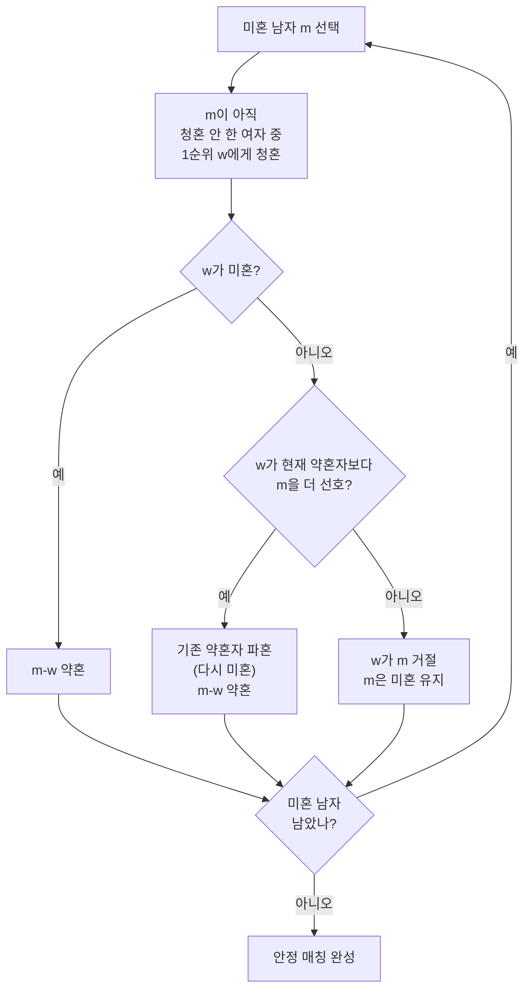

# 오늘의 주제: 안정 결혼 문제 — 게일-섀플리 알고리즘 (Stable Marriage / Gale-Shapley)

> **언어: Python**

## 한 줄 요약
서로에 대한 선호 순위가 있는 두 그룹(남 N명·여 N명)을 짝지을 때, **어떤 짝도 "현재 짝보다 서로를 더 선호해서 이탈하려는" 불안정 쌍이 없는** 완전 매칭(안정 매칭)을 항상 만들어 준다. 청혼-거절 과정으로 **O(N²)** 에 구한다.

---

## 언제 쓰나
- N:N 매칭인데 **양쪽 모두 선호 순위**를 가지고, "이탈 유인이 없는" 배정을 원할 때.
- 인턴-병원 배정(전공의 매칭 NRMP가 실제로 이 알고리즘), 룸메이트/파트너 배정, 학교 배정 등.
- 이분매칭(홉크로프트-카프)과 다른 점: 이분매칭은 **간선 존재 여부**만 보고 매칭 크기를 최대화. 여기선 **선호 순위**가 있고 크기는 항상 완전 매칭(N쌍), 대신 "안정성"을 보장한다.

---

## 핵심 정의: 불안정 쌍(blocking pair)
매칭 M에서 남자 m·여자 w가 서로의 현재 짝이 아닌데,
- m이 (자기 현재 짝보다) w를 더 선호하고,
- w도 (자기 현재 짝보다) m을 더 선호하면

→ 둘은 몰래 짝을 바꾸는 게 이득이다. 이런 쌍을 **불안정 쌍**이라 한다.
**안정 매칭 = 불안정 쌍이 하나도 없는 완전 매칭.**

---

## 알고리즘 (남자가 청혼하는 버전)
1. 모든 남자를 "미혼" 상태로 둔다.
2. 미혼 남자 m을 골라, **아직 청혼 안 한 여자 중 가장 선호하는 w**에게 청혼한다.
3. w의 반응:
   - w가 미혼 → **약혼** (m-w).
   - w가 이미 m'과 약혼했는데 **m을 m'보다 더 선호** → m'을 차고 m과 약혼. m'은 다시 미혼이 됨.
   - 아니면 → w가 m을 거절. m은 여전히 미혼.
4. 미혼 남자가 없을 때까지 반복.



### 왜 항상 끝나고, 안정할까 (정당성)
- **종료성**: 각 남자는 같은 여자에게 두 번 청혼하지 않는다. 청혼은 최대 N×N번 → 반드시 끝난다.
- **완전 매칭**: 어떤 남자가 끝까지 미혼이면 그는 모든 여자에게 거절당한 것 → 모든 여자가 이미 약혼 상태 → 여자 N명이 다 약혼인데 남자는 N명이므로 모순. 즉 전원 매칭.
- **안정성**: 임의의 쌍 (m, w)가 서로 짝이 아니라고 하자. m이 w를 현재 짝보다 선호했다면, 알고리즘 중 m은 **w에게 반드시 청혼했었다**(선호 순서대로 내려가므로). 그런데 지금 짝이 아니라는 건 w가 그때 거절했거나 나중에 더 나은 남자로 갈아탄 것 → w는 **현재 짝을 m보다 선호**한다. 따라서 (m, w)는 불안정 쌍이 될 수 없다. ∎

### 중요한 성질
- **청혼하는 쪽에 최적(man-optimal)**: 이 매칭에서 각 남자는 "어떤 안정 매칭에서든 얻을 수 있는 여자 중 가장 선호하는 여자"와 맺어진다. 동시에 **청혼받는 쪽엔 최악(woman-pessimal)**. → 누가 청혼하느냐가 결과를 바꾼다.
- 안정 매칭은 여러 개일 수 있지만, 게일-섀플리는 그 중 청혼자-최적인 유일한 하나를 준다.

---

## 대표 예제 1: 안정 매칭 구성 (기본형)

입력: 남자 i의 여자 선호 리스트 `men_pref[i]`(선호순), 여자 j의 남자 선호 리스트 `women_pref[j]`.

```python
import sys
from collections import deque

def stable_matching(n, men_pref, women_pref):
    # 여자 입장에서 남자의 '순위'를 O(1)로 비교하기 위한 역인덱스
    # w_rank[w][m] = 여자 w가 남자 m을 몇 번째로 선호하는가 (작을수록 선호)
    w_rank = [[0] * n for _ in range(n)]
    for w in range(n):
        for order, m in enumerate(women_pref[w]):
            w_rank[w][m] = order

    men_next = [0] * n          # 남자 m이 다음에 청혼할 선호 인덱스
    husband = [-1] * n          # 여자 w의 현재 약혼자
    free = deque(range(n))      # 미혼 남자 큐

    while free:
        m = free.popleft()
        w = men_pref[m][men_next[m]]   # m의 다음 청혼 대상
        men_next[m] += 1
        if husband[w] == -1:           # w 미혼 → 약혼
            husband[w] = m
        elif w_rank[w][m] < w_rank[w][husband[w]]:  # m을 더 선호 → 갈아타기
            free.append(husband[w])    # 기존 약혼자 미혼으로
            husband[w] = m
        else:                          # 거절 → m 다시 청혼해야 함
            free.append(m)

    wife = [-1] * n
    for w in range(n):
        wife[husband[w]] = w
    return wife   # wife[m] = 남자 m의 짝 여자
```

- **시간복잡도**: 청혼 총 횟수 O(N²), 각 청혼 O(1) → **O(N²)**. 공간 O(N²)(역순위 표).
- 핵심 아이디어: **`w_rank` 역인덱스**로 "w가 m과 현재 약혼자 중 누굴 더 좋아하나"를 리스트 탐색 없이 O(1)에 비교.

---

## 대표 예제 2: 안정 룸메이트가 아니라 "청혼자만 바꿔보기"

같은 입력에서 **여자가 청혼**하도록 두 선호표의 역할만 바꿔 호출하면, 여자-최적 안정 매칭이 나온다. 두 결과가 다르면 안정 매칭이 여러 개라는 뜻.

```python
wife_men_opt   = stable_matching(n, men_pref, women_pref)          # 남자 최적
# 역할 스왑: 여자가 청혼자
husband_women_opt = stable_matching(n, women_pref, men_pref)       # 여자 최적
# husband_women_opt[w] = 여자 w의 짝 남자
```

> 실전 팁: 문제에서 "남자가 청혼"이라고 명시되면 반드시 남자를 `free` 큐에 넣어야 채점 결과(man-optimal)가 맞는다. 청혼 주체를 잘못 잡으면 **정답이 다른 안정 매칭**으로 나와 오답 처리된다.

---

## 자주 하는 실수
- **여자 선호 비교를 리스트 `index()`로**: 매 비교가 O(N)이라 전체 O(N³). 반드시 `w_rank` 역인덱스로 O(1) 비교.
- **청혼 주체 혼동**: man-optimal ↔ woman-optimal은 다른 매칭. 문제 지문의 청혼 방향을 그대로 따라야 한다.
- **`men_next` 안 올림 / 두 번 청혼**: 거절당한 남자를 다시 큐에 넣되, `men_next[m]`는 이미 증가시켜 다음 후보로 넘어가야 무한루프가 안 생긴다.
- **입력 인덱스 1-based**: 문제 입력이 1번부터면 0-based로 변환하거나 배열 크기를 n+1로. 안 맞추면 IndexError.
- **안정 룸메이트 문제와 혼동**: 한 그룹만 있는 룸메이트 매칭(Irving 알고리즘)은 안정 매칭이 **존재하지 않을 수도** 있다. 게일-섀플리(양쪽 그룹)는 항상 존재.

---

## Python 템플릿 (복붙용)

```python
import sys
from collections import deque
input = sys.stdin.readline

def stable_matching(n, propose_pref, review_pref):
    # propose_pref[p]: 청혼자 p의 선호(선호순), review_pref[r]: 심사자 r의 선호(선호순)
    rank = [[0]*n for _ in range(n)]
    for r in range(n):
        for i, p in enumerate(review_pref[r]):
            rank[r][p] = i
    nxt = [0]*n
    match = [-1]*n              # match[r] = 심사자 r의 현재 약혼자
    free = deque(range(n))
    while free:
        p = free.popleft()
        r = propose_pref[p][nxt[p]]; nxt[p] += 1
        if match[r] == -1:
            match[r] = p
        elif rank[r][p] < rank[r][match[r]]:
            free.append(match[r]); match[r] = p
        else:
            free.append(p)
    res = [-1]*n               # res[p] = 청혼자 p의 짝
    for r in range(n):
        res[match[r]] = r
    return res
```

---

## 정리
- **불안정 쌍(서로를 현재 짝보다 선호)** 이 하나도 없는 완전 매칭 = 안정 매칭.
- 게일-섀플리: 미혼 청혼자가 선호순으로 청혼 → 심사자는 더 좋은 사람으로 갈아타기. **항상 종료·완전·안정**.
- **O(N²)**, 역순위표로 비교 O(1). **청혼하는 쪽에 최적**이라는 비대칭성 꼭 기억.
