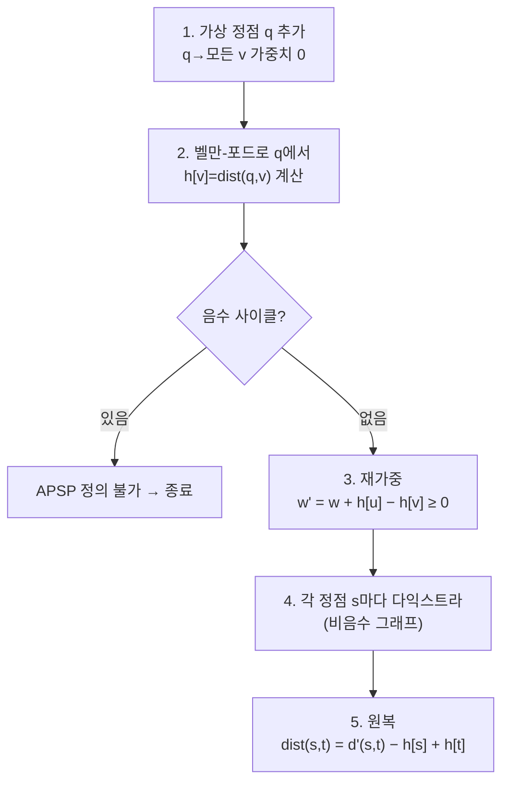

# 오늘의 주제: 존슨 알고리즘 (Johnson's Algorithm) — 희소 그래프의 음수 간선 전역 최단경로

> **모든 쌍 최단경로(APSP)** 인데 **간선에 음수가 섞여 있고**, 그래프가 **희소(E ≪ V²)** 할 때 쓴다.
> 플로이드-워셜은 O(V³)로 밀도와 무관하게 무겁다.
> 존슨은 **간선 재가중(reweighting)** 으로 음수를 없앤 뒤, 각 정점에서 다익스트라를 V번 돌린다 → **O(V·E·log V)**.

---

## 1. 문제 상황: "음수 간선 + 모든 쌍 + 희소"

- 다익스트라: 빠르지만(**O(E log V)**) **음수 간선에서 깨진다**.
- 벨만-포드: 음수 OK지만 **단일 출발점**, APSP로 쓰려면 V번 = O(V²E)로 느리다.
- 플로이드-워셜: 음수 OK, APSP지만 **O(V³)** — 정점이 많고 간선이 적으면 낭비.

존슨의 목표: **음수를 제거해서 다익스트라를 쓸 수 있게** 만드는 것.

---

## 2. 핵심 아이디어: 포텐셜(potential)로 간선 재가중

각 정점 `v`에 값 `h[v]`(포텐셜)를 부여하고, 간선 가중치를 이렇게 바꾼다.

```
w'(u → v) = w(u → v) + h[u] − h[v]
```

이 변환의 두 가지 결정적 성질:

**(a) 경로 길이가 양끝점만으로 보정된다 (telescoping).**
경로 `s → … → t`의 새 길이는
`w'(경로) = w(경로) + h[s] − h[t]`
중간 항 `h`들이 모두 상쇄된다. **s, t가 같으면 어떤 경로든 같은 상수만큼 보정** → 최단경로의 "순서(어느 경로가 최단인지)"는 **절대 안 바뀐다**. 원래 거리는 `dist(s,t) = dist'(s,t) − h[s] + h[t]` 로 복원.

**(b) 새 가중치를 음수가 아니게 만들 수 있다.**
`h[v]` = "가상의 슈퍼 소스에서 v까지의 최단거리" 로 잡으면, 최단거리 부등식
`h[v] ≤ h[u] + w(u→v)` (삼각부등식) 가 항상 성립.
정리하면 `w'(u→v) = w(u→v) + h[u] − h[v] ≥ 0`. **모든 간선이 비음수가 된다!**

> 왜 이 `h`인가: 최단거리는 정의상 "더 짧은 우회로가 없다"는 완화(relax) 조건을 만족한다.
> 그 조건이 곧 `w' ≥ 0`. 그래서 벨만-포드로 구한 최단거리가 완벽한 포텐셜이 된다.

---

## 3. 알고리즘 절차



1. **가상 정점 `q`** 를 만들어 모든 정점으로 가중치 0 간선을 잇는다. (모든 정점 도달 보장 → `h` 잘 정의됨)
2. `q`에서 **벨만-포드** 1회 → `h[v]`. 음수 사이클이면 최단경로 자체가 없으므로 종료.
3. 모든 간선을 `w' = w + h[u] − h[v]` 로 **재가중** (이제 전부 ≥ 0).
4. **각 정점을 출발점으로 다익스트라** V번 → `d'(s, t)`.
5. `dist(s, t) = d'(s, t) − h[s] + h[t]` 로 **원래 거리 복원**.

---

## 4. 시간복잡도

- 벨만-포드 1회: **O(V·E)**
- 다익스트라 V회(힙): **O(V · E log V)**
- 합계: **O(V·E log V)** — 희소 그래프(E ≈ V)면 O(V² log V)로 플로이드 O(V³)를 압도.
- **조밀 그래프(E ≈ V²)** 면 존슨 O(V³ log V)라 오히려 손해 → 그땐 플로이드.

**언제 쓰나:** 정점 많고 간선 적고(희소) 음수 간선이 섞인 APSP. 없으면 그냥 다익스트라 V번.

---

## 5. 대표 예제 — 음수 간선 포함 모든 쌍 최단경로

입력: 정점 수 V, 간선 목록 `(u, v, w)` (음수 가능, 음수 사이클은 없다고 가정).
출력: `dist[s][t]` 전체.

### 핵심 아이디어
- 슈퍼 소스 `q`는 실제 배열에 넣지 않고, `h`를 **모든 정점 0에서 시작하는 벨만-포드** 로 대체하면 간단하다.
  (`q→v` 0 간선을 다는 것과 "모든 정점을 동시에 소스로" 두는 것이 동치.)
- 재가중 후 다익스트라는 반드시 **비음수 그래프** 위에서 돈다.
- 복원 시 도달 불가능(INF)은 그대로 INF로 남긴다.

```python
import heapq

def johnson(n, edges):
    # n: 정점 수(0..n-1), edges: (u, v, w) 리스트
    graph = [[] for _ in range(n)]
    for u, v, w in edges:
        graph[u].append((v, w))

    # 1~2단계: 슈퍼소스 = 모든 정점 0. 벨만-포드로 h 계산
    h = [0] * n                      # q→v 가중치 0 → 초기 dist 전부 0
    for i in range(n):               # V번 반복(음수 사이클 판정 위해 마지막 1회 더)
        updated = False
        for u, v, w in edges:
            if h[u] + w < h[v]:
                h[v] = h[u] + w
                updated = True
                if i == n - 1:       # V번째에도 갱신 → 음수 사이클
                    raise ValueError("negative cycle")
        if not updated:
            break

    # 3단계: 재가중 (w' = w + h[u] - h[v] >= 0)
    reweighted = [[] for _ in range(n)]
    for u in range(n):
        for v, w in graph[u]:
            reweighted[u].append((v, w + h[u] - h[v]))

    INF = float('inf')
    dist = [[INF] * n for _ in range(n)]

    # 4단계: 각 정점에서 다익스트라
    def dijkstra(src):
        d = [INF] * n
        d[src] = 0
        pq = [(0, src)]
        while pq:
            cur, u = heapq.heappop(pq)
            if cur > d[u]:
                continue
            for v, w in reweighted[u]:      # w >= 0 보장
                nd = cur + w
                if nd < d[v]:
                    d[v] = nd
                    heapq.heappush(pq, (nd, v))
        return d

    # 5단계: 원래 거리로 복원
    for s in range(n):
        d = dijkstra(s)
        for t in range(n):
            if d[t] < INF:
                dist[s][t] = d[t] - h[s] + h[t]
    return dist
```

---

## 6. 자주 하는 실수

- **복원을 빼먹는다.** 다익스트라가 준 `d'`는 재가중된 값. 반드시 `− h[s] + h[t]` 로 되돌려야 진짜 거리.
- **부호 방향 혼동.** 재가중은 `+h[u] − h[v]`(출발 더하고 도착 뺌), 복원은 `− h[s] + h[t]`(출발 빼고 도착 더함). 정확히 반대.
- **음수 사이클 판정 누락.** 음수 사이클이 있으면 APSP 자체가 정의 불가 → 벨만-포드 V번째 갱신 여부로 반드시 검사.
- **도달 불가능 정점.** `h`를 "모든 정점 0 시작"으로 잡으면 모든 정점이 자동 도달 가능해 `h`가 항상 정의된다. 복원 단계에서 `d'[t] == INF`는 INF 유지.
- **조밀 그래프에 존슨.** E ≈ V²면 로그 붙은 존슨이 플로이드보다 느리다 → 그래프 밀도 먼저 보고 선택.

---

## 7. 한 줄 요약

> **벨만-포드로 포텐셜 `h`를 뽑아 음수를 지우고(`w' = w+h[u]−h[v] ≥ 0`), 다익스트라 V번으로 APSP를 빠르게.**
> 최단경로 순서를 보존하는 재가중이 핵심이며, 희소 + 음수 간선일 때 플로이드보다 유리하다.
