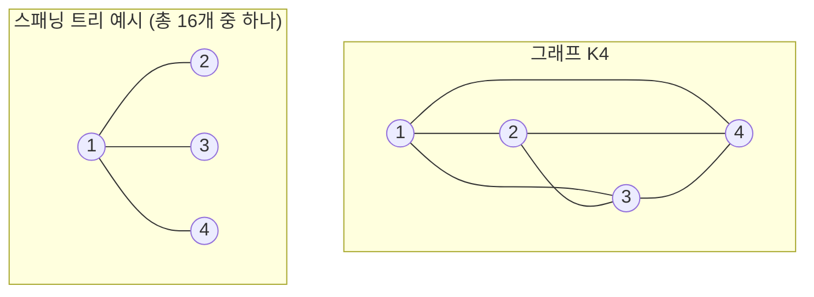

# 키르히호프 정리 (Matrix-Tree Theorem) — 스패닝 트리 개수 세기

> **오늘의 주제:** 무방향 그래프의 **스패닝 트리(신장 트리) 개수**를 라플라시안 행렬의 여인수(소행렬식)로 구하는 **키르히호프 정리**. 가우스 소거 위에서 O(V³)에 동작하며, 조합적 카운팅을 선형대수 문제로 바꾸는 강력한 도구다.

---

## 1. 핵심 아이디어

정점 `n`개짜리 그래프의 **스패닝 트리**란: 모든 정점을 연결하면서 사이클이 없는 부분 그래프(간선 `n-1`개). 이걸 하나하나 세는 건 지수적이지만, 키르히호프 정리는 **행렬식 한 방**으로 끝낸다.

**라플라시안 행렬** `L = D − A`:
- `D` : 차수 대각행렬 (`D[i][i] = deg(i)`)
- `A` : 인접행렬 (`A[i][j] = i-j 간선 수`)

> **정리:** `L`에서 **아무 한 행 `i`와 같은 번호의 열 `i`를 지운** `(n−1)×(n−1)` 소행렬의 **행렬식**이 곧 스패닝 트리의 개수다.
>
> 어느 `i`를 지워도 값은 **같다**. (모든 여인수가 동일하다는 것이 정리의 일부)

```
  스패닝 트리 개수 τ(G) = det( L에서 i행·i열 제거한 소행렬 )
```

---

## 2. 왜 동작하는가 (정당성)

각 간선에 임의 방향을 준 **근접행렬(incidence matrix)** `B` (크기 `n × m`)를 생각한다. 간선 `e = (u→v)`에 대해 `B[u][e] = +1`, `B[v][e] = −1`, 나머지 0.

- 그러면 **`L = B Bᵀ`** 가 성립한다. (차수 = 자기 항의 합, 인접 = 교차 항)
- 한 행을 지운 `B̃` (크기 `(n−1) × m`)에 대해 지운 소행렬은 `B̃ B̃ᵀ`.
- **코시–비네(Cauchy–Binet) 공식**으로 전개하면:
  `det(B̃ B̃ᵀ) = Σ (m개 간선 중 n−1개 고르는 모든 부분집합 S) det(B̃_S)²`
- `B̃_S`는 간선 `n−1`개로 이뤄진 정사각 행렬인데, 그 행렬식이 **±1이면 S가 스패닝 트리, 0이면 사이클 존재**임이 알려져 있다(그래프의 근접행렬은 완전 유니모듈러).
- 따라서 `det(B̃_S)² ∈ {0, 1}` 이고, 합은 **정확히 스패닝 트리 개수**가 된다. ∎

즉 "행렬식의 제곱합 = 트리 개수"라는 조합론적 아름다움이 이 정리의 본질이다.

---

## 3. 주의점 & 확장

- **전체** `L`의 행렬식은 **항상 0** (모든 행의 합이 0 → 열들이 선형종속). 반드시 **한 행·열을 지운 소행렬**을 써야 한다.
- **자기 루프**는 스패닝 트리에 영향 없음 → 무시. `D`에도 넣지 않는다.
- **다중 간선**은 그대로 개수만큼 `A[i][j]`에 더한다 (평행 간선도 서로 다른 트리를 만든다).
- **가중치 버전(가중 스패닝 트리):** `A[i][j]`, `deg`에 간선 가중치를 넣으면, 소행렬식 = **모든 스패닝 트리에 대해 (트리 간선 가중치의 곱)의 합**. 개수 세기는 모든 가중치=1인 특수 경우.
- **방향 그래프(arborescence, 유향 신장 트리):** 라플라시안을 `out-degree` 기준으로 만들고 **루트 정점의 행·열을 지우면**, 그 루트로 향하는(또는 루트에서 나가는) 유향 신장 트리 개수가 나온다.
- **큰 답 → mod:** 개수가 폭발하므로 보통 소수 `p`로 나눈 나머지를 구한다. 가우스 소거에서 나눗셈을 **모듈러 역원**으로 대체한다.

**Cayley 공식 검증:** 완전그래프 `Kₙ`의 스패닝 트리 개수는 `n^(n−2)`. `K₄ → 4² = 16`. 아래 템플릿으로 확인 가능.

---

## 4. 대표 예제

### 예제 1) 완전그래프 K₄ 의 스패닝 트리 개수 = 16



라플라시안과 소행렬:

```
     [ 3 -1 -1 -1 ]                    [ 3 -1 -1 ]
L =  [-1  3 -1 -1 ]   → 1행·1열 제거 → [-1  3 -1 ]  , det = 16
     [-1 -1  3 -1 ]                    [-1 -1  3 ]
     [-1 -1 -1  3 ]
```

### 예제 2) 일반 그래프 — 정수/모듈러 소행렬식 계산

간선 목록이 주어질 때 스패닝 트리 개수(mod p)를 구하는 완전한 풀이.

```python
import sys
MOD = 10**9 + 7

def spanning_tree_count(n, edges, mod=MOD):
    # 1-indexed 정점 → 0-indexed로 라플라시안 구성
    L = [[0] * n for _ in range(n)]
    for u, v in edges:
        u -= 1; v -= 1
        if u == v:            # 자기 루프 무시
            continue
        L[u][u] += 1
        L[v][v] += 1
        L[u][v] -= 1
        L[v][u] -= 1
    # 마지막 행·열 제거 → (n-1)x(n-1) 소행렬의 det (mod)
    return det_mod([[L[i][j] % mod for j in range(n - 1)]
                    for i in range(n - 1)], mod)

def det_mod(mat, mod):
    n = len(mat)
    if n == 0:
        return 1 % mod
    det = 1
    for c in range(n):
        # 피벗 찾기 (0이 아닌 행과 교환)
        piv = next((r for r in range(c, n) if mat[r][c] % mod), None)
        if piv is None:
            return 0                       # 특이행렬 → det 0
        if piv != c:
            mat[c], mat[piv] = mat[piv], mat[c]
            det = (-det) % mod             # 행 교환 시 부호 반전
        det = det * mat[c][c] % mod
        inv = pow(mat[c][c], mod - 2, mod) # 페르마 소정리 모듈러 역원
        for r in range(c + 1, n):
            f = mat[r][c] * inv % mod
            if f:
                for k in range(c, n):
                    mat[r][k] = (mat[r][k] - f * mat[c][k]) % mod
    return det % mod

# 검증: K4 → 16
K4 = [(1,2),(1,3),(1,4),(2,3),(2,4),(3,4)]
print(spanning_tree_count(4, K4))   # 16
# 검증: K5 → 5^3 = 125
K5 = [(i, j) for i in range(1,6) for j in range(i+1,6)]
print(spanning_tree_count(5, K5))   # 125
```

- **시간복잡도:** 라플라시안 구성 `O(V² + E)`, 가우스 소거 `O(V³)`.
- **공간복잡도:** `O(V²)`.

---

## 5. 자주 하는 실수

- ❌ 전체 `L`의 행렬식(=0)을 그대로 씀 → 반드시 **한 행·열 제거한 소행렬**.
- ❌ 모듈러에서 음수 그대로 방치 → 파이썬은 `%`가 음수를 자동 보정하지만, 최종 반환·중간 비교에서 습관적으로 `% mod` 유지.
- ❌ 피벗이 mod 아래서 0인데(정수로는 0이 아닐 수 있음) 교환/스킵 처리를 빠뜨림 → `mat[r][c] % mod`로 판정.
- ❌ 자기 루프를 차수에 넣음 → 트리 개수가 틀어짐. 무시해야 한다.
- ❌ 다중 간선을 하나로 합침 → 평행 간선은 서로 다른 트리를 만드므로 개수만큼 더해야 함.
- ⚠️ 그래프가 **비연결**이면 스패닝 트리 존재 X → 소행렬식이 자동으로 0이 나온다(굳이 별도 처리 불필요).

---

## 6. Python 템플릿 (핵심만)

```python
def spanning_trees(n, edges, mod=10**9+7):
    L = [[0]*n for _ in range(n)]
    for u, v in edges:            # 1-indexed
        u -= 1; v -= 1
        if u == v: continue
        L[u][u] += 1; L[v][v] += 1
        L[u][v] -= 1; L[v][u] -= 1
    M = [[L[i][j] % mod for j in range(n-1)] for i in range(n-1)]
    det = 1
    for c in range(n-1):
        p = next((r for r in range(c, n-1) if M[r][c]), None)
        if p is None: return 0
        if p != c: M[c], M[p] = M[p], M[c]; det = -det
        det = det * M[c][c] % mod
        inv = pow(M[c][c], mod-2, mod)
        for r in range(c+1, n-1):
            f = M[r][c]*inv % mod
            for k in range(c, n-1):
                M[r][k] = (M[r][k] - f*M[c][k]) % mod
    return det % mod
```

**언제 쓰나:** "그래프의 스패닝 트리가 몇 개?", "가중 스패닝 트리 가중치 곱의 합", "격자/특수 그래프 신장 트리 카운팅", "확률/전기회로 네트워크 분석"에서 정형적으로 등장. 조합 카운팅을 선형대수로 환원하는 대표 사례.
