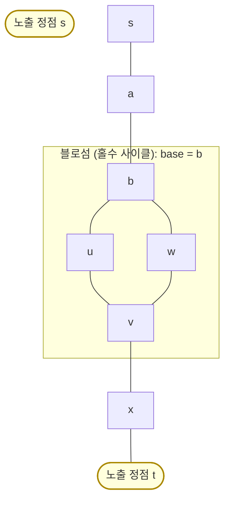

# 일반 그래프 최대 매칭 — 블로섬 알고리즘 (Edmonds' Blossom)

> **오늘의 주제: 일반 그래프 최대 매칭 (General Graph Maximum Matching, Edmonds' Blossom Algorithm)**
>
> 이분 그래프가 아닌 **임의의 무방향 그래프**에서 간선을 최대한 많이, 정점이 겹치지 않게 고르는 문제. 이분매칭(쾨니그·헝가리안)이 안 통하는 이유인 **홀수 사이클(blossom)** 을 어떻게 처리하는지가 전부다.

---

## 1. 문제 정의와 왜 어려운가

- **매칭(matching)**: 서로 끝점을 공유하지 않는 간선 집합 M.
- **최대 매칭**: |M| 이 최대인 매칭.
- 이분 그래프라면 이분매칭(증가 경로 DFS) / 홉크로프트–카프로 끝난다. 그런데 **일반 그래프**엔 홀수 길이 사이클이 생긴다.

### 증가 경로(augmenting path) 복습
- **노출 정점(exposed/free)**: 아직 매칭 안 된 정점.
- **증가 경로**: 노출 정점에서 시작해 노출 정점에서 끝나고, `비매칭–매칭–비매칭–…–비매칭` 으로 **간선이 번갈아** 나오는 경로. 길이는 홀수(비매칭 간선이 1개 더 많음).
- **Berge 정리**: M이 최대 매칭 ⟺ 증가 경로가 없다. → "증가 경로 찾아 뒤집기(flip)"를 반복하면 최대 매칭. 매칭 크기는 한 번에 1씩 늘어 최대 V/2번 반복.

### 이분에선 왜 쉽고 일반에선 왜 막히나
BFS로 노출 정점에서 층을 만들면, 각 정점에 **짝수 거리(outer)** / **홀수 거리(inner)** 라벨을 준다. 이분 그래프에선 같은 라벨(outer–outer) 간선이 절대 안 생긴다(홀수 사이클이 없으니까). 일반 그래프에선 **outer–outer 간선**이 생길 수 있고, 이게 바로 **홀수 사이클 = 블로섬**의 신호다.

---

## 2. 블로섬(Blossom)이란

두 outer 정점 u, v 를 잇는 간선을 만났을 때, 탐색 트리에서 둘의 **최소 공통 조상(LCA)** b 를 찾으면
`b → … → u → v → … → b` 가 **홀수 길이 사이클(2k+1개 정점)** 을 이룬다. 이것이 블로섬이고, b 를 **밑동(base)** 이라 부른다.

핵심 통찰(Edmonds): **블로섬 전체를 하나의 슈퍼 정점으로 수축(contract)** 시켜도 최대 매칭은 보존된다. 블로섬 안에서는 base 를 어느 방향으로 돌든 나머지 짝수 개 정점이 자기들끼리 완벽히 매칭되므로, 밖에서 base 로 증가 경로가 닿기만 하면 사이클을 적절히 돌아 관통할 수 있다. 수축한 그래프에서 증가 경로를 찾은 뒤 **펼치면(lift)** 원래 경로가 복원된다.



> `b–u–v–w–b` 는 정점 4개처럼 보이지만, 실제 블로섬은 base b 를 포함한 **홀수 개 정점**의 사이클이다(위 그림은 개념도). u–v 가 outer–outer 간선으로 발견되는 순간 b 를 base 로 수축한다.

---

## 3. 알고리즘 흐름 (한 번의 증가 경로 탐색)

각 노출 정점 root 마다 BFS:

1. root 를 outer 로 큐에 넣는다. `match[]`, `parent[]`, `base[]` 준비. `base[v]=v` 초기화.
2. 큐에서 outer 정점 u 를 꺼내 인접 v 를 본다:
   - `base[u]==base[v]` 이거나 `match[u]==v` 이면 스킵(같은 블로섬/자기 짝).
   - **v 가 root 이거나 (v 가 매칭됐고 그 짝이 outer)** → **블로섬 발견**. u, v 의 LCA b 를 구하고, 경로상의 모든 정점을 `base=b` 로 수축, 새로 outer 가 된 정점들을 큐에 추가.
   - **v 가 미탐색** :
     - `match[v]` 가 없다 → **증가 경로 발견!** v 부터 parent/ match 를 거꾸로 따라가며 매칭을 뒤집고 return True.
     - 있다 → v(inner) 와 그 짝 `match[v]`(outer) 를 트리에 붙이고 짝을 큐에 넣는다.
3. 큐가 비면 이 root 에선 증가 경로 없음.

모든 정점을 root 로 시도하며 증가에 성공할 때마다 매칭 +1. 더 이상 못 늘리면 종료.

### 정당성 요점
- 블로섬 수축이 최대 매칭을 보존한다(Edmonds). 그래서 수축–탐색–펼침이 Berge 정리를 안전하게 구현한다.
- 라벨링에서 outer–outer 간선을 만나는 것 = 홀수 사이클 존재 신호. 이걸 무시하면 이분 알고리즘이 잘못된 답을 낸다.

---

## 4. 복잡도

- 표준 구현: 정점마다 O(V·E) → 전체 **O(V³)** (또는 O(V·E)). V ≤ 수백~수천 수준의 코테 문제에 충분.
- 최적화판(Micali–Vazirani)은 O(E√V) 지만 구현이 매우 복잡해 코테에선 거의 안 씀.

---

## 5. 대표 예제

### 예제 A) 백준 없이 개념 검증 — 홀수 사이클 그래프
5-사이클(1-2-3-4-5-1)의 최대 매칭은 2 (V=5 → ⌊5/2⌋). 이분 알고리즘은 블로섬 처리를 못 해 1로 오답 낼 수 있다. 블로섬은 정확히 2를 낸다.

### 예제 B) 백준 14406 — 완전 매칭 존재 판정류 / 일반 매칭
일반 그래프에서 최대 매칭 크기를 구해 `2·매칭 == V` 이면 완전 매칭 존재. (문제별 모델링은 다르지만, 코어는 아래 템플릿 그대로.)

---

## 6. Python 템플릿

```python
import sys
from collections import deque
input = sys.stdin.readline

def max_general_matching(n, adj):
    # 정점 1..n, adj[u] = 인접 리스트
    match = [0] * (n + 1)      # match[v] = v의 짝 (0이면 없음)
    p = [0] * (n + 1)          # BFS 트리 parent
    base = [0] * (n + 1)       # 수축 후 대표(base)
    q = deque()
    used = [False] * (n + 1)   # 큐에 넣었는지(=outer 방문)
    blossom = [False] * (n + 1)

    def lca(a, b):
        seen = [False] * (n + 1)
        while True:
            a = base[a]
            seen[a] = True
            if match[a] == 0:
                break
            a = p[match[a]]
        while True:
            b = base[b]
            if seen[b]:
                return b
            b = p[match[b]]

    def mark_path(v, b, child):
        # v에서 base b까지 거슬러 올라가며 블로섬으로 표시
        while base[v] != b:
            blossom[base[v]] = True
            blossom[base[match[v]]] = True
            p[v] = child
            child = match[v]
            v = p[match[v]]

    def find_path(root):
        nonlocal match, p, base, q, used, blossom
        used = [False] * (n + 1)
        p = [0] * (n + 1)
        base = list(range(n + 1))
        used[root] = True
        q = deque([root])
        while q:
            u = q.popleft()
            for v in adj[u]:
                if base[u] == base[v] or match[u] == v:
                    continue
                if v == root or (match[v] != 0 and p[match[v]] != 0):
                    # 블로섬 발견 → 수축
                    b = lca(u, v)
                    blossom[:] = [False] * (n + 1)
                    mark_path(u, b, v)
                    mark_path(v, b, u)
                    for i in range(1, n + 1):
                        if blossom[base[i]]:
                            base[i] = b
                            if not used[i]:
                                used[i] = True
                                q.append(i)
                elif p[v] == 0:
                    p[v] = u
                    if match[v] == 0:
                        # 증가 경로 발견 → 뒤집기
                        return v
                    else:
                        used[match[v]] = True
                        q.append(match[v])
        return 0

    res = 0
    for v in range(1, n + 1):
        if match[v] == 0:
            u = find_path(v)
            if u:
                res += 1
                # 경로를 따라 매칭 뒤집기
                while u:
                    pv = p[u]
                    ppv = match[pv]
                    match[u] = pv
                    match[pv] = u
                    u = ppv
    return res

# 사용 예
# n, m = map(int, input().split())
# adj = [[] for _ in range(n + 1)]
# for _ in range(m):
#     a, b = map(int, input().split())
#     adj[a].append(b); adj[b].append(a)
# print(max_general_matching(n, adj))
```

---

## 7. 자주 하는 실수

- **이분인 줄 알고 이분매칭만 돌림** → 홀수 사이클(삼각형 등)이 있으면 오답. "일반 그래프"면 블로섬을 의심.
- **base 갱신을 인접에만 적용** → 블로섬 수축 시 `base[i]==b` 판정은 반드시 `base[base[i]]` 기준으로 전 정점을 훑어야 한다.
- **used(outer 방문) 재초기화 누락** → 각 root 탐색마다 `used, p, base` 를 새로 초기화해야 함.
- **`p[match[v]] != 0` 조건 빠뜨림** → v 의 짝이 이미 트리(outer)에 있어야 블로섬. inner 정점을 잘못 base 로 잡으면 무한루프/오답.
- **매칭 뒤집기 순서 착오** → 증가 경로 복원은 `u → p[u] → match[p[u]]` 순으로 갈아끼운다.

---

## 8. 언제 쓰나 (한 줄 정리)

- **"임의(비이분) 무방향 그래프에서 짝짓기 최대"** → 블로섬. 대표: 홀수 사이클 포함 매칭, 완전 매칭 존재 판정, 일반 그래프 최소 정점 커버 관련(König은 이분 전용이라 여기선 못 씀).
- 가중치까지 있으면 → **가중 일반 매칭**(가중 블로섬, 훨씬 복잡)으로 확장. 코테에선 보통 무가중까지.
