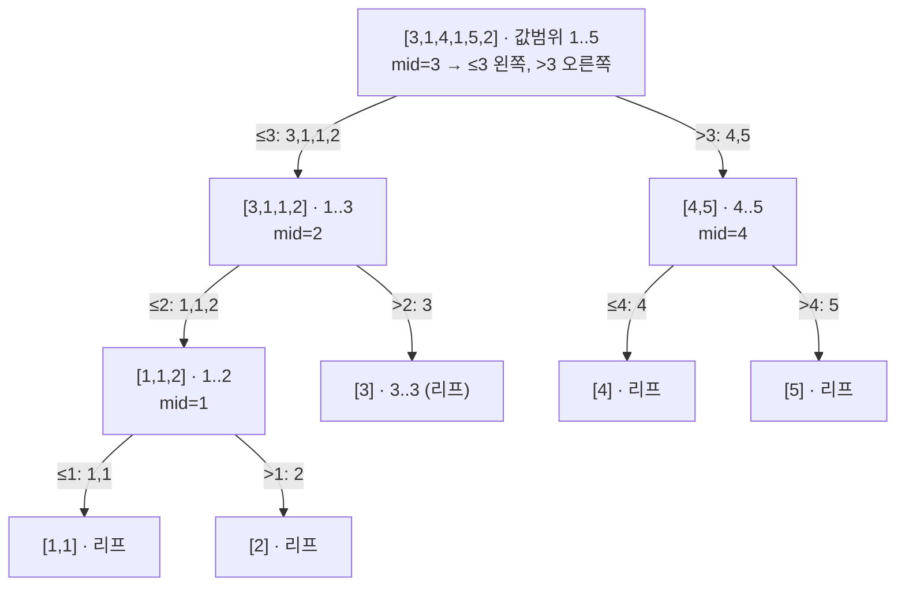

# 오늘의 주제: 웨이블릿 트리 (Wavelet Tree)

> **한 줄 요약**: 값의 범위를 이분(mid 기준)해 가며 배열을 재귀적으로 안정 분할해서 쌓은 트리.
> 각 노드에 "이 위치까지 왼쪽(≤mid)으로 몇 개 갔는지" 누적배열만 두면,
> **구간 k번째 수**·**구간에서 x 이하 개수**를 O(log(값범위))에 답한다.

머지소트트리·PST와 같은 "정적 배열 구간 순위" 계열이지만, **값 축을 분할**한다는 점이 다르다.
전체 공간 O(N log C), 쿼리 O(log C) (C = 값의 범위). 온라인 쿼리 가능.

---

## 1. 핵심 아이디어

배열 `a`와 값 범위 `[lo, hi]`가 있을 때:

- `mid = (lo+hi)//2`.
- 각 원소를 **순서를 유지한 채** 두 그룹으로 나눈다: `v ≤ mid`는 왼쪽 자식, `v > mid`는 오른쪽 자식.
- 노드에는 `map_left[i]` = "앞에서 i개 중 왼쪽으로 간 개수"(prefix sum)만 저장.
- `lo == hi`가 되면 리프(값이 하나로 확정).

이 `map_left` 하나가 마법이다. 어떤 구간 `[l, r)`이 주어져도
`map_left[l]`, `map_left[r]`만 보면 **그 구간이 왼쪽/오른쪽 자식에서 각각 어느 구간으로 대응되는지** 즉시 안다.

```
왼쪽 자식에서의 구간  = [ map_left[l],        map_left[r] )
오른쪽 자식에서의 구간 = [ l - map_left[l],   r - map_left[r] )
```

앞쪽(≤mid)은 map_left 값이 곧 새 인덱스, 뒤쪽(>mid)은 "전체 - 왼쪽 = 오른쪽 개수"라 위와 같이 빠진다.

### 왜 동작하나 (정당성)
안정 분할이라 각 자식 안에서도 **원래 상대 순서가 보존**된다. 따라서 상위 구간 `[l,r)`에 속한 원소들은
자식에서도 연속 구간을 이룬다. 그 연속 구간의 경계가 정확히 `map_left`로 계산되는 것.
값을 이분해 내려가므로 깊이는 `log2(hi-lo+1)`.

---

## 2. 구조 그림

값 `[3,1,4,1,5,2]`, 범위 `[1,5]`를 분할하는 모습 (mid로 값을 쪼갬):



kth 쿼리는 루트에서 시작해 "이 구간에서 왼쪽으로 간 개수 `inLeft`"와 `k`를 비교하며
`k ≤ inLeft`면 왼쪽, 아니면 `k -= inLeft` 하고 오른쪽으로 내려가 리프에서 값을 확정한다.

---

## 3. 대표 예제

### 예제 1 — 백준 7469 K번째 수 (구간 k번째 작은 값)
배열 `a[1..n]`과 `m`개 쿼리 `(i, j, k)`. `a[i..j]` 중 k번째로 작은 값을 출력.

**핵심 아이디어**: 웨이블릿 트리의 `kth(l, r, k)` 그대로. 온라인으로 각 쿼리 O(log C).

```python
import sys
input = sys.stdin.readline
sys.setrecursionlimit(1 << 20)

class WaveletTree:
    def __init__(self, arr, lo, hi):
        self.lo, self.hi = lo, hi
        self.left = self.right = None
        n = len(arr)
        self.m = [0]*(n+1)            # map_left prefix
        if lo == hi or n == 0:
            return
        mid = (lo + hi) >> 1
        for i, v in enumerate(arr):
            self.m[i+1] = self.m[i] + (v <= mid)
        larr = [v for v in arr if v <= mid]
        rarr = [v for v in arr if v > mid]
        self.left  = WaveletTree(larr, lo, mid)
        self.right = WaveletTree(rarr, mid+1, hi)

    def kth(self, l, r, k):           # [l, r) 구간 k번째(1-index) 작은 값
        if self.lo == self.hi:
            return self.lo
        lb, rb = self.m[l], self.m[r]
        inLeft = rb - lb
        if k <= inLeft:
            return self.left.kth(lb, rb, k)
        return self.right.kth(l - lb, r - rb, k - inLeft)

    def lte(self, l, r, x):           # [l, r) 구간에서 값 <= x 개수
        if l >= r or x < self.lo:
            return 0
        if x >= self.hi:
            return r - l
        lb, rb = self.m[l], self.m[r]
        return self.left.lte(lb, rb, x) + self.right.lte(l - lb, r - rb, x)

def main():
    n, m = map(int, input().split())
    a = list(map(int, input().split()))
    wt = WaveletTree(a, min(a), max(a))
    out = []
    for _ in range(m):
        i, j, k = map(int, input().split())   # 1-index 포함구간 [i, j]
        out.append(str(wt.kth(i-1, j, k)))     # 내부는 [l, r) 반열림
    sys.stdout.write("\n".join(out))
```

- **시간복잡도**: 구축 O(N log C), 쿼리당 O(log C). C는 값의 범위(좌표압축 시 O(N)).
- **주의**: `kth`는 구간을 반열림 `[l, r)`로 다룬다. 1-index 포함구간 `[i, j]`는 `kth(i-1, j, k)`.

### 예제 2 — 구간에서 x 이하 개수 / x의 순위
`lte(l, r, x)`로 구간 내 "x 이하 개수"를 구하면, 값의 순위·구간 내 특정 값 빈도 등으로 확장된다.
예: `[l,r)`에서 값이 `[x, y]` 범위인 개수 = `lte(l,r,y) - lte(l,r,x-1)`.

```python
# [l, r) 에서 값이 [x, y] 인 원소 개수
def range_count(wt, l, r, x, y):
    return wt.lte(l, r, y) - wt.lte(l, r, x - 1)
```

---

## 4. 자주 하는 실수
- **좌표압축**: 값 범위 C가 크면(예: 10^9) 그대로 쓰면 깊이가 ~30이라 상수는 버틸 수 있지만,
  음수·희소 값이면 좌표압축 후 인덱스로 트리를 세우고 결과를 원래 값으로 역매핑하는 편이 안전.
- **반열림/포함구간 혼동**: `m[]`는 prefix라 `[l, r)` 기준. 문제의 1-index 포함구간을 꼭 `l-1`로 변환.
- **안정 분할 필수**: `v <= mid`와 `v > mid`를 원래 순서대로 나눠야 `map_left` 대응이 성립. 정렬하면 깨진다.
- **재귀 깊이**: 값 범위 C에 대해 깊이 log C(≤~30). 파이썬은 `setrecursionlimit` 넉넉히.
- **머지소트트리와 비교**: 머지소트트리는 쿼리 O(log²N)(값 이분탐색×세그), 웨이블릿은 O(log C).
  웨이블릿이 더 빠르지만 갱신은 어렵다(정적 배열 전용). 동적 갱신 필요 시 PST/머지소트트리+BIT 고려.

---

## 5. Python 템플릿 (요약)
```python
class WaveletTree:
    def __init__(self, arr, lo, hi):
        self.lo, self.hi, self.left, self.right = lo, hi, None, None
        n = len(arr); self.m = [0]*(n+1)
        if lo == hi or n == 0: return
        mid = (lo+hi)>>1
        for i, v in enumerate(arr):
            self.m[i+1] = self.m[i] + (v <= mid)
        self.left  = WaveletTree([v for v in arr if v <= mid], lo, mid)
        self.right = WaveletTree([v for v in arr if v >  mid], mid+1, hi)
    def kth(self, l, r, k):                 # [l,r) k번째 작은 값
        if self.lo == self.hi: return self.lo
        lb, rb = self.m[l], self.m[r]; inL = rb - lb
        return self.left.kth(lb, rb, k) if k <= inL \
               else self.right.kth(l-lb, r-rb, k-inL)
    def lte(self, l, r, x):                 # [l,r) 값<=x 개수
        if l >= r or x < self.lo: return 0
        if x >= self.hi: return r - l
        lb, rb = self.m[l], self.m[r]
        return self.left.lte(lb, rb, x) + self.right.lte(l-lb, r-rb, x)
```

**언제 쓰나**: 정적 배열에서 구간 k번째 수, 구간 값 빈도/순위, 구간 내 값 범위 개수 등을
갱신 없이 여러 번 온라인으로 물어볼 때. C가 클 땐 좌표압축과 함께.
