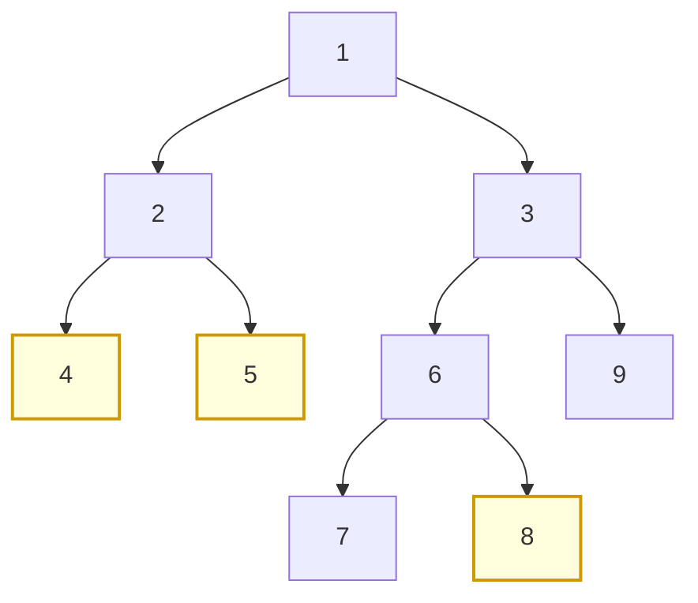
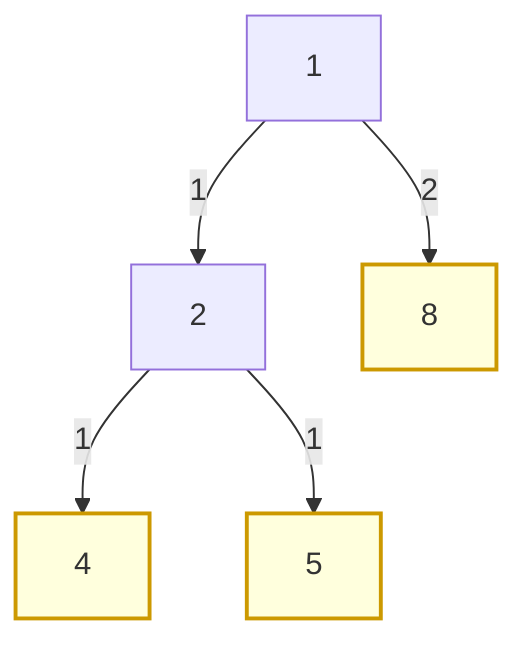

# 오늘의 주제: 가상 트리 (Virtual Tree / Auxiliary Tree)

> **한 줄 요약**: 트리에서 매 쿼리마다 주어지는 **핵심 정점 집합 S**만 남기고, 그들의 **쌍별 LCA**를 더해 만든 압축 트리. 원래 트리가 N개여도 가상 트리는 **O(|S|)** 크기라, 쿼리마다 트리 전체를 순회하는 O(N)을 O(|S| log N)으로 줄인다.

---

## 언제 쓰나

- 쿼리가 여러 개 들어오고, 각 쿼리마다 **트리의 일부 특별한 정점(key node)** 집합 S가 주어진다.
- 각 쿼리를 원래 트리 전체(N)로 풀면 `Σ N`이 되어 TLE.
- 하지만 **모든 쿼리의 |S| 합이 작다**(예: `ΣS ≤ 5·10^5`)면, 각 쿼리를 **가상 트리 위에서만** 처리해 `Σ O(|S| log N)`으로 해결.

핵심 통찰: 트리 DP/경로 문제의 답은 대부분 **key 정점과 그들의 갈림길(=쌍별 LCA)** 에서만 결정된다. 그 사이의 일자 경로는 "간선 하나(가중치 = 원래 거리)"로 압축해도 정보 손실이 없다.

---

## 왜 "쌍별 LCA"만 추가하면 되나 (정당성)

key 정점들을 **오일러 in-time(tin) 순으로 정렬**했을 때, 가상 트리에 필요한 분기점(갈림 정점)은 **정렬 순서상 인접한 두 정점의 LCA**들 뿐이다.

- 어떤 세 정점 a,b,c의 LCA들을 모두 모아도, 실제로 "새로 생기는" 조상은 tin 인접쌍의 LCA 집합에 모두 포함된다.
- 따라서 정점 집합 = `S ∪ { lca(s_i, s_{i+1}) : tin 정렬 인접쌍 }`. 크기 ≤ `2|S| − 1`.

**부모 연결은 스택으로**: 정점을 tin 순으로 훑으면 DFS 전위 순회 순서와 같다. 스택에 "현재 루트→정점 경로"를 유지하다가, 새 정점 v의 조상이 아닌 것들을 pop하면서 간선을 이어주면 가상 트리가 완성된다. (모노톤 스택으로 볼록 껍질 만드는 것과 같은 골격)

---

## 그림으로 보기

원래 트리(N=9)에서 key 정점 S = {4, 5, 8} 이라 하자. 루트는 1.



tin 순 정렬 후 인접쌍 LCA를 추가 → `lca(4,5)=2`, `lca(5,8)=1`, `lca(8,?)` 등. 결과 가상 트리(간선 라벨 = 원 트리 거리):



정점 9개 → 4개로 압축. 6, 7 같은 "지나가기만 하는" 정점은 간선 가중치 속으로 흡수됐다.

---

## 대표 예제: 소모전 (War of Attrition)

**문제(고전형)**: 뿌리 1의 트리, 각 간선에 방어력(가중치)이 있다. 매 쿼리마다 "적 도시" 집합 S가 주어진다. **간선을 끊어(간선 가중치만큼 비용)** 모든 적 도시가 루트와 **연결되지 않도록** 하는 최소 비용을 구하라. `ΣS`는 작다.

- **아이디어**: 답은 key 정점과 그 LCA들에서만 결정 → 가상 트리를 만들고 그 위에서 트리 DP.
- **DP**: `dp[v]` = v의 서브트리(가상 트리 기준)에서 v 아래의 모든 key 정점을 루트 쪽과 끊는 최소 비용.
  - `minEdge[v]` = 원 트리에서 루트→v 경로상 최소 간선 가중치.
  - v가 key면: `dp[v] = minEdge[v]` (v 자신을 위쪽에서 반드시 끊음).
  - v가 key가 아니면: 자식 c들에 대해 `dp[v] = Σ min(dp[c], minEdge[c])` — 각 자식 가지를 "c에서 끊기(dp[c])" vs "c로 내려가는 간선 자체를 끊기(minEdge[c])" 중 싼 쪽.

### Python 풀이 (핵심)

```python
def solve_query(keys, minEdge):   # keys: 이 쿼리의 key 정점 리스트
    root, adj = build_virtual_tree(keys)   # 가상 트리 구성 (아래 템플릿)
    is_key = set(keys)

    def dp(v):                      # 재귀 대신 반복 DFS 권장(깊이 큼)
        if v in is_key:
            return minEdge[v]
        total = 0
        for c in adj[v]:
            total += min(dp(c), minEdge[c])
        return total
    return dp(root)
```

- **시간복잡도**: 쿼리당 정렬 O(|S| log|S|) + LCA O(|S| log N) + DP O(|S|) → `Σ O(|S| log N)`.

---

## Python 템플릿: 가상 트리 구성

전제: `tin[]`(오일러 진입 시간)과 이진 승법(binary lifting) LCA를 **전처리**해 둔다.

```python
import sys
from math import log2

sys.setrecursionlimit(1 << 25)
input = sys.stdin.readline

# --- 전처리: tin, depth, up(이진 승법) ---
def preprocess(n, adj0, root=1):
    LOG = max(1, int(log2(n)) + 1)
    up = [[0]*(n+1) for _ in range(LOG)]
    tin = [0]*(n+1); depth = [0]*(n+1)
    timer = 1
    # 반복 DFS로 tin/depth/부모 채우기
    stack = [(root, 0)]; visited = [False]*(n+1)
    order = []
    st = [(root, 0, iter(adj0[root]))]
    visited[root] = True; tin[root] = timer; timer += 1
    up[0][root] = root
    while st:
        v, _, it = st[-1]
        for w in it:
            if not visited[w]:
                visited[w] = True
                depth[w] = depth[v] + 1
                up[0][w] = v
                tin[w] = timer; timer += 1
                st.append((w, v, iter(adj0[w])))
                break
        else:
            st.pop()
    for k in range(1, LOG):
        for v in range(1, n+1):
            up[k][v] = up[k-1][up[k-1][v]]
    return LOG, up, tin, depth

def lca(u, v, LOG, up, depth):
    if depth[u] < depth[v]: u, v = v, u
    d = depth[u] - depth[v]
    for k in range(LOG):
        if (d >> k) & 1: u = up[k][u]
    if u == v: return u
    for k in range(LOG-1, -1, -1):
        if up[k][u] != up[k][v]:
            u = up[k][u]; v = up[k][v]
    return up[0][u]

# --- 가상 트리 구성 ---
def build_virtual_tree(keys, tin, LOG, up, depth):
    nodes = sorted(keys, key=lambda x: tin[x])
    # tin 인접쌍 LCA 추가
    extra = [lca(nodes[i], nodes[i+1], LOG, up, depth)
             for i in range(len(nodes)-1)]
    allv = sorted(set(nodes) | set(extra), key=lambda x: tin[x])
    adj = {v: [] for v in allv}
    stack = [allv[0]]
    for v in allv[1:]:
        # v의 조상이 아닌 정점들을 pop하며 간선 연결
        anc = lca(stack[-1], v, LOG, up, depth)
        while len(stack) >= 2 and depth[stack[-2]] >= depth[anc]:
            adj[stack[-2]].append(stack.pop())
        if stack[-1] != anc:                 # 갈림점 anc 삽입
            if anc not in adj: adj[anc] = []
            adj[anc].append(stack.pop())
            stack.append(anc)
        stack.append(v)
    while len(stack) >= 2:                    # 남은 사슬 연결
        adj[stack[-2]].append(stack.pop())
    return stack[0], adj    # (가상 트리 루트, 인접리스트)
```

---

## 자주 하는 실수

- **tin 정렬을 빼먹음**: 정렬 없이 스택을 돌리면 부모 연결이 깨진다. 반드시 오일러 진입 시간 오름차순.
- **anc(=LCA)를 정점 집합에 안 넣음**: 인접쌍 LCA를 `allv`에 합집합으로 꼭 포함해야 갈림점이 생긴다.
- **가상 트리 정리(clean-up) 누락**: `adj`를 딕셔너리로 매 쿼리 새로 만들거나, 배열로 재사용한다면 쿼리 끝에 사용한 정점만 초기화. 매번 `[0]*(n+1)` 하면 그 자체가 O(N)이라 압축 의미가 사라진다.
- **재귀 DFS 깊이**: 가상 트리도 최악 사슬형이면 |S| 깊이 → 반복 DFS 또는 `setrecursionlimit` 상향.
- **루트 포함 여부**: 문제에 따라 루트(1)를 항상 넣어야 답이 정의되는 경우가 있다(소모전은 루트가 자연히 최상단 LCA로 들어옴).

---

## 한 줄 정리

> **key 정점 + tin 인접쌍 LCA → tin 정렬 → 모노톤 스택으로 압축.** 트리 전체 N을 매번 훑지 말고, 답이 결정되는 O(|S|)개 정점만 남겨 그 위에서 DP하라.
