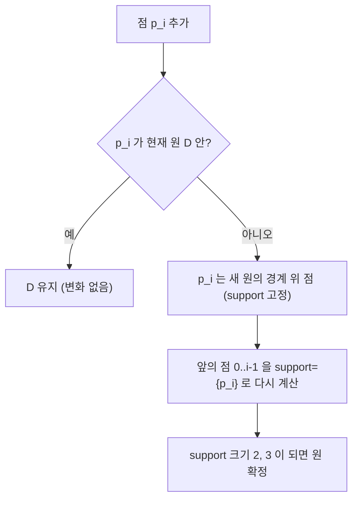

# 최소 외접원 — Welzl 알고리즘 (Smallest Enclosing Circle)

> **오늘의 주제: 최소 외접원(Minimum Enclosing Circle)을 기대 O(n)에 구하는 Welzl 랜덤 증분 알고리즘**
> 평면 위 n개의 점을 모두 포함하는 **가장 작은 원**을 찾는다. 무식하게 하면 3점 조합 O(n⁴)이지만, Welzl은 랜덤 순서 증분으로 **기대 선형 시간**에 정확한 답을 낸다.

---

## 1. 문제 정의와 핵심 성질

주어진 점 집합 P를 모두 감싸는 원 중 반지름이 최소인 원(중심 c, 반지름 r)을 구한다. 유일하게 존재한다.

**결정적 성질 (Welzl의 근거):**
- 최소 외접원의 경계 위에는 **점이 최대 3개**만 있으면 충분하다.
- 경계 위 점이 2개면 그 두 점은 **지름의 양 끝**이고, 3개면 그 세 점의 **외접원(circumcircle)**이 곧 답이다.
- 즉 답은 "어떤 2점 또는 3점"으로 완전히 결정된다. 이 결정 점들을 **support set R**이라 부른다.

**왜 3점이면 충분한가?** 최소 외접원을 아주 조금 줄이거나 옮기려는 순간, 경계에 걸린 점들이 이를 막는다. 평면(2D)에서 원을 "고정"하려면 자유도상 최대 3개의 접점이면 충분하고, 그 이상은 불필요하다. 이게 Welzl 재귀의 종료 조건(|R| = 3)이 되는 이유다.

---

## 2. 알고리즘 아이디어 — 랜덤 증분

점을 **랜덤 순서**로 하나씩 추가하며 "현재까지의 최소 외접원 D"를 유지한다.

- 새 점 p가 이미 D 안에 있으면 → D는 그대로.
- p가 D **밖**에 있으면 → p는 반드시 **새 원의 경계 위**에 있어야 한다. 그래서 p를 support로 고정하고, 앞의 점들로 다시 최소 원을 계산한다(한 단계 깊은 재귀).



**랜덤 순서가 핵심.** "밖에 있는 점"이 등장할 확률이 낮아지도록 셔플하면, 재귀가 깊어지는 사건의 기대 횟수가 상수로 눌려 전체 **기대 O(n)**이 된다. (셔플 안 하면 최악 O(n³)까지 나빠질 수 있다.)

---

## 3. 원을 만드는 기하 서브루틴

**두 점의 원(지름):** 중심 = 중점, 반지름 = 거리/2.

**세 점의 외접원(circumcircle):** 세 점 a, b, c의 외심은 아래 공식으로.
```
d = 2 * ( ax(by-cy) + bx(cy-ay) + cx(ay-by) )
ux = ( (ax²+ay²)(by-cy) + (bx²+by²)(cy-ay) + (cx²+cy²)(ay-by) ) / d
uy = ( (ax²+ay²)(cx-bx) + (bx²+by²)(ax-cx) + (cx²+cy²)(bx-ax) ) / d
```
`d`가 0에 가까우면 세 점이 (거의) 일직선 → 이 경우는 두 점 원들의 최대치로 대체하면 되지만, Welzl 흐름상 그런 3점 조합은 답이 되지 못하므로 자연히 걸러진다.

---

## 4. Python 템플릿 (반복 버전 권장)

Python은 재귀 깊이 제한(기본 1000)이 있어 n이 크면 재귀 Welzl이 터진다. 아래는 **support를 명시적으로 넘기는 반복형** 구현이다.

```python
import math, random

def circle_two(a, b):
    cx, cy = (a[0]+b[0])/2, (a[1]+b[1])/2
    r = math.dist((cx, cy), a)
    return (cx, cy, r)

def circle_three(a, b, c):
    ax, ay = a; bx, by = b; cx, cy = c
    d = 2*(ax*(by-cy) + bx*(cy-ay) + cx*(ay-by))
    if abs(d) < 1e-12:               # 일직선 → 유효한 외접원 아님
        return None
    a2, b2, c2 = ax*ax+ay*ay, bx*bx+by*by, cx*cx+cy*cy
    ux = (a2*(by-cy) + b2*(cy-ay) + c2*(ay-by)) / d
    uy = (a2*(cx-bx) + b2*(ax-cx) + c2*(bx-ax)) / d
    return (ux, uy, math.dist((ux, uy), a))

def in_circle(c, p, eps=1e-9):
    return c is not None and math.dist((c[0], c[1]), p) <= c[2] + eps

def min_enclosing_circle(points):
    P = points[:]
    random.shuffle(P)                 # 기대 O(n)의 핵심
    c = None
    for i, p in enumerate(P):
        if in_circle(c, p):
            continue
        c = (p[0], p[1], 0.0)         # p 를 경계 support 로 고정
        for j in range(i):
            q = P[j]
            if in_circle(c, q):
                continue
            c = circle_two(p, q)      # p, q 두 support
            for k in range(j):
                s = P[k]
                if in_circle(c, s):
                    continue
                c = circle_three(p, q, s)  # 세 support → 확정
    return c                          # (cx, cy, r)
```
3중 루프처럼 보여도, `in_circle`을 통과하지 못하는 점(밖에 있는 점)만 안쪽 루프로 내려가고 랜덤 셔플 덕분에 그 사건이 드물어 **기대 선형**이 된다.

---

## 5. 대표 예제 — BOJ 2626 최소 외접원

> n개의 점을 모두 포함하는 원 중 반지름이 가장 작은 원의 **중심 좌표와 반지름**을 소수 둘째 자리까지 출력.

핵심 아이디어: 위 `min_enclosing_circle` 그대로 호출하면 정확한 답(외심/중점 기반)이 나온다.

```python
import sys, math, random
input = sys.stdin.readline

def solve():
    n = int(input())
    pts = [tuple(map(int, input().split())) for _ in range(n)]
    cx, cy, r = min_enclosing_circle(pts)   # 위 템플릿 사용
    print(f"{cx:.2f} {cy:.2f}")
    print(f"{r:.2f}")

solve()
```

- **시간복잡도:** 기대 O(n). n=1000이면 사실상 즉시.
- **정확도:** Welzl은 근사가 아니라 **정확해**를 준다(부동소수 오차만 존재). 삼분탐색/경사하강 근사보다 안정적이다.

---

## 6. 자주 하는 실수

- **셔플 누락:** `random.shuffle` 빼면 정렬된 입력에서 O(n³)으로 폭발. 반드시 넣기.
- **재귀 버전으로 큰 n 처리:** Python 재귀 깊이 초과 → 위처럼 반복형/명시 support로 쓰거나 `sys.setrecursionlimit` 상향.
- **`in_circle` eps 방향:** 경계 위 점이 "밖"으로 판정돼 무한히 support로 재확정되지 않도록 `<= r + eps`로 여유를 준다. eps가 너무 크면 원이 미세하게 작게 나올 수 있으니 1e-7~1e-9 권장.
- **세 점 일직선 처리:** `circle_three`가 None을 반환하는 경우를 무시하면 크래시. Welzl 흐름에선 정상 답에 그런 3점이 안 나오지만, 방어적으로 None 체크.
- **정수 좌표라고 정수 나눗셈 쓰기:** 중심/반지름은 실수. `/`(실수 나눗셈)와 `math.dist` 사용.

---

## 요약

- 최소 외접원은 **경계 위 2~3점**으로 완전히 결정된다 → 이 점들만 찾으면 된다.
- **랜덤 순서 증분(Welzl):** 새 점이 밖이면 그 점을 경계로 고정하고 앞부분을 재계산. 기대 **O(n)**.
- 근사 아님, **정확해**. 삼분탐색보다 빠르고 안정적. BOJ 2626류에 바로 적용.
