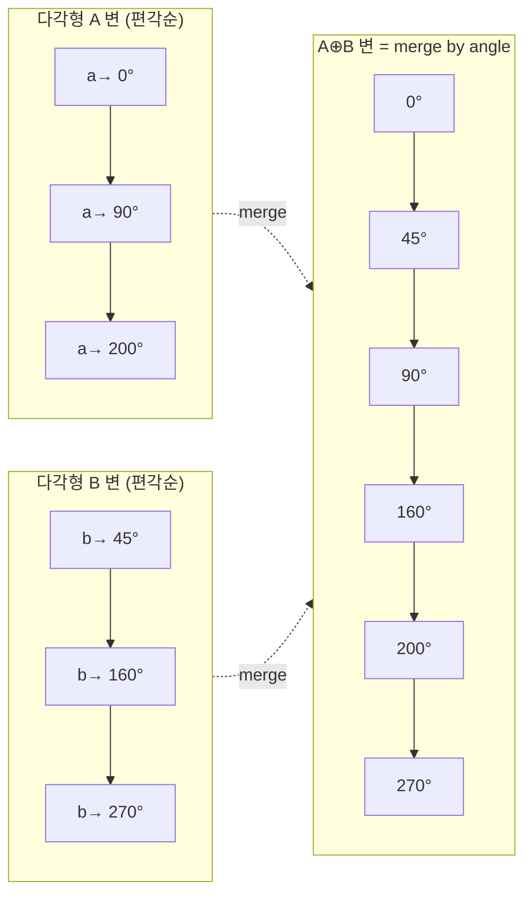

# 오늘의 주제: 민코프스키 합 (Minkowski Sum of Convex Polygons)

두 볼록 다각형 $A$, $B$의 **민코프스키 합**은

$$A \oplus B = \{\, a + b \mid a \in A,\; b \in B \,\}$$

즉 $A$의 모든 점과 $B$의 모든 점을 벡터로 더해서 만든 점 집합이다. 핵심 사실:

> **두 볼록 다각형의 민코프스키 합은 다시 볼록 다각형이고, 그 변(edge)들은 $A$의 변과 $B$의 변을 모두 모아 각도순으로 정렬한 것과 같다.**

정점이 각각 $n$, $m$개면 합은 정점 최대 $n+m$개의 볼록 다각형이며, **각 변을 편각(angle)으로 병합**하기 때문에 $O(n+m)$에 만들어진다.

---

## 왜 이렇게 되는가 (정당성)

볼록 다각형을 변 벡터들의 순환 나열로 보자. 변을 반시계(CCW)로 돌면 편각이 단조 증가한다.
민코프스키 합의 경계는 "어떤 방향 $d$로 가장 멀리 있는 점"을 $d$가 한 바퀴 도는 동안 추적한 것이다.
방향 $d$에서 $A\oplus B$의 지지점(support)은 `argmax_a⟨a,d⟩ + argmax_b⟨b,d⟩`,
즉 **각 다각형에서 방향 $d$의 지지점의 합**이다.
$d$를 회전시키면 지지점은 각 다각형의 변을 편각순으로 지나가므로,
합의 경계 변들 = $A$의 변들 ∪ $B$의 변들을 **편각순으로 이어붙인 것**이 된다. (두 정렬된 수열의 merge)



---

## 대표 응용: 두 볼록 다각형 사이 최소 거리

민코프스키 합의 가장 흔한 코테 활용은 **충돌 판정 / 최소 거리**다.

> 볼록 다각형 $A$와 $B$가 있을 때, $\min_{a\in A, b\in B}\lVert a-b\rVert$ 를 구하라.
> ($A$, $B$가 겹치면 0.)

핵심 변환:

$$\min_{a,b}\lVert a-b\rVert = \operatorname{dist}\big(O,\; A \oplus (-B)\big)$$

즉 $B$를 원점 대칭시킨 $-B$와 $A$의 민코프스키 합을 만들면,
**원점에서 그 볼록 다각형까지의 거리**가 곧 두 다각형의 최소 거리다.
원점이 $A\oplus(-B)$ 내부에 있으면 두 다각형이 겹친다는 뜻(거리 0).

- 시간복잡도: 각 다각형 볼록껍질 $O(n\log n)$ + 합 병합 $O(n+m)$ + 원점–다각형 거리 $O(n+m)$
- 이미 볼록이고 CCW 정렬돼 있으면 전체 $O(n+m)$

### Python 풀이

```python
import sys, math

def convex_hull(pts):
    pts = sorted(set(pts))
    if len(pts) <= 2:
        return pts
    def cross(o, a, b):
        return (a[0]-o[0])*(b[1]-o[1]) - (a[1]-o[1])*(b[0]-o[0])
    lo = []
    for p in pts:
        while len(lo) >= 2 and cross(lo[-2], lo[-1], p) <= 0:
            lo.pop()
        lo.append(p)
    up = []
    for p in reversed(pts):
        while len(up) >= 2 and cross(up[-2], up[-1], p) <= 0:
            up.pop()
        up.append(p)
    return lo[:-1] + up[:-1]          # CCW, 중복 없이

def reorder(poly):
    # 가장 아래(그다음 왼쪽) 점을 시작으로 CCW 정렬 → 편각 단조 증가 보장
    k = min(range(len(poly)), key=lambda i: (poly[i][1], poly[i][0]))
    return poly[k:] + poly[:k]

def minkowski_sum(A, B):
    A, B = reorder(A), reorder(B)
    n, m = len(A), len(B)
    res = []
    i = j = 0
    while i < n or j < m:
        res.append((A[i % n][0] + B[j % m][0],
                    A[i % n][1] + B[j % m][1]))
        # 다음 변 벡터끼리 외적 비교 → 편각 작은 쪽 진행
        ax = A[(i+1) % n][0] - A[i % n][0]; ay = A[(i+1) % n][1] - A[i % n][1]
        bx = B[(j+1) % m][0] - B[j % m][0]; by = B[(j+1) % m][1] - B[j % m][1]
        cr = ax*by - ay*bx
        if i >= n:      j += 1
        elif j >= m:    i += 1
        elif cr > 0:    i += 1          # A 변의 각이 더 작다
        elif cr < 0:    j += 1
        else:           i += 1; j += 1  # 평행 → 동시에
    return res

def point_seg_dist(p, a, b):
    px, py = p; ax, ay = a; bx, by = b
    dx, dy = bx-ax, by-ay
    if dx == dy == 0:
        return math.hypot(px-ax, py-ay)
    t = ((px-ax)*dx + (py-ay)*dy) / (dx*dx + dy*dy)
    t = max(0.0, min(1.0, t))
    return math.hypot(px-(ax+t*dx), py-(ay+t*dy))

def point_in_convex(p, poly):
    n = len(poly)
    for i in range(n):
        a, b = poly[i], poly[(i+1) % n]
        cr = (b[0]-a[0])*(p[1]-a[1]) - (b[1]-a[1])*(p[0]-a[0])
        if cr < 0:                      # CCW 기준 오른쪽 → 밖
            return False
    return True

def min_dist_convex(A, B):
    A = convex_hull(A)
    negB = convex_hull([(-x, -y) for x, y in B])
    S = minkowski_sum(A, negB)
    if len(S) >= 3 and point_in_convex((0, 0), S):
        return 0.0
    best = float('inf')
    for i in range(len(S)):
        best = min(best, point_seg_dist((0, 0), S[i], S[(i+1) % len(S)]))
    return best

# 예시
A = [(0, 0), (2, 0), (2, 2), (0, 2)]
B = [(5, 5), (6, 5), (6, 6), (5, 6)]
print(f"{min_dist_convex(A, B):.6f}")   # 4.242641  (= (3,3) 거리 = 3√2)
```

---

## 자주 하는 실수

- **CCW 정렬을 안 맞춤**: 민코프스키 병합은 두 다각형 모두 같은 방향(여기선 CCW)으로 편각 단조 증가해야 한다. `reorder`로 최하단 점부터 시작시켜 각이 한 바퀴 도는 순서를 보장하자.
- **볼록성 가정 위반**: 입력이 정점 나열만 주어질 때 오목하거나 정점 순서가 뒤섞였으면 먼저 `convex_hull`로 정규화.
- **평행 변 처리 누락**: 두 변의 외적이 0(평행·같은 방향)일 때 한쪽만 진행하면 정점이 어긋난다. 위 코드처럼 동시에 `i,j`를 올리거나, 합쳐도 결과는 동일하니 일관되게 처리.
- **겹침(내부) 판정 빠뜨림**: 최소 거리 문제에서 원점이 합의 내부면 답은 0. 변까지 거리만 재면 겹칠 때 틀린 양수가 나온다.
- **정수/실수 혼동**: 민코프스키 합 좌표·내부판정은 정수로(외적) 정확히, 거리 계산만 실수로. 오차 줄이려면 제곱거리로 비교하다 마지막에 √.

---

## Python 템플릿 (볼록 already-CCW 두 다각형 합)

```python
def minkowski_sum(A, B):
    # A, B: 반시계(CCW) 정렬된 볼록 다각형 정점 리스트
    def start(p):
        k = min(range(len(p)), key=lambda i: (p[i][1], p[i][0]))
        return p[k:] + p[:k]
    A, B = start(A), start(B)
    n, m = len(A), len(B)
    res, i, j = [], 0, 0
    while i < n or j < m:
        res.append((A[i%n][0]+B[j%m][0], A[i%n][1]+B[j%m][1]))
        ax, ay = A[(i+1)%n][0]-A[i%n][0], A[(i+1)%n][1]-A[i%n][1]
        bx, by = B[(j+1)%m][0]-B[j%m][0], B[(j+1)%m][1]-B[j%m][1]
        cr = ax*by - ay*bx
        if   i >= n: j += 1
        elif j >= m: i += 1
        elif cr > 0: i += 1
        elif cr < 0: j += 1
        else:        i += 1; j += 1
    return res
```

**언제 쓰나**: 두 볼록 물체 충돌/최소거리, "한 물체를 기준으로 다른 물체가 움직일 수 있는 영역"(설정 공간, configuration space), 볼록 다각형의 스칼라 확장, 로봇 경로계획의 장애물 팽창.
